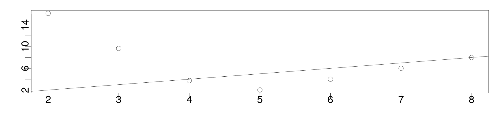

<style>
.section .reveal .state-background {
   background: #ffffff;
}
.section .reveal h1,
.section .reveal h2,
.section .reveal p {
   color: black;
   margin-top: 50px;
   text-align: center;
}
</style>

Model Selection
========================================================
date: 11/14/2019
autosize: true
incremental: true
width: 1920
height: 1080

<h2 style='color:black'>Instructions:</h2>
<p style='color:black'>Use the left and right arrow keys to navigate the presentation forward and backward respectively.  You can also use the arrows at the bottom right of the screen to navigate with a mouse.<br></p>

========================================================

## A review of model selection

* We haven't derived any formal ways yet to systematically select a model from a wide range of variables, other than t-test and ANOVA.

  * The primary issue with this approach is that in doing so much multiple hypothesis testing, we we are surely going to get "false-positives" in counting some variables as significant.
  
  * Likewise, the relative p-values depend on the larger model in which we start from initially, so that these values will change and may become inflated when we trim to a smaller model.
  
* Nonetheless, this is usally the first choice for model selection that we usually take, as we start empirically building a model and selecting for variables.

* We will firstly discuss how this would look if done systematically, and some of the issues.

* After this, we will develop a few more sophisticated procedures.

========================================================

<h2> Backwards elimination</h2>

* One systematic way of approaching this is to set a variable for the response and many possible variables for the predictors.

* With some pre-defined $\alpha_\mathrm{crit}$ critical value in mind for a level of signficance, we will make a model summary and use the t-test for the exclude one out hypothesis test.

* In particular, we will choose the variable for which the p-value is the largest (and larger than $\alpha_\mathrm{crit}$), and remove this variable <em>alone</em>.

* The removal of this variable will then necessarily change the significance of the other variables, so we must re-fit the model with the one variable removed and re-compute the p-values.

* Subsequently, we will iterate on the above, removing the next variable that has a p-value greater than $\alpha_\mathrm{crit}$.

* Typically in this case $\alpha_\mathrm{crit}$ might be set higher than $5\%$ in practice, to acheive some balance between the complexity reduction and the model fit.

  * We may indeed even consider setting this as high as $\alpha_\mathrm{crit} =10\%$ for creating a predictive model.

* Here, the p-value $\alpha_\mathrm{crit}$ is commonly called the p-to-remove value.

========================================================

<h2> Forward selection/ step-wise selection</h2>

* Forward selection simply reverses the last process of variable selection, where we will start with no variables in the model whatsoever.

* We will add a variable one at a time, testing the significance of this variable in a single predictor model.

  * after evaluating the p-value of each of the proposed variables, we choose the variable with the smallest p-value below $\alpha_\mathrm{crit}$ to include in the model, and <em>only this variable</em>
  
* Subsequently, we iterate on this process, including another variable to the model until there are no more that, when added, fall below the value of $\alpha_\mathrm{crit}$.

* If we decide to change our mind on a variable somewhere through either forward or backward regression, this is referred to as step-wise regression, and there are several ways to go through a forward/ backward process.

========================================================

<h2> An example of backward elimination</h2>

* We will study this in an example looking at life expectancy as regressed upon by demographic factors in various states of the USA, from the 1970 census.


```r
library("faraway")
statedata <- data.frame(state.x77,row.names=state.abb)
head(statedata)
```

```
   Population Income Illiteracy Life.Exp Murder HS.Grad Frost   Area
AL       3615   3624        2.1    69.05   15.1    41.3    20  50708
AK        365   6315        1.5    69.31   11.3    66.7   152 566432
AZ       2212   4530        1.8    70.55    7.8    58.1    15 113417
AR       2110   3378        1.9    70.66   10.1    39.9    65  51945
CA      21198   5114        1.1    71.71   10.3    62.6    20 156361
CO       2541   4884        0.7    72.06    6.8    63.9   166 103766
```

<ul>
  <li>Here the demographic factors include:</li>
  <ol>
    <li>Population -- population of the state; </li>
    <li>Income -- income per capita in the state</li>
    <li>Illiteracy -- illiteracy per capita in the state</li>
    <li>Murder -- murder rate per 100,000 people in the state</li>
    <li>HS Grad -- High school graduation rate in the state per capita</li>
    <li>Frost -- mean number of days with minimum temperature below freezing in the capital or other large city;</li>
    <li>Area -- land area of the state in square miles.</li>
  </ol>
</ul>

========================================================
### An example of backward elimination


* With a pre-selected value of $\alpha_\mathrm{crit}=5\%$, we will go through backward elimination:


```r
lmod <- lm(Life.Exp ~ ., statedata)
sumary(lmod)
```

```
               Estimate  Std. Error t value  Pr(>|t|)
(Intercept)  7.0943e+01  1.7480e+00 40.5859 < 2.2e-16
Population   5.1800e-05  2.9187e-05  1.7748   0.08318
Income      -2.1804e-05  2.4443e-04 -0.0892   0.92934
Illiteracy   3.3820e-02  3.6628e-01  0.0923   0.92687
Murder      -3.0112e-01  4.6621e-02 -6.4590  8.68e-08
HS.Grad      4.8929e-02  2.3323e-02  2.0979   0.04197
Frost       -5.7350e-03  3.1432e-03 -1.8246   0.07519
Area        -7.3832e-08  1.6682e-06 -0.0443   0.96491

n = 50, p = 8, Residual SE = 0.74478, R-Squared = 0.74
```

* As a remark, in the big model we see that the murder rate is strongly significant explanatory variable on life expectancy but, unusually, income (for this model) is not.

* This may be understood in part where other variables tigthly correlated with income (illiteracy, education) might make some information redundant.

========================================================
### An example of backward elimination

* On the last summary, Area had the largest p-value greater than $5\%$, so we eliminate this, using the "update" function.

* The update function takes the linear model as the first argument, and the second is the formula to re-fit the model with, subtracting out the predictor we wish to remove:


```r
lmod <- update(lmod, . ~ . - Area)
sumary(lmod)
```

```
               Estimate  Std. Error t value  Pr(>|t|)
(Intercept)  7.0989e+01  1.3875e+00 51.1652 < 2.2e-16
Population   5.1883e-05  2.8788e-05  1.8023   0.07852
Income      -2.4440e-05  2.3429e-04 -0.1043   0.91740
Illiteracy   2.8459e-02  3.4163e-01  0.0833   0.93400
Murder      -3.0182e-01  4.3344e-02 -6.9634 1.454e-08
HS.Grad      4.8472e-02  2.0667e-02  2.3454   0.02369
Frost       -5.7758e-03  2.9702e-03 -1.9446   0.05839

n = 50, p = 7, Residual SE = 0.73608, R-Squared = 0.74
```

========================================================
### An example of backward elimination


* Subsequently, illiteracy should be removed:


```r
lmod <- update(lmod, . ~ . - Illiteracy)
sumary(lmod)
```

```
               Estimate  Std. Error t value  Pr(>|t|)
(Intercept)  7.1066e+01  1.0289e+00 69.0669 < 2.2e-16
Population   5.1149e-05  2.7095e-05  1.8878   0.06566
Income      -2.4771e-05  2.3160e-04 -0.1070   0.91531
Murder      -3.0001e-01  3.7042e-02 -8.0992 2.907e-10
HS.Grad      4.7758e-02  1.8591e-02  2.5689   0.01367
Frost       -5.9099e-03  2.4678e-03 -2.3948   0.02095

n = 50, p = 6, Residual SE = 0.72773, R-Squared = 0.74
```

========================================================
### An example of backward elimination

* Next, we remove income,


```r
lmod <- update(lmod, . ~ . - Income)
sumary(lmod)
```

```
               Estimate  Std. Error t value  Pr(>|t|)
(Intercept) 71.02712853  0.95285296 74.5415 < 2.2e-16
Population   0.00005014  0.00002512  1.9960  0.052005
Murder      -0.30014880  0.03660946 -8.1987 1.775e-10
HS.Grad      0.04658225  0.01482706  3.1417  0.002968
Frost       -0.00594329  0.00242087 -2.4550  0.018018

n = 50, p = 5, Residual SE = 0.71969, R-Squared = 0.74
```


========================================================
### An example of backward elimination

* and finally we remove population:


```r
lmod <- update(lmod, . ~ . - Population)
sumary(lmod)
```

```
              Estimate Std. Error t value  Pr(>|t|)
(Intercept) 71.0363788  0.9832622 72.2456 < 2.2e-16
Murder      -0.2830652  0.0367313 -7.7064 8.039e-10
HS.Grad      0.0499487  0.0152011  3.2859  0.001950
Frost       -0.0069117  0.0024475 -2.8240  0.006988

n = 50, p = 4, Residual SE = 0.74267, R-Squared = 0.71
```

* we could possibly include population anyway (as it is really on the line), but the difference in $R^2$ is not large, so we may prefer the smaller model.

  * Overall, we see that the reduction of the four parameters results in only a slight loss of fit to the data.

========================================================
### An example of backward elimination

* It is important to remember that even when we have removed a variable, this doesn't mean that it has no impact on the response -- this is always understood relative to the overall model in questions.

* Respectively, if we fit,


```r
sumary(lm(Life.Exp ~ Illiteracy+Murder+Frost, statedata))
```

```
              Estimate Std. Error  t value  Pr(>|t|)
(Intercept) 74.5567171  0.5842507 127.6108 < 2.2e-16
Illiteracy  -0.6017607  0.2989270  -2.0131  0.049981
Murder      -0.2800474  0.0433940  -6.4536 6.033e-08
Frost       -0.0086910  0.0029595  -2.9367  0.005166

n = 50, p = 4, Residual SE = 0.79112, R-Squared = 0.67
```

we see that illiteracy is significant with respect to a different choice of variables.

* Particularly, we cannot reliably conclude that illiteracy is not a variable of interest, only that it is surprising that it would be more important than the other variables in the model chosen by backward selection.

========================================================

<h2> Notes on step-wise procedures</h2>

* The point of the above is to show how (what we do intuitively) can be done somewhat more systematically.

* However, this is somewhat "hacky" and has fundamental issues in its approach:

  <ol>
    <li> Doing this totally "by hand", we will typically miss an "optimum" that we might find by a more rigorous method.</li>
    <li> The final p-values can't be treated very literally, due to so much multiple testing.  Particularly, we will inflate the significance as we move along through selection</li>
    <li> Variables that are dropped by this selection process can't be said not to have an important effect, and we need to be careful to specify what was actually excluded in the end.</li>
    <li> Step-wise approaches may be over-agressive in the removal of variables for prediction purposes -- even if a parameter isn't strictly significant, there is a balance to be held with predictions and our ability to make some kind of useful prediction</li>
  </ol>
  
* Genearlly, (as in the final) we should try to make a more systematic selection based upon a criterion based on the purpose of the model.

========================================================

<h2> Criterion methods</h2>

* If we re-framed this somewhat abstractly, and supposed there was a way to measure "how-much-information" is added or lost when selecting certain variables, we might be able to make a more rigorous decision.

* A widely used idea in:
  
  1. physics;
  2. statistics;
  3. computer science;
  4. information theory;
  
  is the idea of <b>entropy</b>.

========================================================

<h3> Entropy </h3>
  
* Entropy was originally developed as a concept in thermodymics, as the idea of "how many microscopic (unobservable) states are consistent with macroscopic (observable) constraints on the system?"

* In the context of of information, we can understand entropy similarly as the measure of possible unkowns (the total uncertainty) relative to what is known.

  * This can be loosely understood as the minimum unknown information to recover an unknown mincrostate given some known macrostate.
  
  * This is commonly used as a measure of the necessary information to recover a lossless, compressed signal in signal processing.
  
* In the context of regression (viewed as a kind of signal processing) we can view this likewise as a measure of how much uncertainty exists within one model versus another.

* One commonly used measure of the difference of entropy in one distribution versus another is the "Kullback-Leibler Divergence" (KL-divergence).

  * We remark, this is not to be considered a distance as it is <b>not symmetric</b>.
  
  * A more formal <b>distance</b> on probability distributions include Wasserstein Distances (earth-mover distances in image processing).
  
* Nonetheless, the KL-divergence is quite useful  for deriving the relative uncertainty of different models.
  
========================================================

<h3> KL-divergence</h3>

*  Suppose we had some idea of what the correct form of the model for the relationship should be in terms of some function $f$.

* Let us have a family of possible models $g_\theta$ that look like $f$, but has a dependence on a choice of parameter $\theta$.

  * Particularly, we will assume that whenever $f(x)= 0$ then $g_\theta(x) = 0$, such that the suppport of $g_\theta$ is contained within the support of $f$. 

* We will measure the Kullback-Leibler divergence of $f$ and $g_\theta$ as,

  $$\begin{align}
  I(f,g) \triangleq \int f(x) \log\left(\frac{f(x)}{g(x\vert \theta)}\right) \mathrm{d}x
  \end{align}$$
  
* This measures a kind of relative entropy of $f$ with respect to $g_\theta$, and in particular, the ammount of information lost between using the "true" form of the model $f$ and our choice of model $g_\theta$ (for some choice of $\theta$).

* We are thus interested in as a general criterion of minimizing the information lost from the true model with respect to our choice of a particular approximate form.

  * The quantitity itself is positive for all choices of $g_\theta \neq f$ and zero when $g_\theta = f$.

* The main issue about the above is that we don't actually know $f$, and that this cannot be computed as it is written...

========================================================
### KL-divergence

* On the other hand, we can use a typical trick and use a maximum-likelihood estimate for $\theta$.

* Define $\hat{\theta}$ to be the maximum likelihood estimated value for the parameter $\theta$. 

*  We write  the equation at this parameter value as, 

  $$\begin{align}
  \hat{I}(f,g) = \int f(x) \log\left(f(x)\right)\mathrm{d}x - \int f(x) \log \left(g\left(x\vert \hat{\theta}\right) \right)\mathrm{d}x
  \end{align}$$
  
  simply by expanding in the log of the fraction.


  * Notice, while $f$ is an unkown model, we integrate out the values of $f$ over all possible values it attains, so the left term becomes a constant that we don't have to worry about in the selection of a model.
  
* Through some approximations, we can show that

  $$\begin{align}
  \mathbb{E}\left[\hat{I}\left(f,g\right)\right] \approx \log\left(L\left(\hat{\theta}\right)\right) + p + \text{ "some constant"},
  \end{align}$$
  
  where: 
  <ol>
    <li> the expectation can be understood as taking place over all possible random outcomes of the observations;</li>
    <li> $p$ is the number of parameters in the model;</li>
    <li> $\log\left(L\left(\hat{\theta}\right)\right)$ is the log-likelihood of the best-choice of parameters for this model;
    <li> the constant is dependent on the unkown, true model, but doesn't affect our optimization procedure.</li>
  </ol>
  
========================================================

### Akaike information criterion

* Due to historical conventions, we define an AIC (Akaike Information Criterion) multiplying by 2 to get

  $$\begin{align}
  AIC =  -2\log\left(L\left(\hat{\theta}\right) \right)+ 2p
  \end{align}$$
  
* For linear regression models, the computation of $-2\log\left(L\left(\hat{\theta}\right)\right)$ boils down to a computational form of the maximium log-likelihood,

  $$\begin{align}
  -2L\left(\hat{\theta}\right) = n \log\left(\frac{RSS}{n}\right) + \text{ "some other constant"},
  \end{align}$$
  
  where:
  
  <ol>
    <li> the constants are the same for the same dataset; and</li>
    <li> the constants are the same for the same unkown, true model.</li>
  </ol>

* Therefore, when comparing models over the same dataset, we are safe to use this as a criterion for a "best" model.

  * For other types of comparision, we need to be more careful, see the recommended readings for references.

* The goal then, with this criterion, is to minimize the AIC with respect to two competing factors:
  <ol>
   <li> Improve the fit, reducing the RSS, possibly by including more explanatory variables that add new information (variables that are not highly correlated);</li>
   <li> but not overfit, being penalized in terms of the number of parameters $p$.</li>
  </ol>

========================================================

<h3> Bayes Information Criterion</h3>

* There are many possible criterion we can consider, of similar flavor to the above, for the model selection.

* The most well-known competitor is the Bayes Information Criterion (BIC) given of the form,

  $$\begin{align}
  \mathrm{BIC} \triangleq 2n \log\left(\frac{RSS}{n}\right) + p \log(n),
  \end{align}$$
  
  where again:
  
  <ol>
    <li>we try to minimize the RSS; and</li>
    <li>try not to overparameterize with the penalty for too many parameters $p$.</li>
  </ol>
  
* The BIC is extremely similar, but it has a stronger penalty term and favors simpler models overall.

* Very loosely speaking, we might favor the AIC for predictive models (to get more accurate predictions at the cost of complexity) or the BIC for explanatory models (to get simplicity for explanation purposes at the cost of accuracy).

  * However, either can be used for either purpose.
  
* Indeed, we can consider generally if the two criteria coincide on the selection of the model predictors, or if they favor separate models.

* In the case where we have multiple models which are "optimal" with respect to different criteria, we can evaluate which is a preferable model based on diagnostics.
  
  * The form of the model should be chosen based on how well the models satisfy the assumptions of the Gauss-Markov theorem.  
  
========================================================

<h3> An example of the AIC</h3>

* We will use the AIC to reselect the life expectancy model by state, using the "leaps" library -- this will exhaustively search through the dataset for the best: 1 predictor model, 2 predictory model, 3 predictor model, and so forth...


```r
library("leaps")
sum_life <- summary(regsubsets(Life.Exp~.,data=statedata))
sum_life
```

```
Subset selection object
Call: regsubsets.formula(Life.Exp ~ ., data = statedata)
7 Variables  (and intercept)
           Forced in Forced out
Population     FALSE      FALSE
Income         FALSE      FALSE
Illiteracy     FALSE      FALSE
Murder         FALSE      FALSE
HS.Grad        FALSE      FALSE
Frost          FALSE      FALSE
Area           FALSE      FALSE
1 subsets of each size up to 7
Selection Algorithm: exhaustive
         Population Income Illiteracy Murder HS.Grad Frost Area
1  ( 1 ) " "        " "    " "        "*"    " "     " "   " " 
2  ( 1 ) " "        " "    " "        "*"    "*"     " "   " " 
3  ( 1 ) " "        " "    " "        "*"    "*"     "*"   " " 
4  ( 1 ) "*"        " "    " "        "*"    "*"     "*"   " " 
5  ( 1 ) "*"        "*"    " "        "*"    "*"     "*"   " " 
6  ( 1 ) "*"        "*"    "*"        "*"    "*"     "*"   " " 
7  ( 1 ) "*"        "*"    "*"        "*"    "*"     "*"   "*" 
```

========================================================

<h3> An example of the AIC</h3>


* With three explanatory variables, we find the model that uses the murder rate, highschool graduation and frost variables once again.

* We also see the $R^2$ and adjusted $R^2_a$ of each model by calling this as an argument of the summary of the output:


```r
sum_life$rsq
```

```
[1] 0.6097201 0.6628461 0.7126624 0.7360328 0.7361014 0.7361440 0.7361563
```

```r
sum_life$adjr2
```

```
[1] 0.6015893 0.6484991 0.6939230 0.7125690 0.7061129 0.6993268 0.6921823
```

* As with $R^2$, the $R^2_a$ represents better fit when it is larger.

* In each of these alternative measures, we see that the model with population included (4 predictors) is actually favored.

* We will now discuss what the difference of $R^2$ and adjusted $R^2$ is as criteria for model fit...

========================================================

<h3> Adjusted $R^2_a$</h3>

* We remember that the definition for $R^2$ with intercept is given as,

  $$\begin{align}
  1 - \frac{RSS}{TSS}
  \end{align}$$

  where the $TSS$ is the residual sum of squares for the null model, using only the mean of the data for prediction.
  
* If we try to optimize $R^2$ alone, this can lead to overparameterization -- specifically, $R^2$ is monotonically increasing with additional parameters.

* However, we can include a penalty like before for the number of parameters in the model:

  $$\begin{align}
  R^2_a &\triangleq 1 - \frac{RSS/ \left(n-p\right)}{TSS/\left(n-1\right)} \\
  &  = 1 - \frac{\hat{\sigma}^2_\text{model}}{\hat{\sigma}^2_\text{null model}}
  \end{align}$$
  
* When $n-p$ is small, the numerator is large -- therefore the difference with one gets smaller when unneccessary parameters are included.
  
* Thus, this accounts for the the fit of the model, but penalized for overfiting and compensating only when the new parameter adds meaningful information.

========================================================

<h3> Mallow's $C_p$</h3>

* As an alternative criterion, we can consider "how well does the model predict?" in the mean square sense.

* Specifically, suppose we compare the predicted value from our model $\hat{\mathbf{Y}}_i$ with the expected value of the response given the explanatory variables $\mathbb{E}\left[\mathbf{Y}_i \vert \mathbf{X}_i\right]$;

* then, we can theoreticaly compute the mean square difference of these quantities over all possible random outcomes (normalized by the variance) as,

  $$\begin{align}
  \frac{1}{\sigma^2}\sum_{i}^n \mathbb{E}\left[\hat{\mathbf{Y}} - \mathbb{E}\left[\mathbf{Y}_i \vert \mathbf{X}_i\right]\right]^2
  \end{align}$$

* While we cannot compute this in reality, this can be estimated with a sample-based statistic,

  $$\begin{align}
  C_p = \frac{RSS_p}{\hat{\sigma}^2} + 2p - n
  \end{align}$$
  
* Again, we see the competing terms between the $RSS$ and the number of parameters, favoring a compromise between the two.

========================================================

<h3> Mallow's $C_p$</h3>

* In the case that there isn't a lack of fit, then the Mallow's $C_p \approx p$, the number of predictors.

* Therefore, Mallow's $C_p$ favors the smallest model of $p_0$ parameters where the coefficient is either $C_{p_0} \approx p_0$ or less than $p_0$.

  * For any values of Mallow's $C_p$ which are smaller, but for which $C_p \geq p$, we conclude that there is not a good fit to the data.
  
* We can extract Mallow's $C_p$ as a value from the regsubsets summary as,


```r
sum_life$cp
```

```
[1] 16.126760  9.669894  3.739878  2.019659  4.008737  6.001959  8.000000
```
 

========================================================

<h3> Mallow's $C_p$</h3>

* We plot Mallow's $C_p$ versus the number of <b>parameters</b> as 
  

```r
par(cex=3, mai=c(1.5,1.5,.5,.5), mgp=c(3,0,0))
plot(2:8,sum_life$cp,xlab="No. of Parameters",ylab="Cp Statistic")
abline(0,1)
```



* Notice, Mallow's $C_p$ gives an indication that the model with 3 predictors (4 parameters) or 4 predictors (5 parameters) may be a good choice.

  * The 4 predictor model (with ```population```) is a slightly better fit, but we may favor the 3 predictor model for simplicity.

========================================================

<h3> Practical computation for large models</h3>

* We note that combinatorially, if we have $q$ potential explanatory variables that we might try to choose whether or not to put into a model, there will be to choices per variable:
  <ol>
  <li>yes we include this;</li>
  <li>no we don't include this.</li>
  </ol>
* Each choice is independent from each other choice, so that the total number of combinations we can consider is $2^q$.

* Suppose there are 20 possible variables we might consider -- this corresponds to:


```r
as.integer(2)^20
```

```
[1] 1048576
```
 
 * That is, we will have over one million  models to compare... 
 
* Exhaustive search is strictly infeasible even for a (relatively) small number of possible explanatory variables.

  * In practice, this will depend on computational power limitations, but typically we must compromise.  
  
  * Try using exhaustive search based on your hardware, and if there is no reasonable time to convergence, quit it.

========================================================

### Step-wise information criteria

* An alternative is to use an incremental approach, mixing the ad-hoc method we considered at the beginning, with a specific criterion for the best choice of model.

* Particularly we can compute, e.g., the AIC for all one parameter models;

* then we can compute the AIC for all two parameter models with the first chosen variable imposed on the model with two parameters.

* This may not produce an optimal model in the same sense as exhaustive search, but is a cheaper alternative that avoids the problems with many multiple hypothesis tests.

* This is done explicitly in R with the "step" function.

* Likewise, this can be done by a method of reduction starting with a large model.
  
  * by default, the step function will use this method, though by choosing parameters, it can be performed by forward, backward or both-ways selection.
  
========================================================

### Step-wise information criteria

* The output process is too long to see completely on the slide, but the code is presented for refrence.


```r
lm_step <- step(lm(Life.Exp ~ ., data=statedata))
```

```
Start:  AIC=-22.18
Life.Exp ~ Population + Income + Illiteracy + Murder + HS.Grad + 
    Frost + Area

             Df Sum of Sq    RSS     AIC
- Area        1    0.0011 23.298 -24.182
- Income      1    0.0044 23.302 -24.175
- Illiteracy  1    0.0047 23.302 -24.174
<none>                    23.297 -22.185
- Population  1    1.7472 25.044 -20.569
- Frost       1    1.8466 25.144 -20.371
- HS.Grad     1    2.4413 25.738 -19.202
- Murder      1   23.1411 46.438  10.305

Step:  AIC=-24.18
Life.Exp ~ Population + Income + Illiteracy + Murder + HS.Grad + 
    Frost

             Df Sum of Sq    RSS     AIC
- Illiteracy  1    0.0038 23.302 -26.174
- Income      1    0.0059 23.304 -26.170
<none>                    23.298 -24.182
- Population  1    1.7599 25.058 -22.541
- Frost       1    2.0488 25.347 -21.968
- HS.Grad     1    2.9804 26.279 -20.163
- Murder      1   26.2721 49.570  11.569

Step:  AIC=-26.17
Life.Exp ~ Population + Income + Murder + HS.Grad + Frost

             Df Sum of Sq    RSS     AIC
- Income      1     0.006 23.308 -28.161
<none>                    23.302 -26.174
- Population  1     1.887 25.189 -24.280
- Frost       1     3.037 26.339 -22.048
- HS.Grad     1     3.495 26.797 -21.187
- Murder      1    34.739 58.041  17.456

Step:  AIC=-28.16
Life.Exp ~ Population + Murder + HS.Grad + Frost

             Df Sum of Sq    RSS     AIC
<none>                    23.308 -28.161
- Population  1     2.064 25.372 -25.920
- Frost       1     3.122 26.430 -23.877
- HS.Grad     1     5.112 28.420 -20.246
- Murder      1    34.816 58.124  15.528
```

========================================================


<h2> A summary of model selection</h2>

* Some general (and non-exhaustive) considerations for model selection are the following:

  <ol>
    <li> All of these techniques are sensitive to outliers, and we should look for potential problems with highly influential observations.</li>
    <li> All these techniques are also sensitive to changes of scale, and the models may need to be re-evaluated after changes of scale and/or removal of outliers of high leverage (which are themselves sensitive to changes of scale).</li>
    <li> Hypothesis testing methods, while simple to implement, greatly suffer when we perform many hypothesis tests.</li>  
    <li>It is generally preferrable to use a criterion approach (or multiple criterion approaches) as a first look and use hypothesis testing to distinguish between nested models of similar performance with ANOVA (when appropriate).</li>
    <li> Approaching the selection problem as above makes the p-values of parameters more useful for interpretation and explanation of the response with the parameters.</li>
    <li>If multiple models are being evaluated, with very similar AIC, $R^2_a$ and $C_p$, consider:
    <ol>
    <li> Do the models have similar qualitative implications for explanation and prediction?</li>
    <li> What are the relative costs and difficulty of measuring the explanatory variables?</li>
    <li> Which model has better performing diagnostic analysis?</li>
    </ol>
    </li>
    <li> If two models have very similar performance by the above, but very different qualitative implications, then it indicates that the data can't well (or definitively) explain the response.</li>
  </ol>
