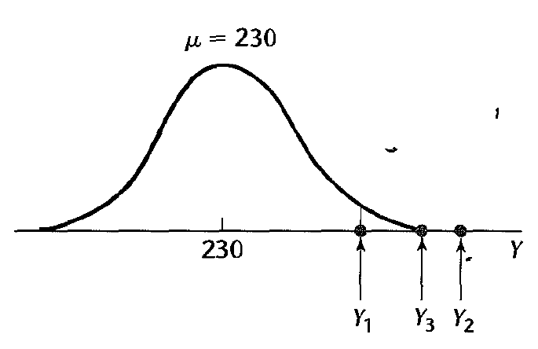
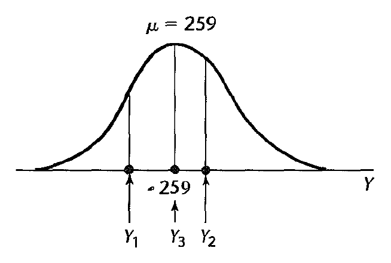
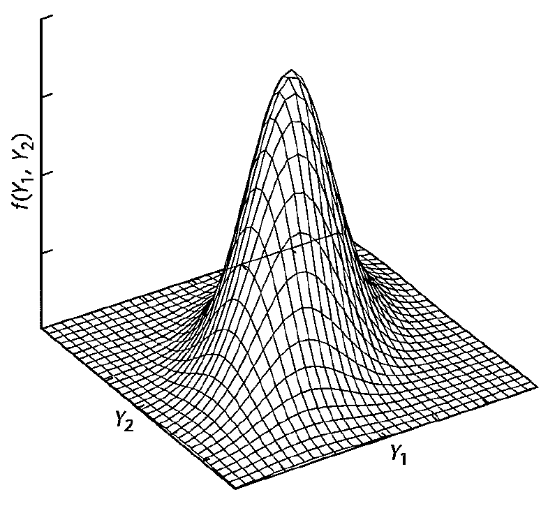
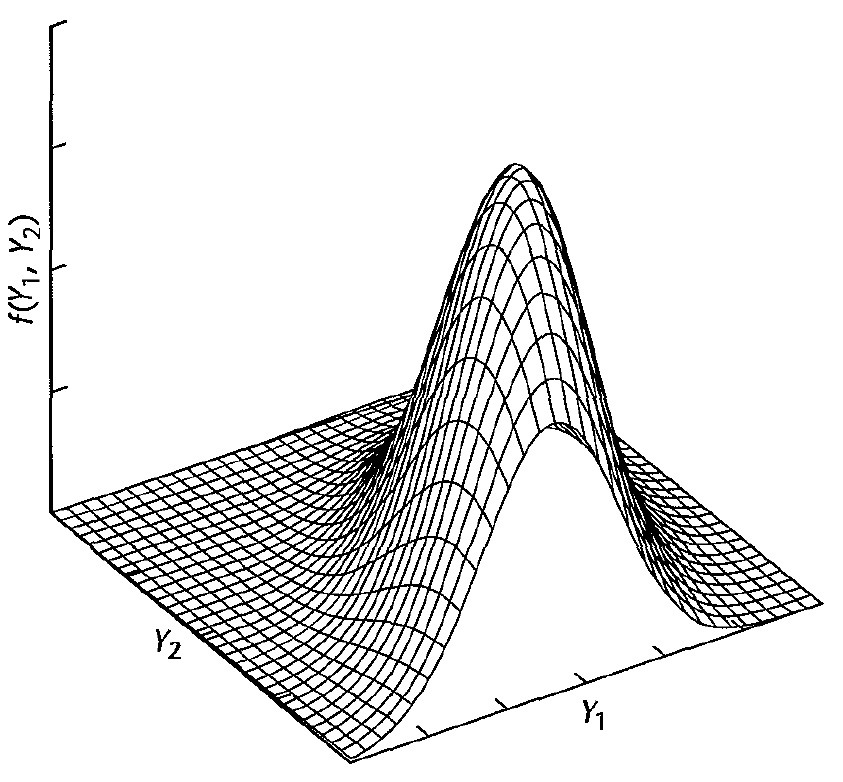

Simple linear regression -- part 3
========================================================
date: 09/09/2020
autosize: true
incremental: true
width: 1920
height: 1080

<h2 style="text-align:left"> Instructions:</h2>

Use the left and right arrow keys to navigate the presentation forward and backward respectively.  You can also use the arrows at the bottom right of the screen to navigate with a mouse. 

<blockquote>
FAIR USE ACT DISCLAIMER: 
This site is for educational purposes only.  This website may contain copyrighted material, the use of which has not been specifically authorized by the copyright holders. The material is made available on this website as a way to advance teaching, and copyright-protected materials are used to the extent necessary to make this class function in a distance learning environment.  The Fair Use Copyright Disclaimer is under section 107 of the Copyright Act of 1976, allowance is made for “fair use” for purposes such as criticism, comment, news reporting, teaching, scholarship, education and research.
</blockquote>

========================================================

<h2>Outline</h2>

* The following topics will be covered in this lecture:

  * Gaussian error regression models
  * Estimation by Maximum Likelihood
  * Gaussian correlation models

========================================================

<h2>Gaussian Error Regression Models</h2>

<ul>
  <li>Recall now our standard regression equation,
  $$\begin{align}
  Y_i = \beta_0 + \beta_1 X_i + \epsilon_i.
  \end{align}$$</li>
  <li>Up to now we have only made assumptions about the first two moments of the variation in the signal, $\epsilon_i$, and the decorrelation of cases:</li>
  <ol>
    <li>$\mathbb{E}[ \epsilon_i ] = 0$ for each $i$;</li>
    <li>$\mathbb{E}[ \epsilon_i^2 ] = \sigma^2$ for each $i$; and</li>
    <li>$\mathbb{E}[ \epsilon_i \epsilon_j ] = 0$ for every $i\neq j$.</li>
  </ol>
  <li>Regardless of the actual distribution of the error/ variation $\epsilon_i$, the Gauss-Markov theorem holds and the solution by least squares is the BLUE.</li>
    <li>However, to create confidence intervals and  perform uncertainty quantification, we will need to assume some additional structure.</li>
  <li> It is often assumed that the error distribution for $\epsilon_i$ is Gaussian for several reasons: </li>
  <ol>
    <li>Gaussian errors simplify the regression analysis significantly; </li>
    <li>Gaussian distributions are quite common in real applications;</li>
    <li>it can be shown that linear combinations of Gaussian random variables are also Gaussian so that, in a linear model, many other quantities will also be Gaussian; and finally</li>
    <li>even when errors are not strictly Gaussian, a Gaussian distribution is often a "good" approximation.</li>
  </ol>
  <li> The notion of a Gaussian distribution being a "good" approximation is formalized with the Central Limit Theorem, which we now recall.</li>
</ul>

========================================================

<h3> Central limit theorem</h3>

<ul>
  <li>Suppose we have a sequence of random variables, $\left\{x_i \right\}_{i=1}^\infty$ which are independent, identically distributed <strong>from any distribution</strong>, such that for all $i$
<ol>
  <li> $\mathbb{E}[x_i] = \mu$; and</li>
  <li> $\mathrm{var}(x_i) = \sigma^2$, for some finite $\sigma$.</li>
</ol>
<li> For each $n\geq 1$ define the sample-based mean of the sequence $\left\{x_i \right\}_{i=1}^n$

  $$\begin{align}
  \overline{x}_n \triangleq \frac{1}{n} \sum_{i=1}^n x_i
  \end{align}$$</li>

<li> Then, as the number of random variables $n\rightarrow \infty$, the sample-based means
  
  $$\begin{align}
  \sqrt{n}\left(\overline{x}_n - \mu\right) {\xrightarrow {d}} N(0, \sigma^2)
  \end{align}$$
  where the convergence is in distribution.</li>
  
<li> Put another way, for $n$ sufficiently large, $\overline{x}_n$ has <b>approximately</b> a $N\left(\mu, \frac{\sigma^2}{\sqrt{n}}\right)$ distribution.</li>

<li> Heuristically, 
  <ul>
    <li><b>for large sample sizes</b>, we can produce confidence intervals for the mean of the unbiased estimator (e.g., the true $\beta_0,\beta_1$),</li>
    <li>from the sample based estimate (the least squares solution $\hat{\beta}_0 ,\hat{\beta}_1$) with a Gaussian assumption;</li>
    <li>this is a <b>good approximation</b> if not strictly accurate.</li>
  </ul>
<li> The "goodness" of this approximation can be made more formal in another course.</li>
</ul>

========================================================

<h3>Gaussian Error Regression</h3>

<ul>
  <li>The Gaussian assumption will be introduced on top of our existing assumptions as follows:</li>
  <ol>
    <li>We suppose that we have a signal in the data, linear in the parameters $\beta_0,\beta_1$,
    $$Y_i = \beta_0 + \beta_1 X_i + \epsilon_i$$</li>
    <li>$X_i$ is a known constant, while $\beta_0,\beta_1$ are unkown but fixed values for all $i$.</li>
    <li>$\epsilon_i$ are drawn independently and identically distributed (iid) as,
    $$\epsilon_i \sim N\left(0, \sigma^2\right)$$
    for each $i$.</li>
  </ol>
<li>Independence of the $\epsilon_i$ implies that the cases are once again uncorrelated.</li>
<li>Additionally, as we have assumed the form of the distribution as Gaussian, and the form of the first two moments, we have entirely parametrized the distribution of the variation.</li>
</ul>

========================================================

<h3>Gaussian Error Implications -- continued</h3>

<ul>
  <li>As was mentioned before, Gaussianity thus simplifies the regression analysis significantly.</li>
  <li> It is easy to construct confidence intervals for the mean of a sample-based estimate of the mean of a Gaussian random variable from the Student t distribution.</li>
  <li> Likewise, the t-test derived from the Student t distribution can be used to perform hypothesis tests.</li>
  <li>We will return to both of these points when we introduce multiple regression more formally.</li>
  <li> For the moment, we will return to the addendum of the Gauss-Markov theorem:
  <ul>
    <li>If in addition, $\epsilon\sim N\left(0,\sigma^2\right)$, then the solution by least squares is the "maximum likelihood estimator".</li>
  </ul>
  </li>
</ul>

========================================================

<h2>Estimation of parameters by maximum likelihood</h2>

<ul>
  <li> A concept widely used in statistical inference is a "likelihood" function.</li>
  <li>Consider a probability density, denoted $p_\theta(y)$, which depends on the value of the parameter $\theta$.</li> 
  <ul>
    <li>Suppose we are investigating some random variable $Y$, for which there is some "true" parameter $\theta_0$, such that 
    $$P(a \leq Y \leq b)= \int_a^b y p_{\theta_0}(y) \mathrm{d}y.$$</li>
  </ul>
  <li>We assume that even though $\theta_0$ is not known, <b>we can evaluate the density</b>
 $$\begin{align}
  p_\theta(Y=y)
 \end{align}$$
 for any choice of $\theta$ and some observed piece of data $y$.
 </li>
 <li>Then, the likelihood of $\theta$ based on an observed $y$ is defined
 $$\begin{align}
 \mathcal{L}(\theta \vert y) = p_\theta(Y=y)
 \end{align}$$
 where we evaluate the probability of $Y$ attaining an observed piece of data $y$ given a <b>choice</b> of $\theta$.</li>
 <li> The "likelihood" is thus a measure of how well does our choice of parameter make the distribution describe the observed data.</li>
 <li>Maximum likelihood estimation is thus the process of finding a $\hat{\theta}$ which maximizes the likelihood, 
 <ul>
  <li>i.e., $\hat{\theta}$ which maximizes the probability density for the observed data $y$ given the density $p_\theta$.</li>
 </ul>
</ul>

========================================================

<h3>Estimation of parameters by maximum likelihood -- an example</h3>

 

 Courtesy of: Kutner, M. et al. Applied Linear Statistical Models 5th Edition

<ul>
  <li>Suppose that we have three samples $Y_1,Y_2,Y_3$ from what we know is a population that is Gaussian distributed.</li>
  <ul>
    <li>Moreover, we suppose that while we know the standard deviation $\sigma=10$, we do not know the true mean $\mu$.</li>
  </ul>
  <li>Let $\mathrm{exp}\left\{x\right\}$ denote the function $e^x$.</li>
  <li>By varying the choice of $\mu$, we can evaluate the density of any particular sample with the Gaussian density
  $$f_j = \frac{1}{\sqrt{2\pi}10}\mathrm{exp}\left\{-\frac{1}{2}\left(\frac{Y_j - \mu}{10}\right)^2\right\},$$
  denoted $f_j$ for sample $j$, based on the <b>choice</b> of $\mu$.</li>
  <li>We suppose that the observed data points are $Y_1 = 250, Y_2=265,Y_3=259$</li>
  <li><b>Q:</b> given the above data points, and the associated graph to the left, does $\mu=230$ appear to be the "most likely" choice for the true mean?</li>
</ul>

========================================================

<h3>Estimation of parameters by maximum likelihood -- an example continued</h3>

 

 Courtesy of: Kutner, M. et al. Applied Linear Statistical Models 5th Edition

<ul>
  <li>Intuitively, we can tell that there are better choices for the "center of mass" of the data, given by our choice of $\mu$.</li>
  <li>One particular choice may be to set $\mu= 259= Y_3$ as on the left.</li>
  <li>Indeed, we can compare the values for the density function for each choice of $\mu$ as in the table below:
  <table>
  <tr>
  <th>Density</th><th>$\mu=230$ </th><th>$\mu= 259$</th>
  </tr>
  <tr><td>$f_1$</td> <td>.005399</td> <td>.026609</td> </tr>
  <tr><td>$f_2$</td> <td>.000087</td> <td>.033322</td> </tr>
  <tr><td>$f_3$</td> <td>.000595</td> <td>.039894</td> </tr>
  </table></li>
  <li>The likelihood value for the data above, assuming that these are independent samples of the true Gaussian distribution, is given by the product of the respective densities.</li>
  <li>By performing a numerical optimization, we can recover the "most likely" choice of $\mu$ given our observations.</li>
  <li>However, for a Gaussian distribution as above, it can be demonstrated that the sample mean is the maximum likelyhood estimate of $\mu$.</li>
</ul>

========================================================

<h3>Estimation of the regression function by maximum likelihood</h3>

<ul>
  <li>As with the toy example before, we can apply the same method to estimating the regression parameters $\beta_0,\beta_1$.</li>
  <li>Recall that we assume $\epsilon_i \sim N(0,\sigma^2)$, such that</li>
    <ul>
      <li>each observation is iid drawn from a Gaussian distribution,
      $$Y_i \sim N(\beta_0+ \beta_1 X_i, \sigma^2)$$</li>
    </ul>
    <li>To put this in the framework of a likelihood function, we suppose that $\overline{\beta}_0,\overline{\beta}_1,\overline{\sigma}$ are free parameters, such that
    $$\begin{align}\mathcal{L}\left(\overline{\beta}_0,\overline{\beta}_1,\overline{\sigma}\vert Y_i\right)& = p_{\overline{\beta}_0,\overline{\beta}_1,\overline{\sigma}}\left(Y_i\right) \\
    &=\frac{1}{\sqrt{2\pi}\overline{\sigma}}\mathrm{exp}\left\{-\frac{1}{2}\left(\frac{Y_i - \overline{\beta}_0 - \overline{\beta}_1 X_i}{\overline{\sigma}}\right)^2\right\}
    \end{align}$$</li>
    <li>Then, due to the independence, the likelihood over the set of the $n$ observations is given simply as the product of the individual likelihoods:
    $$\mathcal{L}\left(\overline{\beta}_0,\overline{\beta}_1,\overline{\sigma}\vert Y_{i=1,\cdots,n}\right)
    =\prod_{i=1}^n\frac{1}{\sqrt{2\pi}\overline{\sigma}}\mathrm{exp}\left\{-\frac{1}{2}\left(\frac{Y_i - \overline{\beta}_0 - \overline{\beta}_1 X_i}{\overline{\sigma}}\right)^2\right\}$$
    </li>
    <li> By maximizing the above product over all the observed data, with respect to the choice of the free parameters $\overline{\beta}_0,\overline{\beta}_1,\overline{\sigma}$, we obtain the maximium likelihood estimate.</li>
</ul>

========================================================

<h3>Estimation of the regression function by maximum likelihood -- continued</h3>

<ul>
  <li><b>Q:</b>Suppose we want to maximize the likelihood function,
  $$\mathcal{L}\left(\overline{\beta}_0,\overline{\beta}_1,\overline{\sigma}\vert Y_{i=1,\cdots,n}\right)
    =\prod_{i=1}^n\frac{1}{\sqrt{2\pi}\overline{\sigma}}\mathrm{exp}\left\{-\frac{1}{2}\left(\frac{Y_i - \overline{\beta}_0 - \overline{\beta}_1 X_i}{\sigma}\right)^2\right\};$$
    what approach can we take to make this tractible?</li>
  <li>The function $\log()$ is monotonic, so that an increase in the argument corresponds to an increase in the output.</li>
  <li>Using this fact, we can reduce our analysis of the likilhood function to something more simple, the "log-likelihood",
  $$\log(\mathcal{L}) = constant - n\log{\overline{\sigma}} - \frac{1}{2\overline{\sigma}^2}\sum_{i=1}^n \left(Y_i - \overline{\beta}_0 - \overline{\beta}_1 X_i \right)^2;$$</li>
  <li>finding the maximum value of the above equation is equivalent to finding the maximum of the likelihood, due to the monotonicity.</li>
  <li>Note, we write a number of values as "constant", because for purposes of optimization in the free parameters $\overline{\beta}_0,\overline{\beta}_1,\overline{\sigma}$, these make no difference in the outcome.</li>
  <li><b>Q:</b> what would be a plausible approach of finding the maximum of the above?</li>
  <li><b>A:</b> one approach is to take the derivative in each free parameter, as before.</li>
  <li>This will result in this case in three equations which will resemble the normal equations of the least squares approach.</li>
</ul>

========================================================

<h3>Estimation of the regression function by maximum likelihood -- a remark</h3>

<ul>
  <li>We stated that, as an addendum to the Gauss-Markov theorem, the parameter estimates by least squares $\hat{\beta}_0,\hat{\beta}_1$ are also the maximum likelihood parameters in the case of Gaussian errors.</li>
  <li> However, we note, the maximum likelihood estimate above simultaneously estimates the unknown variance $\sigma^2$.</li>
  <li> As opposed to the unbiased estimate of the variance,
  $$\hat{\sigma}^2 \triangleq \frac{RSS}{n-p},$$
  the maximum likelihood estimate is biased.</li>
  <li> Indeed, the maximum likelihood estimate for the variance is given by the naive normalization,
  $$\sum_{i=1}^n \frac{\left(Y_i - \hat{Y}_i\right)^2}{n}.$$</li>
  <li>For large values of $n$, the difference in the denominator between $n$ and $n-p$ may become small (with a reasonable number of parameters), but for small sample sizes this is quite an important difference.</li>
  <li>We can see that maximum likelihood estimate will severely underestimate $\sigma^2$ when $n$ is small or for any $p$ close to $n$.</li>
</ul>

========================================================

<h2>Gaussian correlation models</h2>

<ul>
  <li>So far, we have taken the relatively simple formulation of the regression problem in which the explanatory variable $X$ is assumed to be a controllable constant value.</li>
  <ul>
    <li>In this context, the variation that we refer to in $\epsilon_i$ is prototypically defined in terms of repeated sampling of replicated cases.</li>
    <li> Particularly, we are considering scenarios in which we can hold the value of $X_i$ constant, and take multiple independent samples of the associated value of the response $Y_i$.</li>
  </ul>
  <li>However, there are situations in which we want to consider <b>both</b> the response $Y$ and the predictor $X$ to be random variables.</li>
  <ul>
    <li>For example, an analyst may may be interested in two variables "height of person" and "weight of person" in a study of a sample of persons, with each variable being taken as random.</li>
    <li> The analyst might wish to study the relation between the two variables or might be interested in
    <ul>
      <li> making inferences about weight of a person on the basis of the person's height;</li>
      <li> making inferences about height on the basis of weight;</li>
      <li> or in both.</li>
    </ul>
  </ul>
  <li> In this context, we can treat our regression as a <b>correlation model</b>.</li>
  <li> In the case of a joint Gaussian distribution for $Y$ and $X$, our techniques in regression remain essentially the same, but the framework for our analysis and the meaning of parameters will change.</li> 
  <li> We will discuss this change of framework in the remaining lecture.</li>
</ul>

========================================================

<h3>Bivariate Gaussian distribution</h3>

 

 Courtesy of: Kutner, M. et al. Applied Linear Statistical Models 5th Edition

<ul>
  <li>To begin, we will recall the basis of the Gaussian correlation model --- the multivariate Gaussian distribution.</li>
  <li>Reframing slightly, we suppose that $Y_1$ and $Y_2 = X$ are jointly distributed with respect to a Gaussian distribution as on the left.</li>
  <ul>
    <li>In this case, we will re-write $X$ as above, as its meaning is symmetric with the response.</li> 
  </ul>
  <li> The bivariate Gaussian has the functional form of the below, where</li> 
  <ol>
    <li>$\mu_i,\sigma_i$ are the mean and standard deviation of $Y_i$ respectively;</li>
    <li>$\rho_{12} \triangleq \frac{\sigma_{12}^2}{\sigma_1 \sigma_2}$ is the <b>coefficient of correlation</b> between $Y_1,Y_2$;</li>
    <li>in the figure on the left, we identify $f(Y_1,Y_2)$ as $p_{Y_1,Y_2}(y_1,y_2)$.</li>
  </ol>
</ul>

$$\begin{align}
  p_{Y_1,Y_2}(y_1,y_2) = \frac{1}{2 \pi \sigma_1 \sigma_2 \sqrt{1 - \rho_{12}^2}}\mathrm{exp}\left\{\frac{1}{2\left(1 -  \rho_{12}^2\right)} \left[\left(\frac{y_1 - \mu_1}{\sigma_1}\right)^2 + \left(\frac{y_2 - \mu_2}{\sigma_2}\right)^2 - 2\rho_{12}\left( \frac{y_1 - \mu_1}{\sigma_1}\right)\left( \frac{y_2 - \mu_2}{\sigma_2}\right)\right] \right\}
\end{align}$$

========================================================

<h3>Marginal Distributions</h3>

 Courtesy of: Bscan Creative Commons, via <a href="https://commons.wikimedia.org/wiki/File:MultivariateNormal.png" target="blank">Wikimedia Commons</a>

<ul>
  <li>An important feature of jointly Gaussian random variables is that their marginal and conditional distributions are also Gaussian.</li>
  <li> We recall, given a joint density $p_{X,Y}(x,y)$, we define the marginal density of $X$ as,
  $$\begin{align}
  p_X(x)\triangleq \int_y p_{X,Y}(x,y) \mathrm{d}y = \int_y p_{X\vert Y}(x\vert y)p_Y(y)\mathrm{d}y= \mathbb{E}_Y \left[p_{X\vert Y}(x\vert y)\right],
  \end{align}$$
  where each equality on the right is an equivalent form.</li>
  <ul>  
    <li> Intuitively, the marginal probability of $X$ is computed by examining the conditional probability of $X$ given a particular value of $Y$, and then averaging this conditional probability over the distribution of all values of $Y$.</li>
    <li> What is left is the "intrinsic" probability of $X$ when we have averaged out the effects of $Y$, which $X$ implicitly depends on.</li>
  </ul>
</ul>

<ul>  
  <li>In the figure above, we see the joint, sample-density of a bivariate Gaussian and the respective sample-based marginal densities for $X$ and $Y$ in blue and red respectively.</li>
  <li>In particular, it can be shown as with the example from the last slide, $Y_i$ has a marginal density given as,
  $$p_{Y_i}(y_i) =\frac{1}{\sqrt{2\pi}\sigma_i} e^{-\frac{1}{2} \left(\frac{y_i - \mu_i}{\sigma_i}\right)^2}.$$ 
  </li>
  <li><b>Note:</b> when two variables are individually Gaussian, it is not gauranteed that their joint distribution is Gaussian.</li>
</ul>

========================================================

<h3>Conditional Gaussian Inferences</h3>

<ul>
  <li>The conditional density is defined,
  $$p_{Y_1\vert Y_2}(y_1\vert y_2) \triangleq \frac{p_{Y_1,Y_2}(y_1,y_2)}{p_{Y_2}(y_2)},$$
  where</li>
  <ul>
    <li>$p_{Y_1,Y_2}(y_1,y_2)$ is once again the joint Gaussian density; and</li>
    <li>$p_{Y_2}(y_2)$ is the marginal density for $y_2$.</li>
  </ul>
 <li><b>Q:</b> using the definition of the conditional density above, and the definition of the marginal density,
 $$p_{Y_1}(y_1)\triangleq \int_{y_2} p_{Y_1,Y_2}(y_1,y_2) \mathrm{d}y_2$$
 can you show that 
 $$p_{Y_1}(y_1) = \int_{y_2} p_{Y_1\vert Y_2}(y_1\vert y_2)p_{Y_2}(y_2)\mathrm{d}y_2?$$</li>
 <li><b>Solution:</b> Note that by definition,
 $$p_{Y_1\vert Y_2}(y_1\vert y_2) p_{Y_2}(y_2) = p_{Y_1,Y_2}(y_1,y_2),$$
 such that the identity is recovered by substitution.</li>
</ul>

========================================================

<h3>Conditional Gaussian Inferences -- continued</h3>

<ul>
  <li>Given two jointly Gaussian random variables, we can analytically compute the conditional density as
  $$p_{Y_1 \vert Y_2}(y_1 \vert y_2) = \frac{1}{\sqrt{2\pi}\sigma_{1 \vert 2} }\mathrm{exp}\left\{-\frac{1}{2}\left( \frac{y_1 - \alpha_{1\vert 2} - \beta_{12} y_2}{\sigma_{1\vert 2}} \right)^2\right\},$$
  where:</li>
  <ol>
    <li>$\alpha_{1 \vert 2} \triangleq  \mu_1 - \mu_2 \rho_{12}\frac{\sigma_1}{\sigma_2}$ </li>
    <li>$\beta_{12} \triangleq \rho_{12}\frac{\sigma_1}{\sigma_2}$</li>
    <li>$\sigma_{1 \vert 2}^2 \triangleq \sigma^2_1 \left(1 - \rho_{12}^2\right)$
  </ol>
  <li>Therefore, the conditional Gaussian has mean parameterized by,
  $$\mathbb{E}\left[Y_1 \vert Y_2\right] = \alpha_{1\vert 2} + \beta_{12} y_2,$$
  and standard deviation $\sigma_{1\vert 2}$.
  <li><b>Q:</b> if the true means $\mu_1,\mu_2$, the true variances $\sigma_1^2,\sigma_2^2$ and correlation $\rho_{12}$ are unknown, how does this resemble our earlier discussion of maximum likelihood estimation? </li>
  <li> Recall, the form of the likelihood function (for free parameters $\overline{\beta}_1 \overline{\beta}_2, \overline{\sigma}$ 
  $$\begin{align}\mathcal{L}\left(\overline{\beta}_0,\overline{\beta}_1,\overline{\sigma}\vert Y_i\right)& =\frac{1}{\sqrt{2\pi}\overline{\sigma}}\mathrm{exp}\left\{-\frac{1}{2}\left(\frac{Y_i - \overline{\beta}_0 - \overline{\beta}_1 X_i}{\sigma}\right)^2\right\},
    \end{align}$$
  such that we can interpret the parameters of the correlation model in the same sense as the Gaussian error regression parameters.</li> 
  </li>
</ul>

========================================================

<h3>Characteristics of conditional distributions</h3>

 Courtesy of: Kutner, M. et al. Applied Linear Statistical Models 5th Edition

<ul>
  <li>We will discuss several important properties of the conditional distribution:</li>
    <ol>
      <li>The conditional probability distribution of $Y_1$ for any given value of $Y_2$ is also Gaussian.</li>
        <ul>
          <li>Indeed, we can visualize this in the two dimensional case where the cross section represents the conditional Gaussian for $Y_1$ a fixed value of $Y_2$; </li>
          <li> up to renormalization of the section to integrate to 1, this is the form of the conditional.</li>
        </ul>
        <li>The mean of the conditional distribution is given identically by the regression function in the parameters $\alpha_{1\vert 2}, \beta_{12}$.</li>
        <li>All conditional variances have the same variance, as given by,
        $$\sigma_{1 \vert 2}^2 \triangleq \sigma^2_1 \left(1 - \rho_{12}^2\right)$$</li>
    </ol>
</ul>

========================================================

<h3>When can a Gaussian correlation model be used?</h3>
<ul>
  <li>In general, we can apply the Gaussian correlation model in wider scenarios than jointly Gaussian distribute variables.</li>
  <li>Indeed, if we suppose that,</li>
  <ol>
    <li> the conditional distribution of $Y_i$ conditioned on $X_i$ is Gaussian, with conditional mean
    $$\mathbb{E}\left[ Y_i \vert X_i \right] = \beta_0 + \beta_1 X_i,$$
    and variance $\sigma^2$;</li>
    <li>the conditional variables $Y_i\vert X_i$ and $Y_j \vert X_j$ are independent for each $i\neq j$;</li>
    <li>the $X_i$ are independent random variables who's distributions don't depend on $\sigma^2,\beta_0,\beta_1$;</li>
  </ol>
  <li> then the Gaussian correlation model still holds, and the regression for the conditional distributions can be performed as usual.</li>
</ul>

========================================================

<h2>Review of ideas</h2>

* The Gauss-Markov theorem makes no assumption a priori about the distribution of the errors $\epsilon_i$.

* Regardless of the distribution, the parameters estimated by least squares $\hat{\beta}_1,\hat{\beta}_1$ are the BLUE.

* However, it is a common assumption in practice that these are distributed iid according to the Gaussian $N(0, \sigma^2)$.

* This assumption is justified in that Gaussian distributions are common in practice,

  * and furthermore, in cases of large sample sizes Gaussian errors are a good approximation.
  
* In this case, due to the shape of the Gaussian, the mean equals the mode and the minimum variance estimate is also the maximum likelihood estimate.

========================================================

<h3>Review of ideas</h3>

<ul>
 <li>Computing the maximum likelihood estimate consists of maximizing a log-likelihood function, which is a product of the probability densities evaluated at:</li>
  <ol>
    <li> each data point;</li>
    <li> depending on the choice of unkown parameters.</li>
  </ol>
 <li> Taking a derivative in the unkown parameters, we find a similar maximization problem to the objective function for the minimum variance BLUE.</li>
 <li> When we assume the explanatory variable $X$ is also a Gaussian distributed random variable, we also have a natural interpretation of the regression as a correlation model.</li>
 <li> The regression function has the same properties as before, but is interpreted as the conditional mean given the realization of the random predictor.</li>
 <li> This framework isn't limited to Gaussians, but the conditional distributions must be Gaussian for all choices of the predictor.</li>
</ul>
