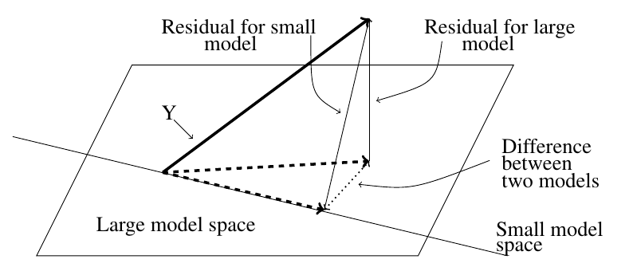

<style>
.section .reveal .state-background {
   background: #ffffff;
}
.section .reveal h1,
.section .reveal h2,
.section .reveal p {
   color: black;
   margin-top: 50px;
   text-align: center;
}
</style>

An introduction to hypothesis testing in regression
========================================================
date: 10/05/2020
autosize: true
incremental: true
width: 1920
height: 1080

<h2 style='color:black'>Instructions:</h2>
<p style='color:black'>Use the left and right arrow keys to navigate the presentation forward and backward respectively.  You can also use the arrows at the bottom right of the screen to navigate with a mouse.<br></p>

<blockquote>
FAIR USE ACT DISCLAIMER:</br>
This site is for educational purposes only.  This website may contain copyrighted material, the use of which has not been specifically authorized by the copyright holders. The material is made available on this website as a way to advance teaching, and copyright-protected materials are used to the extent necessary to make this class function in a distance learning environment.  The Fair Use Copyright Disclaimer is under section 107 of the Copyright Act of 1976, allowance is made for “fair use” for purposes such as criticism, comment, news reporting, teaching, scholarship, education and research.
</blockquote>

========================================================

<h2>Outline</h2>

* The following topics will be covered in this lecture:
  * A review of hypothesis testing
  * The F-test for model selection versus the null
  * Evaluating the F-test in R
  

 
========================================================
<h2> Uncertainty Quantification </h2>

* A quick refresher on the idea of uncertainty by example:

 * Suppose $T$ is a linear unbiased estimator for the speed of light $\theta$. 
 * Like our parameters $\beta$, we will assume that $\theta$ is a deterministic but unkown constant.
 * For sake of example, also suppose that $T$ has standard deviation $\sigma_T$ = 100 km/sec. 
 * Recall Chebyshev’s inequality, 
 
 $$\begin{align}
 P\left(\vert T - \theta \vert \geq k \sigma_T\right) \leq  \frac{1}{k^2}
 \end{align}$$
 
 * We find
 
  $$\begin{align}
 P\left(\vert T - \theta \vert < 2 \sigma_T\right) &gt;  \frac{3}{4}
 \end{align}$$

 * This tells us that there is a probability of at least 75% that $T$ is within 200 km/sec of the speed of light $\theta$. 
 
 * Equivalently, $\theta \in (T-200, T+200)$ with probability 75%.
 
======================================================== 

<h3> Uncertainty Quantification </h3>
 

* Suppose the estimate $T$ gives us based on some data is $t=299852.4$

* We can say that  $\theta \in (299652.4, 300 052.4)$ with <b>confidence</b> 75%.
   * Note that $\theta$ is an an unkown constant -- it is either in the interval or not and there is nothing random about the above statement.
   * Therefore, we can't say that the probability of $\theta \in (299652.4, 300 052.4)$ is 75%, but we used information to guarantee that our proceedure for estimation will work 75% of the time.
   
* Similarly, we will want to fit confidence intervals, and moreover to use hypothesis testing to determine the significance of our model parameters versus the null hypothesis of random variation and no systematic structure.
 
* Particularly, we will be concerned with dual questions:

  1. Does our confidence interval for a parameter $\beta_i$ contain the value $0$? And
  2. how unlikely would it be for $\beta_i$ to equal zero based on our observations?


========================================================

<h2> A review of hypothesis testing</h2>

* The process of hypothesis testing is always defined in terms of a null and an alternative hypothesis.

* In regression, we will denote the hypothesis that there is a systematic, statistical relationship the alternative hypothesis $H_1$.

* The hypothesis that the observed structure can be explained by random variation will be denoted the null hypothesis $H_0$.

* Hypothesis testing thus assumes that the null holds, and finds how surprising it would be to see the observed structure in the case it was just due to random variation.

* We always choose a pre-set value of significance $\alpha$ (typically $5\%$) and determine if the probability of finding a value at least as extreme as our observed results is less than $\alpha$.

  * This probability is known as the p-value.
  
* If the p-value falls below $\alpha$ we reject the null hypothesis in favor of the alternative.

  * On the other hand, if the p-value is greater, then we fail to reject the null model.
  
* Neither indicates causality or the lack thereof, but are good indications of points for further investigation.

  * Examining p-values can also provide corroborating evidence of the explanatory or predictive power of a model when used in conjunction with more robust forms of model selection.
  

========================================================

<h2> Inference</h2>

* Suppose we have a set of response variables and explanatory variables.
 * We want to see if the response variables have a systematic relationship with the explantory variables, or if this can be reduced to random variation.
 * Our null hypothesis $H_0$ is that there is no systematic structure, i.e.,
 $$
 \begin{align}
 \mathbf{Y} = \mu_Y \mathbf{1} + \boldsymbol{\epsilon}
 \end{align}
 $$
 
 * Our alternative hypothesis is that there does exist some (unknown) set of values $\boldsymbol{\beta}$ for which
 
 $$
 \begin{align}
 \mathbf{Y} = \mathbf{X} \boldsymbol{\beta} + \boldsymbol{\epsilon}
 \end{align}
 $$
 
 * Hypothesis testing is a systematic methodology to determine <b>significance</b> of events.  
 * <b>Note:</b> this does not imply causation -- rather the significance can be thought of as<br><br>
   <b>"how suprised would we be if this was just random variation?"</b>
 
* In addition to the null model of random variation, we will be concerned with whether a particular variable, or combination of variables, is significant in the presence of other variables considered.


========================================================

<h3> Inference</h3>

 
* The significance level we assign to the test is the measure of "how suprising" it would be to find out there was no structure.
 
   * For example, a significance value of $5\%$ indicates that the observed outcomes would only be attributable to random variation in about $\frac{1}{20}$ trials.
   
* We should be careful about how much  we can read into the meaning of this  due to the <a href="https://projects.fivethirtyeight.com/p-hacking/" target="blank">saturation of p-values</a>.

 * We will see more robust metrics for model selection later in the course, but because of how widely used p-values are in the literature, we need to understand them.


* To use standard methods for hypothesis testing and confidence intervals, <b>we will now assume additionally Gaussianity</b>, $\boldsymbol{\epsilon} \sim N(0, \sigma^2 \mathbf{I})$.


========================================================

<h3>Occam's Razor</h3>

* In principle, we favor solutions to problems that are as simple as possible.
 * Occam's Razor is the philisophical principle that, <br><br>
 <b>"When presented with competing hypotheses to solve a problem, one should select the solution with the fewest assumptions."</b>

* This makes the problem easier to interpret, and our models transparent in their predictions.

* Suppose we have a large model $\boldsymbol{\Omega}$, which abstractly refers to the set of all linear models possible by choices of $\beta_i$, and their respective uncertainties, over certain variables $X_1, X_2, \cdots, X_{p-1}$.

* Let $q < p-1$, and suppose that abstractly $\boldsymbol{\omega}$ represents a "smaller model", as found by a strictly smaller set of explanatory variables, $X_1, X_2, \cdots, X_q$.

* We will say that we favor the model $\boldsymbol{\omega}$ unless $\boldsymbol{\Omega}$ provides appreciably better results.
 
 * For example, we may consdider, if $RSS_\boldsymbol{\omega} - RSS_\boldsymbol{\Omega}$ is small, then we favor the former, small model. 
 
 * With an additional scaling factor, we can use this principle directly as a test statistic for the null hypothesis, i.e.,
 
 $$\begin{align}
 \frac{RSS_\boldsymbol{\omega} - RSS_\boldsymbol{\Omega}}{RSS_\boldsymbol{\Omega}}
 \end{align}$$
 
========================================================

<h2>Likelihood Ratio test</h2>

* The quantity defined,
 
 $$\begin{align}
 \frac{RSS_\boldsymbol{\omega} - RSS_\boldsymbol{\Omega}}{RSS_\boldsymbol{\Omega}}
 \end{align}$$

 is known as a test-statistic, which is actually defined in terms of the ratio of likelihood functions.

* Let's recall our Gaussian likelihood function

 $$\begin{align}
 \mathcal{L} (\boldsymbol{\beta}, \sigma \vert \mathbf{Y} =Y_{1,\cdots,n} )
 \end{align}$$
 representing the likelihood of the parameter vector $\beta$ and the associated uncertainties with respect to the observed outcomes of the response variable.
 
* The following,
 
 $$\begin{align}
 max_{\boldsymbol{\beta}, \sigma \in \boldsymbol{\Omega}} \mathcal{L} (\boldsymbol{\beta}, \sigma \vert\mathbf{Y} =Y_{1,\cdots,n}  )
 \end{align}$$
 
 will represent the <b> maximum likelihood attainable</b> over all choices of $\boldsymbol{\beta}$ and choices of $\sigma$ in the large model space $\Omega$.


========================================================

<h3>Likelihood Ratio test -- continued</h3>

 
* We can imagine intuitively that,

 $$\begin{align}
 \frac{ max_{\boldsymbol{\beta}, \sigma \in \boldsymbol{\Omega}} \mathcal{L} (\boldsymbol{\beta}, \sigma \vert \mathbf{Y} =Y_{1,\cdots,n}  )}{max_{\boldsymbol{\beta}, \sigma \in \boldsymbol{\omega}} \mathcal{L} (\boldsymbol{\beta}, \sigma \vert\mathbf{Y} =Y_{1,\cdots,n}  )}
 \end{align}$$
 is a reasonable measure of whether the model over the large model space (including more parameters) is more likely than the model over the smaller model space (with fewer parameters).

* If the likelihood ratio statistic is sufficiently large, we can say that:
 * "it would be very surprising that the high likelihood of the larger model versus the low likelihood of the small model is just due to random variation."  

* In the above situation, we reject the null hypothesis, i.e., we reject the small model $\boldsymbol{\omega}$.

========================================================

<h3> F-test for model selection </h3>

* Let us recall, the above intuition was formalized somewhat in our discussion of ANOVA.

  * Particularly, we saw the $RSS$ divided by the number of degrees of freedom as a "mean-square", which has a known expected value as $\sigma^2$.

* The sample variances of standard normal distributions are distributed according to a $\chi^2$, this suggests that it can be shown that the mean square above has a $\chi^2_{n-p}$ distribution in $n-p$ degrees of freedom.
  
* The the ratio of two $\chi^2$ variables is also a commonly used construct in statistics to compare the sample variances of different samples -- this follows a well-known distribution called the F-distribution.

* The random variable <b>$Z$ has the Fisher–Snedecor (F-distribution) distribution with $n$ and $m$ degrees of freedom</b> if

  $$\begin{align}
  Z = \frac{\chi^2(n)/ n}{\chi^2(m)/m}
  \end{align}$$
  
 where $\chi^2(n) ∼ \chi^2_n$ and $χ^2(m) ∼ \chi^2_m$ are independent rvs.

* The pdf and the cdf of the F-distribtution become especially complicated and we will suppress a direct statement of these.


* However, when we explicitly utilize the degrees of freedom for each regression model $\omega$ and $\Omega$, we get a statement we can evaluate based on the theoretical expected values.


========================================================

<h3> F-test for model selection </h3>


* Recall, $\boldsymbol{\omega}$ uses $q < p$ parameters, while $\boldsymbol{\Omega}$ uses $p$.

* We find

 $$\begin{align}
 F &\triangleq \frac{ \left( RSS_\boldsymbol{\omega} - RSS_\boldsymbol{\Omega}\right)/ (p-q)}{RSS_\boldsymbol{\Omega}/(n-p)} 
 \end{align}$$
 
 is an $F$ statistic, with $F$ distribution under the null hypothesis.
 
* This is to say, "if the null hypothesis holds (such that the smaller model is favorable), then $F \sim F_{(p-q),(n-p)}$."

* We will thus study how surprising this value is or not, based on the assumption that $F$ is drawn from the $F_{(p-q),(n-p)}$.


========================================================

<h3> F-test for model selection </h3>


 <div style="float:left; width:50%">

<p style="text-align:center">
Courtesy of IkamusumeFan <a href="https://creativecommons.org/licenses/by-sa/4.0" target="blank">CC BY-SA 4.0</a></p>
</div>

<div style="float:right; width:50%">

<ul>
<li> The hypothesis testing procedure thus follows the following idea:</li>

<ul>
 <li> Let us say (for sake of example) we want to choose a model with $\alpha =5\%$ significance. </li>
 
 <li> We will look at the appropriate $F$ distribution and find the value of 
 $$ F^\alpha_{ (p-q), (n-p) }$$ 
 
 <li> such that the probability of 
 $$F \geq F^\alpha_{(p-q),(n-p)}$$ </li>
 
 
 <li><b> given </b> 
 $$F \sim F_{(p-q),(n-p)}$$ </li>
 
 <li>is equal to
 $$\alpha = 5 \%.$$ </li>

</ul>
</ul>

</div>
<div style="width:100%; float:left">  
<ul>  
  <li> If our observed 
$$\begin{align}
 F &\triangleq \frac{ \left( RSS_\boldsymbol{\omega} - RSS_\boldsymbol{\Omega}\right)/ (p-q)}{RSS_\boldsymbol{\Omega}/(n-p)}  \geq F_{(p-q),(n-p)}^{\alpha},
 \end{align}$$
 we find this to be an unlikely outcome under the null hypothes (due to random variation).</li>
</ul>
</div>
 
========================================================

<h2> Geometric interpretation</h2>

 <div style="float:left; width:50%">

<p style="text-align:center">Courtesy of: Faraway, J. Linear Models with R. 2nd Edition</p>
</div>

<div style="float:right; width:50%">

<ul>
  <li> When we have <b>Gaussian errors, $\boldsymbol{\epsilon}\sim N(0, \sigma^2 \mathbf{I})$</b> ,</li>
  <ul>
    <li> if we have a "large model" and a smaller, simpler version of the model,</li>
    <li> where the smaller version of the model is defined as a sub-combination (subspace) of the larger model,</li>
    <li> we can express the difference in the models as $RSS_\boldsymbol{\omega} - RSS_\boldsymbol{\Omega}$.</li>
    <li> When this difference is "small" relative to various considerations, we should reject the large model for simplicity.</li>
  </ul>
</ul>
</div>
<div style="float:left; width:100%">
<ul>
   <li> However, when there is an appreciable difference in the results, i.e.,</li>
    <ul>
      <li>with significance in the F-test (we would be very surprised that this result was due to random variation)</li>
    </ul>
  <li> we reject the smaller model.</li>
  </ul>
</ul>

</div>

========================================================

<h2> An example</h2>

* Let's consider the null hypothesis that there is no structure whatsover between the response variables and the explanatory variables.

* That is, we suppose the relationship looks like
 $$\begin{align}
  \mathbf{Y} = \mu_Y \mathbf{1} + \boldsymbol{\epsilon}
  \end{align}$$
  
* The null hypothesis is thus, $H_0 : \beta_i = 0$ for $i=1,\cdots,p-1$.

* <b>Q:</b> what is $RSS_\boldsymbol{\omega}$ in this case?

* <b>A:</b> this is the sum of square differences of the predicted value (always the empirical sample-based mean) versus the observed values, i.e.,

  $$\begin{align}
  \boldsymbol{\epsilon}_\boldsymbol{\omega}^\mathrm{T}   \boldsymbol{\epsilon}_\boldsymbol{\omega} &= \left(\mathbf{Y} - \overline{\mathbf{Y}}  \right)^\mathrm{T}\left(\mathbf{Y} - \overline{\mathbf{Y}}\right) \\  
  &=TSS
  \end{align}$$


========================================================

<h3> An example -- continued</h3>

* Let us consider again the ```gala``` data...


```r
library('faraway')
lmod <- lm(Species ~ Area + Elevation + Nearest + Scruz + Adjacent,
gala)
sumary(lmod)
```

```
             Estimate Std. Error t value  Pr(>|t|)
(Intercept)  7.068221  19.154198  0.3690 0.7153508
Area        -0.023938   0.022422 -1.0676 0.2963180
Elevation    0.319465   0.053663  5.9532 3.823e-06
Nearest      0.009144   1.054136  0.0087 0.9931506
Scruz       -0.240524   0.215402 -1.1166 0.2752082
Adjacent    -0.074805   0.017700 -4.2262 0.0002971

n = 30, p = 6, Residual SE = 60.97519, R-Squared = 0.77
```


========================================================

<h3> An example -- continued</h3>

* Secondly, we will fit the null model as variation around a constant value, i.e.,


```r
nullmod <- lm(Species ~ 1, gala)
sumary(nullmod)
```

```
            Estimate Std. Error t value  Pr(>|t|)
(Intercept)   85.233     20.929  4.0725 0.0003285

n = 30, p = 1, Residual SE = 114.63305, R-Squared = 0
```

```r
mean(gala$Species)
```

```
[1] 85.23333
```

* where the fixed constant is indeed the empirical mean value of the response.

========================================================

<h3> An example -- continued</h3>


* Explicitly, the F-test can be computed as follows

 * The RSS of each of the models
    
    ```r
    (rss0 <- deviance(nullmod))
    ```
    
    ```
    [1] 381081.4
    ```
    
    ```r
    (rss <- deviance(lmod))
    ```
    
    ```
    [1] 89231.37
    ```

 * The degrees of freedom of each model  
    
    ```r
    (df0 <- df.residual(nullmod))
    ```
    
    ```
    [1] 29
    ```
    
    ```r
    (df <- df.residual(lmod))
    ```
    
    ```
    [1] 24
    ```

========================================================

<h3> An example -- continued</h3>


* Then, we compute the fstatistic with the ratio of likelihoods

```r
(fstat <- ((rss0-rss)/(df0-df))/(rss/df))
```

```
[1] 15.69941
```

* Finally, we determine the probability of this value being drawn from the F distribution in the two parameters ```df0 - df``` and ```df```.

```r
1-pf(fstat, df0-df, df)
```

```
[1] 6.837893e-07
```

* The function ```pf``` above evaluates the F distribution's CDF at the value ```fstat``` with respect to the degrees of freedom parameters. 

  * This gives precisely the calculation of
  
  $$\begin{align}
  1 - P(Z \leq \text{fstat})  = P(Z &gt; \text{fstat})
  \end{align}$$

* The probability of this value  is approximately zero, on the order of $10^{-7}$.

========================================================

<h3> An example -- continued</h3>


* More compactly, this is computed in an analysis of variance (ANOVA) table


```r
anova(nullmod, lmod)
```

```
Analysis of Variance Table

Model 1: Species ~ 1
Model 2: Species ~ Area + Elevation + Nearest + Scruz + Adjacent
  Res.Df    RSS Df Sum of Sq      F    Pr(>F)    
1     29 381081                                  
2     24  89231  5    291850 15.699 6.838e-07 ***
---
Signif. codes:  0 '***' 0.001 '**' 0.01 '*' 0.05 '.' 0.1 ' ' 1
```

* We tentatively reject the null hypothesis and conclude that at $5\%$ significance, <b>at least one subspace of the explanatory variables</b> has predictive power.

* This does not say which one, or if a combination of the explanatory variables gives the predictive power.

  * This only says, it is very unlikely that there is no relationship between the space of explanatory variables and the changes in the response.
  

========================================================

<h3> An example -- continued</h3>

* The same result can be observed in the F-statistic of the model summary,


```r
summary(lmod)
```

```

Call:
lm(formula = Species ~ Area + Elevation + Nearest + Scruz + Adjacent, 
    data = gala)

Residuals:
     Min       1Q   Median       3Q      Max 
-111.679  -34.898   -7.862   33.460  182.584 

Coefficients:
             Estimate Std. Error t value Pr(>|t|)    
(Intercept)  7.068221  19.154198   0.369 0.715351    
Area        -0.023938   0.022422  -1.068 0.296318    
Elevation    0.319465   0.053663   5.953 3.82e-06 ***
Nearest      0.009144   1.054136   0.009 0.993151    
Scruz       -0.240524   0.215402  -1.117 0.275208    
Adjacent    -0.074805   0.017700  -4.226 0.000297 ***
---
Signif. codes:  0 '***' 0.001 '**' 0.01 '*' 0.05 '.' 0.1 ' ' 1

Residual standard error: 60.98 on 24 degrees of freedom
Multiple R-squared:  0.7658,	Adjusted R-squared:  0.7171 
F-statistic:  15.7 on 5 and 24 DF,  p-value: 6.838e-07
```


