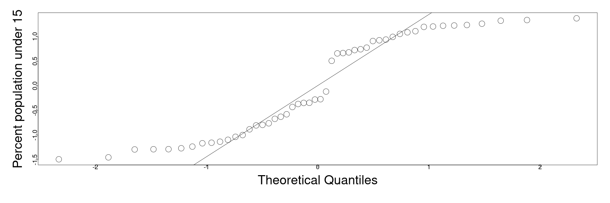
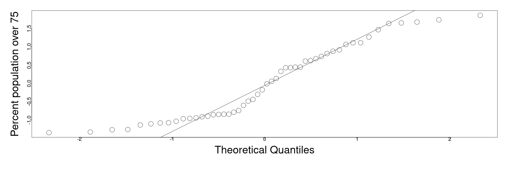
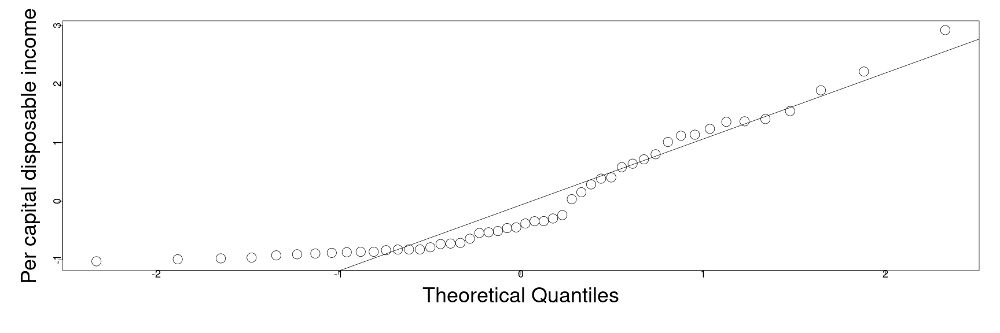
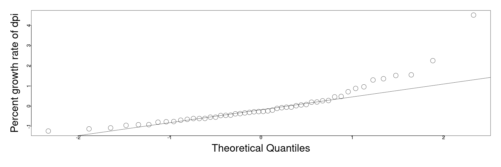
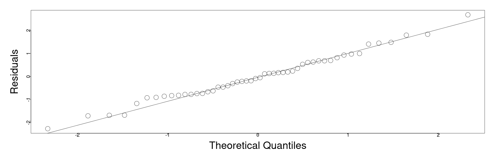

<style>
.section .reveal .state-background {
   background: #ffffff;
}
.section .reveal h1,
.section .reveal h2,
.section .reveal p {
   color: black;
   margin-top: 50px;
   text-align: center;
}
</style>

Diagnostics part 1: Gaussian error assumption
========================================================
date: 10/19/2020
autosize: true
incremental: true
width: 1920
height: 1080

<h2 style='color:black'>Instructions:</h2>
<p style='color:black'>Use the left and right arrow keys to navigate the presentation forward and backward respectively.  You can also use the arrows at the bottom right of the screen to navigate with a mouse.<br></p>

<blockquote>
FAIR USE ACT DISCLAIMER:</br>
This site is for educational purposes only.  This website may contain copyrighted material, the use of which has not been specifically authorized by the copyright holders. The material is made available on this website as a way to advance teaching, and copyright-protected materials are used to the extent necessary to make this class function in a distance learning environment.  The Fair Use Copyright Disclaimer is under section 107 of the Copyright Act of 1976, allowance is made for “fair use” for purposes such as criticism, comment, news reporting, teaching, scholarship, education and research.
</blockquote>

========================================================

<h2>Outline</h2>

* The following topics will be covered in this lecture:
  * The iterative process of regression -- a review
  * Diagnostics of four different assumptions
  * Diagnostics for the Gaussian error assumption
  * Q-Q plots and visual diagnostics
  * Hypothesis testing for Gaussian distributions


========================================================


## Diagnostics

<ul> 
  <li> Our analysis and methodology for:</li>

  <ol>
    <li> fitting a linear model; </li>
    <li> forecasting predictions from a linear model;</li>
    <li> explaning the relationships between variables in a linear model; and</li>
    <li>quantifying the uncertainty of a linear model</li>
  </ol>
</ul>
* all rely on several assumptions, e.g., the conditions for the Gauss Markov theorem and usually Gaussianity of the errors.

* Methods for checking and validating these assumptions are known as <b>diagnostics</b>.

* Typically, we will start with one model as a best first guess.

* Performing diagnostics will reveal issues in the  model, and suggest ways for improvement.

* Building a model is thus usually an interactive, iterative process, where we will create and perform diagnostics over a succession of models.

========================================================

<h3>Constructing a regression model -- an iterative process</h3>
 
 
<div style="float:left; width:30%">
<p style="text-align:center"> Courtesy of: Kutner, M. et al. Applied Linear Statistical Models 5th Edition</p>
</div>
<div style="float:left; width:70%">
<ul>
  <li>This iterative process is represented by the flow chart on the left.</li>
  <li>We must clean the data and perform exploratory analysis to determine relationships between the response, possible predictors, and the between the predictors themselves.</li>
  <ul>
    <li>This step, which we have largely suppressed so far, can actually be one of the larger pieces of work in regression analysis.</li>
    <li>This will be introduced to a certain extent in the midterm and final projects.</li>
    <li>It will be critical to understand the relationships between the variables to identify correlations / multicollinearity, as it affects our framework.</li>
    <li> Understanding the spread of the data will affect our inferences as it relates to extrapolation.</li>
    <li> Being aware of nonlinear scaling in the data (e.g., suggesting a log or square root transform) will also affect our analysis.</li>
    <li>Similarly, we should be aware of multi-modality in the data, as well as aspects of skewness in distributions.</li>
    <li> Deciding the appropriate specification of categorical variables in the model is another way exploratory analysis affects the model selection.</li>
    <li>Finally, identifying unusual observations as well as erroneous and missing data is a key aspect to a realistic analysis.</li>
  </ul>
  <li>This exploratory analysis helps us to develop one or more possible regression models for the study.</li>
</ul>
</div>


========================================================

<h3>Constructing a regression model -- an iterative process</h3>
 
 
<div style="float:left; width:50%">
<p style="text-align:center"> Courtesy of: Kutner, M. et al. Applied Linear Statistical Models 5th Edition</p>
</div>
<div style="float:left; width:50%">
<ul>
  <li> From the point of the last diagram, we can take our tentative models and evaluate if they are suitable for the problem and data.</li>
  <li> If not, we revise and repeat, possibly applying a different framework all together.</li>
  <li> If so, we compare the competing models and explanations for those that are most robust to the uncertainty in accurately identifying a statistical relationship and drawing conclusions from it.</li>
  <li>We will test the models in various ways to see if our framework's assumptions are well-satisfied, that the models are not overfit to the training data and that we can draw the same conclusions in the presence of confounding variables.</li>
  <ul>
    <li>Note, even when we feel quite confident in the model, it is key to <b>qualify our inferences by the uncertainty of the model</b>, e.g., providing confidence intervals.</li> 
  </ul>
  <li> The first two parts of this course have focused on building the theory and studying the application of regression in the situation in which the GM assumptions are well satisfied and there exists a good linear signal in the data.</li>
</ul>
</div>


========================================================

### Diagnostics -- continued

<ul> 
  <li> In the next part of the course, we will consider 4 categories of potential issues with the model:</li>
  <ol>
  <li>Issues with the Gaussian error assumption: our hypothesis testing studied thus far relies on the Gaussian error assumption.</li>
    <ul>
      <li>This is an assumption that will not cause huge issues if it is not satisfied exactly due to the central limit theorem; however, we should be cautious about the use of some hypothesis testing and careful in our judgement if inferences therein will be accurate when this assumption is not satisfied.</li>
      <li>Other courses, or further reading the in the book, will contain more information on how to handle significant departures from Gaussianity, but this is the least of important assumptions as the least squares estimate will still be the BLUE without it.</li>
    </ul>
    <li> Issues with the form of the hypothetical covariance:  we has assumed that 
    $$\mathrm{cov}\left(\mathbf{Y}\right) = \sigma^2\mathbf{I}$$
    but for many cases this will not be true.</li>
    <ul>
      <li>Handling deviations from this assumption will lead to various techniques of transformation, including generalized least squares.</li>
    </ul>
    <li> Issues with unusual observations: some of the observations may not look like others, and they might change the choice and the fit of the model.</li>
    <ul>
      <li>It is important thus to understand how to identify, interpret and treat the effects of influential and unusual observations.</li>
    </ul>
    <li> Issues with the systematic part of the model: we have assumed that there is an actual signal in the data of the form
    $$\begin{align}
    \mathbb{E}[\mathbf{Y}] = \mathbf{X} \boldsymbol{\beta},
    \end{align}$$
    which may not be valid.</li>
    <ul>
      <li>Additionally, this doesn't address the multiple competing models we may choose, nor the issue of overfitting in their selection.</li>
    </ul>
  </ol>
</ul>


========================================================
## Reviewing the Gaussian error assumption

<ul>
  <li>We will begin our discussion of diagnostics with the Gaussian error assumption.</li>
  <li>Although our model may still represent the BLUE without this assumption, we will not be able make use of certain tests without this.</li>
  <li>The hypothesis testing and confidence interval procedures we have learned are based upon assumptions of Gaussian errors.</li>
  <li>For the need to quantify the uncertainty of our model, its explanations and predictions, we should be aware of when it is appropriate or not to make conclusions based on these assumptions.</li>
  <li>The central limit theorem assures that asymptotically in the sample size $n$, $\hat{\boldsymbol{\beta}}$ will be Gaussian distributed about the true parameter values, regardless of the underlying $\boldsymbol{\epsilon}$.</li>
  <li>There is no universal number $n_0$ for the minimum sample size to apply the central limit theorem; for close-to-normal data, the sample size can be quite small and is often take $n_0\approx 30$.</li>
  <li>In the case of strong departures from the Gaussian error assumption, however, $n$ may need quite large, on the order of hundreds of observations.</li>
  <li>Therefore, to gain more corroborating evidence that we can trust our confidence intervals and hypothesis tests, we will often want to quantify if there are strong departures from Gaussian distributions, especially in the context of smaller sample sizes.</li>
  <li>Let us recall, if $\boldsymbol{\epsilon}$ is Gaussian distributed, $\hat{\boldsymbol{\epsilon}}$ will be as well.</li>
  <li>Therefore, we can take
  $$\begin{align}
  H_0: \boldsymbol{\epsilon} \sim N(\boldsymbol{0},\sigma^2 \mathbf{I}) & & H_1 : \boldsymbol{\epsilon} \text{ non Gaussian}
  \end{align}$$
  and study the residuals to determine if we have significant departures from the null hypothesis.</li>
</ul>


========================================================

### Tests for Gaussianity


<div style="float:left; width:40%">
<p style="text-align:center">
Courtesy of Inductiveload via <a href="https://upload.wikimedia.org/wikipedia/commons/c/ca/Normal_Distribution_CDF.svg" target="blank">Wikimedia Commons</a> </p>
</div>
<div style="float:left; width:60%">
<ul>
  <li>An extremely useful tool to assess the Gaussianity of the error is a quantile-quantile <b>(Q-Q)</b> plot.</li>
  <li>To define a Q-Q plot, we will consider the <b>theoretical</b> versus the <b>empirical</b> values for such a plot.</li>
  <li>Suppose we have two probability measures $P_1$ and $P_2$.</li>
  <li>Let each probability have a corresponding cumulative distribution function <b>(CDF)</b> given by $C_1$ and $C_2$ respectively. </li>
  <li>Recall, the CDF of a probability measure $P$ is defined,
  $$\begin{align}
  C(x) \triangleq& P(X \leq x )\\
   \equiv& \int_{-\infty}^x f(t) dt,
  \end{align}$$
  whenever $P$ has a continuous probability density function $f(t)$
  </li>
  <li> On the left, we illustrate this with the CDF of the normal distribution with several different parameters.</li>
  
</ul>
</div>


========================================================

### Quantile-Quantile plots

* Given the two probability measures $P_1,P_2$, and their respective CDF's, we can define their theoretical Q-Q plot as the graph of the $\mathbb{R}^2$ valued function,
  
  $$\begin{align}
  G:&[0,1]  &\mapsto &\mathbb{R}^2& \\
    &p      &\mapsto &(C_1^{-1}(p), C_2^{-1}(p)) & 
  \end{align}$$

  *  Suppose $p$ is a particular quantile, e.g., $p=50\%$.  Then the map $G$ takes $p$ to the point in the plane, $(x_1, x_2)$, for which
    $$\begin{align}
    P_1(X \leq x_1) &= 50\% \\
    P_2(X \leq x_2) &= 50\%
    \end{align}$$

* <b>Q:</b> in the above, what does the point $(x_1,x_2)$ correspond to?

  * <b>A:</b> The point $(x_1,x_2)$ is just the plot of the medians of the two distributions in the plane.
  
* <b>Q:</b> What kind of shape do we expect for the plot when the two CDFs are equal? 

  * <b>A:</b> If the two CDFs are equal, $C_1 = C_2$, the Q-Q plot of $G$ is just the straight line with slope one through the origin.

========================================================

### Quantile-Quantile plots

* Suppose that $P_1,P_2$ represent the same family of probability measures, such that their CDFs differ only by location and shape, i.e.,     
   * suppose $C_1(x) = C_2\left(\frac{x - \mu}{\sigma}\right)$.  
   * Then $C_1^{-1}(p) \equiv \mu +  \sigma C_2^{-1}(p)$, and there is a linear relationship between the quantiles of the two measures.
   
* Therefore, if two distributions differ only in location and scale,
  
  * e.g., $X_1 \sim N(0,1)$ and $X_2 \sim N(\mu, \sigma^2)$,
  
* the Q-Q plot is just a straight line with slope $\sigma$ and intercept $\mu$.

* For this reason, when making a Q-Q plot, the CDFs (and/or the data) are typically standardized to be mean zero and variance one.

* By doing so, when measuring two distributions in the same family (as above), the Q-Q plot will just be the central diagonal of the plane.

========================================================

### Quantile-Quantile plots

<ul>
  <li>Typically, we will use the Q-Q plot to make a visual inspection of the empirical quantiles of our data versus the theoretical quantiles of a target distribution.</li>
  <li> Let's suppose that we have a sample $\left\{X_i\right\}_{i=1}^n$ distributed according to $C_2$ where $C_2$ is an unknown CDF.</li>
  <li> Suppose that we <em>hypothesize</em> $C_2 = C_1$ for some known, theoretical distribution $C_1$.  That is,

  $$\begin{align}
  H_0: C_1 = C_2 \\
  H_1: C_1 \neq C_2
  \end{align}$$</li>
  
  <li>We will make a hypothesis test as above where, </li>
  <ol>
    <li>if the Q-Q plot of the empirical versus theoretical CDF is "almost" the central diagonal, </li>
    <li>we will <em>tentatively</em> fail to reject the null hypothesis.</li>
  </ol>
  <li>Recall, that the inverse of the CDF applied to $50\%$, $C^{-1}\left(50\%\right)$, is just the median.  </li>
  <li><b>Q:</b> Given observations $\left\{x_i\right\}_{i=1}^n$ of the random sample above, how do we compute the empirical inverse CDF?</li>
  <li><b>A:</b> For the observations of the sample $\left\{x_i\right\}_{i=1}^n$, the inverse of the empirical CDF is simply the re-ordered values such that $x_i \leq x_{i+1}$ for all $i=1,\cdots, n-1$.</li>
</ul>


========================================================

### Quantile-Quantile plots

* With sample size $n$, we can make $n$ plotting positions for the inverse of the empirical and theoretical CDF, i.e., we can plot the points,

  $$\begin{align}
  \left\{\left(C_1^{-1}\left(\frac{i}{n+1}\right), x_i\right) \in \mathbb{R}^2:  i = 1,\cdots,n \right\}
  \end{align}$$

  * <b>Q:</b> Notice, we do not compute $C_1^{-1}\left(1\right)$, what would be the possible issue with this plot?
  * <b>A:</b>  If, for instance, $X_1 \sim N(\mu, \sigma^2)$, then $C_1^{-1}(1)= \infty$.
  
  * Generally, some adjustment must be made in the above equation including, e.g., the $n+1$ as the denominator. 
  * Several different approximations can be made, but some adjustment is unavoidable.
  * For a sufficiently large, independent, identically distributed sample, the approximation won't make a very large difference, but will keep the plot finite. 
  * Note: evaluating the hypothesis test,
  
  $$\begin{align}
  H_0: C_1 = C_2 \\
  H_1: C_1 \neq C_2
  \end{align}$$</li>
  
  using the empirical versus theoretical CDF in the Q-Q plot is very close to the Kolmogorov-Smirnov test.
  
* The Kolmogorov-Smirnov test follows a similar principle and can be used generally to evaluate the divergence of the empirical CDF of a sample of observations from a hypothesized CDF.

========================================================
### Reading Q-Q plots
<div style="float:left; width:100%">
<div style="float:left; width:35%;text-align:center;">

</div>
<div style="float:right; width:35%;text-align:center;">

</div>
<div style="float:left; width:100%">
<p style="text-align:center">
Courtesy of <a href="https://stats.stackexchange.com/users/805/glen-b-reinstate-monica" target="blank">Glen_b</a> via the <a href="https://stats.stackexchange.com/q/101290" target="blank">Stack Exchange</a>
</div>
</div>
<div style="float:left; width:100%">
<ul>
  <li>We will now look at a few  simulated examples of Q-Q plots to give a sense of how to read them and diagnose different kinds of departures from Gaussian distributions.</li>
  <li>Note: Q-Q plots are powerful, but are sensitive to the tails of distributions. </li>
<li>It can be hard at times to tell at times if the tails that lie off the diagonal are truly from a heavy-tailed distribution, or if these are simply outliers in otherwise well-behaved data.</li>
  <li>In the plots above, we see what data would look like <strong>drawn from a Gaussian in a normal Q-Q plot</strong>:</li>
  <ul>
    <li><b>left:</b> "on average" over all possible realizations of a given sample size $n$; and</li>
    <li><b>right:</b> given a particular realization of some sample size $n$.</li>
  </ul>
</ul>
</div>

========================================================
### Reading Q-Q plots
<div style="float:left; width:100%">
<div style="float:left; width:35%;text-align:center;">

</div>
<div style="float:right; width:35%;text-align:center;">

</div>
<div style="float:left; width:100%">
<p style="text-align:center">
Courtesy of <a href="https://stats.stackexchange.com/users/805/glen-b-reinstate-monica" target="blank">Glen_b</a> via the <a href="https://stats.stackexchange.com/q/101290" target="blank">Stack Exchange</a>
</div>
</div>
<div style="float:left; width:100%">
<ul>
  <li>In the plots above, we see what data would look like <strong>drawn from a bimodal distribution in a normal Q-Q plot</strong>:</li>
  <ul>
    <li><b>left:</b> "on average" over all possible realizations of a given sample size $n$; and</li>
    <li><b>right:</b> given a particular realization of some sample size $n$.</li>
  </ul>
</ul>
</div>


========================================================
### Reading Q-Q plots
<div style="float:left; width:100%">
<div style="float:left; width:35%;text-align:center;">

</div>
<div style="float:right; width:35%;text-align:center;">

</div>
<div style="float:left; width:100%">
<p style="text-align:center">
Courtesy of <a href="https://stats.stackexchange.com/users/805/glen-b-reinstate-monica" target="blank">Glen_b</a> via the <a href="https://stats.stackexchange.com/q/101290" target="blank">Stack Exchange</a>
</div>
</div>
<div style="float:left; width:100%">
<ul>
  <li>In the plots above, we see what data would look like <strong>drawn from a heavy tailed distribution in a normal Q-Q plot</strong>:</li>
  <ul>
    <li><b>left:</b> "on average" over all possible realizations of a given sample size $n$; and</li>
    <li><b>right:</b> given a particular realization of some sample size $n$.</li>
  </ul>
</ul>
</div>

========================================================
### Reading Q-Q plots

<div style="float:left; width:100%">
<div style="float:left; width:35%;text-align:center;">

</div>
<div style="float:right; width:35%;text-align:center;">

</div>
<div style="float:left; width:100%">
<p style="text-align:center">
Courtesy of <a href="https://stats.stackexchange.com/users/805/glen-b-reinstate-monica" target="blank">Glen_b</a> via the <a href="https://stats.stackexchange.com/q/101290" target="blank">Stack Exchange</a>
</div>
</div>
<div style="float:left; width:100%">
<ul>
  <li>In the plots above, we see what data would look like drawn from a <strong>light tailed distribution in a normal Q-Q plot</strong>:</li>
  <ul>
    <li><b>left:</b> "on average" over all possible realizations of a given sample size $n$; and</li>
    <li><b>right:</b> given a particular realization of some sample size $n$.</li>
  </ul>
</ul>
</div>

========================================================
### Reading Q-Q plots

<div style="float:left; width:100%">
<div style="float:left; width:35%;text-align:center;">

</div>
<div style="float:right; width:35%;text-align:center;">

</div>
<div style="float:left; width:100%">
<p style="text-align:center">
Courtesy of <a href="https://stats.stackexchange.com/users/805/glen-b-reinstate-monica" target="blank">Glen_b</a> via the <a href="https://stats.stackexchange.com/q/101290" target="blank">Stack Exchange</a>
</div>
</div>
<div style="float:left; width:100%">
<ul>
  <li>In the plots above, we see what data would look like <strong>drawn from a left skewed distribution in a normal Q-Q plot</strong>:</li>
  <ul>
    <li><b>left:</b> "on average" over all possible realizations of a given sample size $n$; and</li>
    <li><b>right:</b> given a particular realization of some sample size $n$.</li>
  </ul>
</ul>
</div>


========================================================
### Reading Q-Q plots

<div style="float:left; width:100%">
<div style="float:left; width:35%;text-align:center;">

</div>
<div style="float:right; width:35%;text-align:center;">

</div>
<div style="float:left; width:100%">
<p style="text-align:center">
Courtesy of <a href="https://stats.stackexchange.com/users/805/glen-b-reinstate-monica" target="blank">Glen_b</a> via the <a href="https://stats.stackexchange.com/q/101290" target="blank">Stack Exchange</a>
</div>
</div>
<div style="float:left; width:100%">
<ul>
  <li>In the plots above, we see what data would look like <strong>drawn from a right skewed distribution in a normal Q-Q plot</strong>:</li>
  <ul>
    <li><b>left:</b> "on average" over all possible realizations of a given sample size $n$; and</li>
    <li><b>right:</b> given a particular realization of some sample size $n$.</li>
  </ul>
</ul>
</div>


========================================================

<h2> An example of Q-Q plots</h2>

* We will consider the "savings" dataset, listing the average savings rate, age demographics and per capita incomes of fifty countries averaged over 1960 -1970.


```r
library("faraway")
str(savings)
```

```
'data.frame':	50 obs. of  5 variables:
 $ sr   : num  11.43 12.07 13.17 5.75 12.88 ...
 $ pop15: num  29.4 23.3 23.8 41.9 42.2 ...
 $ pop75: num  2.87 4.41 4.43 1.67 0.83 2.85 1.34 0.67 1.06 1.14 ...
 $ dpi  : num  2330 1508 2108 189 728 ...
 $ ddpi : num  2.87 3.93 3.82 0.22 4.56 2.43 2.67 6.51 3.08 2.8 ...
```

* <b>sr</b> - is the savings rate, calculated as personal savings divided by disposable income;

* <b>pop15</b> - is the percent of the countries' populations under age 15;
 
* <b>pop75</b> - is the percent of the countries' populations over age 75;
 
* <b>dip</b> - is the per-capita disposable income in dollars;

* <b>ddpi</b> - is the percent growth rate of dpi.


========================================================
### An example of Q-Q plots

* Recall, for the response variable we have 50 observations taken of *sample averages* of the savings rate for various countries taken over the 1960's.

* <b>Q:</b> regarding a key theorem, what does this suggest about the distribution of the data response variable?

* <b>A:</b> sample averages tend to be normal by the central limit theorem, so this supports the idea Gaussian error distributions.


```r
par(mai=c(1.5,1.5,.5,.5), mgp=c(3,0,0))
qqnorm(scale(savings$sr),ylab="Savings rate", main="",  cex=3, cex.lab=3, cex.axis=1.5)
qqline(scale(savings$sr))
```


========================================================
### An example of Q-Q plots

* However, not all of the variables seem to be normally distributed


```r
par(mai=c(1.5,1.5,.5,.5), mgp=c(3,0,0))
qqnorm(scale(savings$pop15),ylab="Percent population under 15", main="",  cex=3, cex.lab=3, cex.axis=1.5)
qqline(scale(savings$pop15))
```



========================================================
### An example of Q-Q plots


```r
par(mai=c(1.5,1.5,.5,.5), mgp=c(3,0,0))
qqnorm(scale(savings$pop75),ylab="Percent population over 75", main="",  cex=3, cex.lab=3, cex.axis=1.5)
qqline(scale(savings$pop75))
```




========================================================
### An example of Q-Q plots


```r
par(mai=c(1.5,1.5,.5,.5), mgp=c(3,0,0))
qqnorm(scale(savings$dpi),ylab="Per capital disposable income", main="",  cex=3, cex.lab=3, cex.axis=1.5)
qqline(scale(savings$dpi))
```




========================================================
### An example of Q-Q plots


```r
par(mai=c(1.5,1.5,.5,.5), mgp=c(3,0,0))
qqnorm(scale(savings$ddpi),ylab="Percent growth rate of dpi", main="",  cex=3, cex.lab=3, cex.axis=1.5)
qqline(scale(savings$ddpi))
```




========================================================
### An example of Q-Q plots


```r
lmod <- lm(sr ~ pop15+pop75+dpi+ddpi,savings)
summary(lmod)
```

```

Call:
lm(formula = sr ~ pop15 + pop75 + dpi + ddpi, data = savings)

Residuals:
    Min      1Q  Median      3Q     Max 
-8.2422 -2.6857 -0.2488  2.4280  9.7509 

Coefficients:
              Estimate Std. Error t value Pr(>|t|)    
(Intercept) 28.5660865  7.3545161   3.884 0.000334 ***
pop15       -0.4611931  0.1446422  -3.189 0.002603 ** 
pop75       -1.6914977  1.0835989  -1.561 0.125530    
dpi         -0.0003369  0.0009311  -0.362 0.719173    
ddpi         0.4096949  0.1961971   2.088 0.042471 *  
---
Signif. codes:  0 '***' 0.001 '**' 0.01 '*' 0.05 '.' 0.1 ' ' 1

Residual standard error: 3.803 on 45 degrees of freedom
Multiple R-squared:  0.3385,	Adjusted R-squared:  0.2797 
F-statistic: 5.756 on 4 and 45 DF,  p-value: 0.0007904
```


========================================================

### An example of Q-Q plots


* We want to test the Gaussian error assumption, so here we perform the Q-Q plot with respect to the residuals:


```r
par(mai=c(1.5,1.5,.5,.5), mgp=c(3,0,0))
qqnorm(scale(residuals(lmod)),ylab="Residuals", main="",  cex=3, cex.lab=3, cex.axis=1.5)
qqline(scale(residuals(lmod)))
```



* <b>Q:</b> can you conjecture if we would accept the residuals as following a Gaussian distribution based on the above plot?

* Here, the residuals <em>appear</em> to be sufficiently Gaussian.

========================================================

### Shapiro-Wilk test


* We can numerically test the Gaussianity of the residuals with the Shapiro-Wilk test, validating our Q-Q plot.  

* Given a sample $\left\{X_i\right\}_{i=1}^n$, the Shapiro-Wilk test computes how likely it would be to observe a test statistic for the hypothesis test:

  $$\begin{align}
  H_0: &X_i \sim N\left(\mu_X,\sigma^2_X\right)\\
  H_1: &X_i \hspace{2mm}\text{not Gaussian distributed}
  \end{align}$$
  
* The derivation goes beyond the scope of this discussion, and we compute this in R simply as:


```r
shapiro.test(residuals(lmod))
```

```

	Shapiro-Wilk normality test

data:  residuals(lmod)
W = 0.98698, p-value = 0.8524
```

* <b>Q:</b> does this support the notion that the residuals are Gaussian?

  * <b>A:</b> we fail to reject the null, i.e., that they appear to be Gaussian.

* Note: without performing a Q-Q plot before hand, we can't diagnose what possible issues may exist by the p-value alone.

* Generally, a Q-Q plot will give insight into the structure that might not otherwise be detected.


========================================================

## Gaussianity assumptions

* We note that Gaussianity of the error wasn't required by the Gauss-Markov theorem, rather this gauranteed that least-squares was the <emph>maximum likelihood estimator</em>.

* Additionally, our confidence intervals and hypothesis tests utilized the Gaussian assumption on the error.

* Without Gaussianity of the errors, least-squares is still the best linear unbiased estimator, but we may find that a linear model in itself is not appropriate or that a biased estimator may perform better.

* However, we can sometimes make due "OK" with slightly innacurate uncertainty quantification, if the <b>sample sizes are sufficiently large</b>...
  
* Particularly, the hypothesis testing and confidence intervals we have developed can be understood as good approximations due to the Central Limit Theorem.


========================================================

### A summary of issues with non-Gaussianity

* Generally, when facing a non-Gaussian error distribution the solution will depend on the types of issues detected.

* For a large number of observations, we can usually ignore issues of non-Gaussianity for uncertainty quantification due to the Central Limit Theorem.

* This is also often the case for short-tailed distributions.

* For skewed distributions, a nonlinear transformation of the response may alleviate the issue, 
  
  * e.g., log transformation or square-root.

* For long-tailed distributions, we may need to use robust regression, which we will not cover in this class but is discussed in the course reference books.

