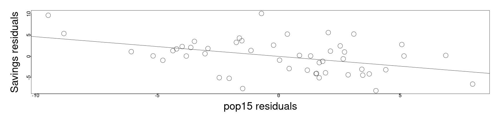
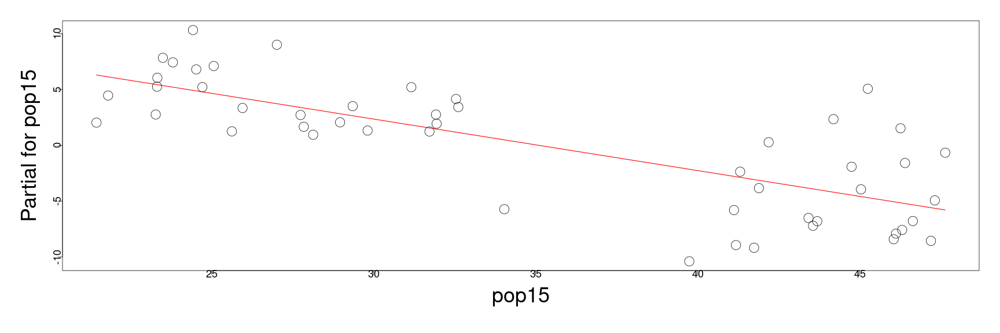
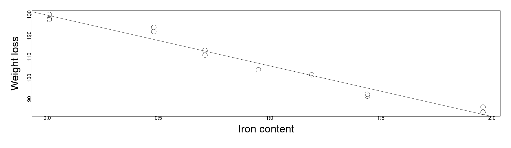
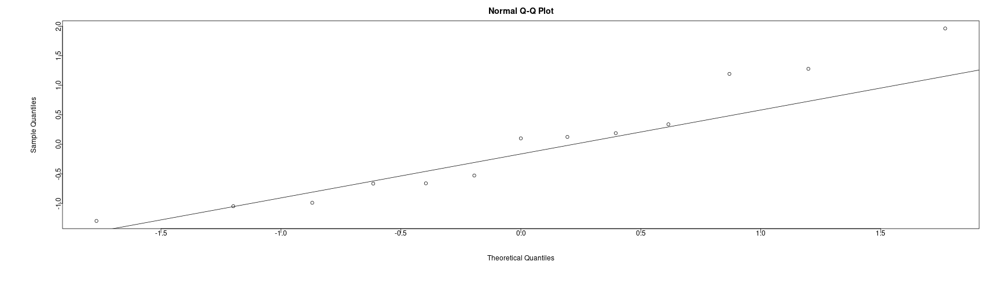
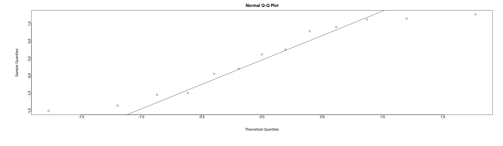
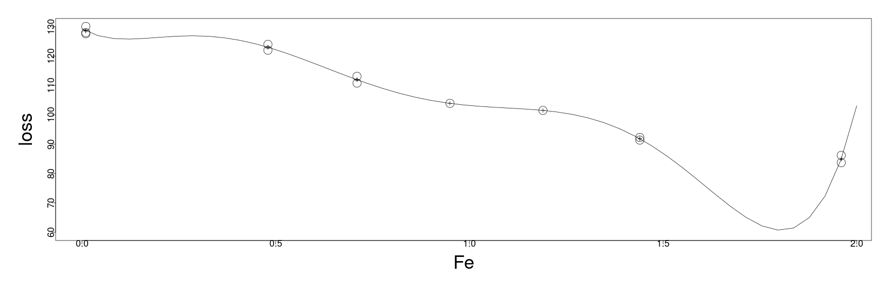
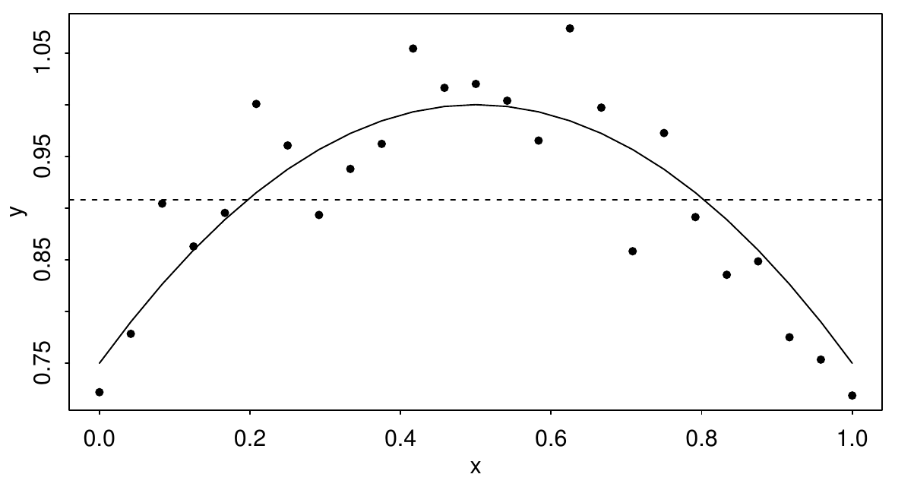

<style>
.section .reveal .state-background {
   background: #ffffff;
}
.section .reveal h1,
.section .reveal h2,
.section .reveal p {
   color: black;
   margin-top: 50px;
   text-align: center;
}
</style>

Diagnostics part 4: model structure and goodness of fit
========================================================
date: 10/28/2020
autosize: true
incremental: true
width: 1920
height: 1080

<h2 style='color:black'>Instructions:</h2>
<p style='color:black'>Use the left and right arrow keys to navigate the presentation forward and backward respectively.  You can also use the arrows at the bottom right of the screen to navigate with a mouse.<br></p>

<blockquote>
FAIR USE ACT DISCLAIMER:</br>
This site is for educational purposes only.  This website may contain copyrighted material, the use of which has not been specifically authorized by the copyright holders. The material is made available on this website as a way to advance teaching, and copyright-protected materials are used to the extent necessary to make this class function in a distance learning environment.  The Fair Use Copyright Disclaimer is under section 107 of the Copyright Act of 1976, allowance is made for “fair use” for purposes such as criticism, comment, news reporting, teaching, scholarship, education and research.
</blockquote>

========================================================

<h2>Outline</h2>

* The following topics will be covered in this lecture:
  * Partial regression plots
  * Partial residual plots
  * Testing for lack of fit
  * A summary of diagnostics


========================================================
## Diagnostics

<ul> 
  <li> We are considering 4 categories of potential issues with the model:</li>
  <ol>
  <li>Issues with the Gaussian error assumption: our hypothesis testing studied thus far relies on the Gaussian error assumption.</li>
  <li> Issues with the form of the hypothetical covariance:  we have assumed that 
    $$\mathrm{cov}\left(\mathbf{Y}\right) = \sigma^2\mathbf{I}$$
    but for many cases this will not be true.</li>
  <li> Issues with unusual observations: some of the observations may not look like others, and they might change the choice and the fit of the model.</li>
  <li> Issues with the systematic part of the model: we have assumed that there is an actual signal in the data of the form
    $$\begin{align}
    \mathbb{E}[\mathbf{Y}] = \mathbf{X} \boldsymbol{\beta},
    \end{align}$$
    which may not be valid.</li>
    </ol>
</ul>


========================================================

<h2>Checking model structure</h2>

* We will now begin to consider the structural part of the signal, and if this is correctly specified.

* In order to check the structural assumption on the model, i.e.,

  $$\begin{align}
  \mathbf{Y} = \mathbf{X} \boldsymbol{\beta} + \boldsymbol{\epsilon},
  \end{align}$$

  it is often a good first diagnostic to examine the 2D plot of the variable $Y$ versus $X_i$ for each variable $X_i$.
  
* However, when there are multiple explanatory variables of interest, this kind of plot is limited;

  * specifically, it lacks any explanation of how the response $Y$ and the particular explanatory variable $X_i$ will vary with respect to other variables simultaneously.
  
* We may instead consider <em>partial regression</em> plots.

* Particularly, consider the following definitions:

  <ol>
    <li>Let $\hat{\boldsymbol{\delta}}$ be the vector of residuals defined for the predicted values of $\mathbf{Y}$ when $X_i$ is not included as an explanatory variable.</li>
    <li>Let $\hat{\boldsymbol{\gamma}}$ be the vector of residuals defined for the predicted values of $X_i$ regressed in terms of the <em>other explanatory variables</em></li>
  </ol>

* Then together, this allows us to approximate the effect of $X_i$ on $Y$ with the effect of the other variables taken out.

* We'll demonstrate this with the savings data...

========================================================

### Partial regression plot


```r
library("faraway")
lmod <- lm(sr ~ pop15 + pop75 + dpi + ddpi,savings)
d <- residuals(lm(sr ~ pop75 + dpi + ddpi,savings))
m <- residuals(lm(pop15 ~ pop75 + dpi + ddpi,savings))
par(mai=c(1.5,1.5,.5,.5), mgp=c(3,0,0))
plot(m,d,xlab="pop15 residuals",ylab="Savings residuals", cex=3, cex.lab=3, cex.axis=1.5)
abline(0,coef(lmod)['pop15'])
```



* The slope of the line is given precisely by the coefficient for "pop15" in the full model, describing the trend of the partial regression.

* This type of plot is typically used for outlier and influential detection; here nothing is particularly troubling.

========================================================

### Partial residual plot

* Additionally, we can consider a <em>partial residual</em> plot, not to be confused with the last.

* Partial residual plots are a similar, alternative type of plot that are more frequently used for nonlinearity detection.

* We can consider, in a different derivation, the effect of the response with the other variables removed.

* The residual of the case $Y_i$ regressing on all variables except for $X_k$, is given

  $$\begin{align}
  Y_i - \sum_{j\neq k}X_{i,j} \hat{\beta}_j &= \hat{Y}_i + \hat{\epsilon}_i - \sum_{j\neq k}X_{i,j} \hat{\beta}_j \\
  &=X_{i,k} \hat{\beta}_k + \hat{\epsilon}_i
  \end{align}$$
  
* Particularly, we can then plot, $X_{i,k} \hat{\beta}_k + \hat{\epsilon}_i$ versus $X_{i,k}$, varying the case index $i$, where the slope and the interpretation with the last plot is the same.

* This is easy to do automatically in R, using the function "termplot"...

========================================================

### Partial residual plot

* The partial residual plot below actually is in terms of the anomaly model, centered at the mean:


```r
par(mai=c(1.5,1.5,.5,.5), mgp=c(3,0,0))
termplot(lmod, partial.resid=TRUE, terms=1,  cex=3, cex.lab=3, cex.axis=1.5, col.res="black")
```



* Distinct from the previous plot, we see the previously observed two sub-groups emerging with high and low percent population below 15.

* Though both plots are meant to describe the dependence of the response on the variable "pop15" with all other factors removed, the second plot here better isolates the structure.

========================================================

### Checking model structure

* Particularly, fitting the response in terms of the two groups separately, we see that for the group with high youth populations, there is almost no fit, but a reasonable fit for the small youth population.


```r
mod1 <- lm(sr ~ pop15+pop75+dpi+ddpi,savings,subset=(pop15 > 35))
mod2 <- lm(sr ~ pop15+pop75+dpi+ddpi,savings,subset=(pop15 < 35))
sumary(mod1)
```

```
               Estimate  Std. Error t value Pr(>|t|)
(Intercept) -2.43396890 21.15502778 -0.1151   0.9097
pop15        0.27385369  0.43919097  0.6235   0.5408
pop75       -3.54847686  3.03328065 -1.1698   0.2573
dpi          0.00042076  0.00500007  0.0842   0.9339
ddpi         0.39547422  0.29010124  1.3632   0.1896

n = 23, p = 5, Residual SE = 4.45441, R-Squared = 0.16
```

```r
sumary(mod2)
```

```
               Estimate  Std. Error t value Pr(>|t|)
(Intercept) 23.96179499  8.08375019  2.9642 0.007164
pop15       -0.38589762  0.19536859 -1.9752 0.060921
pop75       -1.32774213  0.92606273 -1.4337 0.165705
dpi         -0.00045881  0.00072372 -0.6340 0.532640
ddpi         0.88439443  0.29534055  2.9945 0.006679

n = 27, p = 5, Residual SE = 2.77167, R-Squared = 0.51
```

========================================================

### Checking model structure


* From the (earlier) extensive diagonostic analysis on the savings data, we find that the difference in the fit is unlikely due to outliers in the data, but due to a structural component.


```r
mod1 <- lm(sr ~ pop15+pop75+dpi+ddpi,savings,subset=(pop15 > 35))
mod2 <- lm(sr ~ pop15+pop75+dpi+ddpi,savings,subset=(pop15 < 35))
sumary(mod1)
```

```
               Estimate  Std. Error t value Pr(>|t|)
(Intercept) -2.43396890 21.15502778 -0.1151   0.9097
pop15        0.27385369  0.43919097  0.6235   0.5408
pop75       -3.54847686  3.03328065 -1.1698   0.2573
dpi          0.00042076  0.00500007  0.0842   0.9339
ddpi         0.39547422  0.29010124  1.3632   0.1896

n = 23, p = 5, Residual SE = 4.45441, R-Squared = 0.16
```

```r
sumary(mod2)
```

```
               Estimate  Std. Error t value Pr(>|t|)
(Intercept) 23.96179499  8.08375019  2.9642 0.007164
pop15       -0.38589762  0.19536859 -1.9752 0.060921
pop75       -1.32774213  0.92606273 -1.4337 0.165705
dpi         -0.00045881  0.00072372 -0.6340 0.532640
ddpi         0.88439443  0.29534055  2.9945 0.006679

n = 27, p = 5, Residual SE = 2.77167, R-Squared = 0.51
```


========================================================

### Checking model structure

* We have seen the very different fit of the model on the two different blocks of countries with different variances between the groups;

  * this analysis suggests that we might create a new binary categorical variable that identifies a country in one sub-population or the other.
  
* This kind of analysis is important as we have seen how a mis-specified model in the `teengamb` data (a simple encoding versus the mixed effect of `sex`) can greatly change the conclusions we make about the trend in the data.

* Using the variety of diagnostics we have on this model, we have a more complete picture about how to approach the relationships.

* The partial residual plots helped especially to determine if the form of the model,
  
  $$\mathbf{Y} = \mathbf{X}\boldsymbol{\beta} + \boldsymbol{\epsilon}$$

  is a reasonable hypothesis in the first place.
  


========================================================

<h2>Testing for lack of fit</h2>

* Recall, when our assumptions (e.g., G-M) hold then the residual standard error,

  $$\begin{align}
  \hat{\sigma}^2 \triangleq \frac{\hat{\boldsymbol{\epsilon}}^\mathrm{T} \hat{\boldsymbol{\epsilon}}}{n-p} 
  \end{align}$$

  is an unbiased estimate of the true variance $\sigma^2$ of the error.
  
* However, we have now seen many ways how these assumptions can break down.

  * When the model doesn't have the appropriate structure or is not complex enough to fit the data, we will typically overestimate $\sigma^2$ with the emprical $\hat{\sigma}^2$;
  
  * likewise, if we over parameterize the model, then $\hat{\sigma}^2$ will typically underestimate the true variance $\sigma^2$.
  
* In an ideal sittuation, where we may actually know $\sigma^2$, comparing the two values would lead us to understanding the fit of the model by our empirical estimate versus the known value.

  * One example may be when we have only measurement errors for the observations with known variance in their measurments.

* By the same principle, we may more generally get a good estimate of $\sigma^2$ when we have multiple observations of the response for the same values of the explanatory variables.

========================================================

### Testing for lack of fit

* We note that this requires an assumption of the <b>independence</b> of the measurements.

  * That is to say, we need to require that we have multiple independent observations corresponding to the same value of the explanatory variable.
  
* For example, we may be measuring blood presssure as the response variable and using age, height, weight, and other measurements as the explanatory varibles in a model.

* It won't suffice to re-measure the same individual to obtain an estimate of $\sigma^2$ as this will only measure the within-subjet variability.

* Rather, we would need to find multiple individuals with the same measurements for the explanatory varibles to estimate the variance $\sigma^2$ of the error around the signal.

* We call these multiple, independent observations of the response, with the identical explanatory variables <b>replicates</b>.

========================================================

### Replicates

* Suppose we are in the case of simple regression to simplify our discussion.

* Let $Y_{ij}$ be the $i$-th observation of the $j$-th group of replicates.

  * This is to say that all observations in the collection $\{Y_{ij}\}_{i=1}^{k_j}$ correspond to the same value of the predictor $X_j$ and $\{X_j\}_{j=1}^{K}$ will be a set of the measured values for the predictor.
  
  
* Define the mean over all replicates in the $j$-the group as $\overline{Y}_j$; then we can then estimate $\sigma^2$ independently of the regression model as

  $$\begin{align}
   \frac{\sum_{j}\sum_{i}\left(Y_{ij} - \overline{Y}_{j}\right)^2}{\sum_j \left( \{\text{number of replicates of type }j\} - 1\right)}   &=\frac{\sum_{j}\sum_{i}\left(Y_{ij} - \overline{Y}_{j}\right)^2}{n - \text{number of groups}}
  \end{align}$$
  
* The estimate given above is known as the <b>pure error</b>.

* We can formulate a test for lack of fit in terms of the ratio of the two estimates for variance, i.e.,
<ol>
  <li> the estimate by the pure error above;</li>
  <li> and the regression based estimate of $\hat{\sigma}^2$.</li>
  
<b>Q:</b> what test statistic can we use to test if two empirical variances match?

<b>A:</b> this can be done with the F-test.

========================================================

### F-test for checking for lack of fit

* A convenient way to perform the last F-test is as follows:

 1. We may fit a model in which each value for a replicate group is treated as a factor;
 
 2. by treating these as a categorical factor, our model becomes saturated as there will be one parameter in the model per replicate group;
 
 3. the fitted value for each group of replicates will be given as the mean for this group of replicates;
 
 4. while this doesn't provide a model for explaining the phenomenon, the standard error of this dummy model is equal to the pure error;
 
 5. thus, we can use the F-test in an ANOVA table to compare the regression model standard error with the pure error.

* We will demonstrate this process in an example.

========================================================

<h3> An example of testing for lack of fit</h3>

* We can perform a lack of fit test with the corrosion data in the Faraway package, studying the loss of weight in samples of copper/ nickel alloy, due to corrosion, when placed in sea water. 


```r
library("faraway")
head(corrosion)
```

```
    Fe  loss
1 0.01 127.6
2 0.48 124.0
3 0.71 110.8
4 0.95 103.9
5 1.19 101.5
6 0.01 130.1
```

* Each sample has varying ammounts of iron, and the loss is measured in terms of milligrams per day.

* We fit a simple regression model for the rate of loss per day based on the iron content:


```r
lmod <- lm(loss ~ Fe, corrosion)
sumary(lmod)
```

```
            Estimate Std. Error t value  Pr(>|t|)
(Intercept) 129.7866     1.4027  92.524 < 2.2e-16
Fe          -24.0199     1.2798 -18.769 1.055e-09

n = 13, p = 2, Residual SE = 3.05778, R-Squared = 0.97
```

========================================================

### F-test for checking for lack of fit

* We plot the simple regression along with the data points:


```r
par(mai=c(1.5,1.5,.5,.5), mgp=c(3,0,0))
plot(loss ~ Fe, corrosion,xlab="Iron content",ylab="Weight loss",  cex=3, cex.lab=3, cex.axis=1.5)
abline(coef(lmod))
```



* although the $R^2$ value is strong, and the fit looks "OK" we want to test this intuition more formally.

========================================================

### F-test for checking for lack of fit

```r
lmod <- lm(loss ~ Fe, corrosion)
par(mai=c(1.5,1.5,.5,.5), mgp=c(3,0,0))
qqnorm(scale(residuals(lmod)))
qqline(scale(residuals(lmod)))
```



```r
shapiro.test(residuals(lmod))
```

```

	Shapiro-Wilk normality test

data:  residuals(lmod)
W = 0.93304, p-value = 0.3733
```

========================================================

### F-test for checking for lack of fit

```r
par(mai=c(1.5,1.5,.5,.5), mgp=c(3,0,0))
qqnorm(scale(corrosion$loss))
qqline(scale(corrosion$loss))
```



```r
shapiro.test(corrosion$loss)
```

```

	Shapiro-Wilk normality test

data:  corrosion$loss
W = 0.91198, p-value = 0.1952
```


========================================================

### F-test for checking for lack of fit

* Here, in the ANOVA table, the null hypothesis is that the standard error estimate and the pure error estimate are empirical variances that approximate the same $\sigma^2$.

* The alternative hypothesis is that these do not estimate the same quantity, i.e., that the regression model lacks fit.

  * In particular, this would say that the form of the model,
    
    $$\begin{align}
    \mathbf{Y} = \mathbf{X} \boldsymbol{\beta} + \boldsymbol{\epsilon}
    \end{align}$$
    
    is not an accurate form for the model, as the pure error doesn't match the error given by this formulation. 

========================================================

### F-test for checking for lack of fit


```r
lmoda <- lm(loss ~ factor(Fe), corrosion)
sqrt(sum(lmoda$residuals^2)/lmoda$df.residual)
```

```
[1] 1.401289
```

```r
sqrt(sum(lmod$residuals^2)/lmod$df.residual)
```

```
[1] 3.05778
```

```r
anova(lmod, lmoda)
```

```
Analysis of Variance Table

Model 1: loss ~ Fe
Model 2: loss ~ factor(Fe)
  Res.Df     RSS Df Sum of Sq      F   Pr(>F)   
1     11 102.850                                
2      6  11.782  5    91.069 9.2756 0.008623 **
---
Signif. codes:  0 '***' 0.001 '**' 0.01 '*' 0.05 '.' 0.1 ' ' 1
```

* Due to the extremely small p-value, we reject the null at $5\%$ significance.

* In particular, data estimated standard deviation is $\approx 1.4$, while the regression estimate is significantly larger at $3.06$.

* In this case, it appears that there is still a structural issue in the model itself, which makes the $R^2$ misleading.

========================================================

## Evaluating goodness of fit

* A more general question is of how close of a fit to the data is actually appropriate for the problem at hand.

* By including up to sixth degree polynomial terms in the explanatory variable, we can acheive an almost perfect fit, but the model is completely unphysical and clearly will lack any inference power.


```r
par(mai=c(1.5,1.5,.5,.5), mgp=c(3,0,0))
lmodp <- lm(loss ~ Fe+I(Fe^2)+I(Fe^3)+I(Fe^4)+I(Fe^5)+I(Fe^6),corrosion)
plot(loss ~ Fe,  data=corrosion,ylim=c(60,130), cex=3, cex.lab=3, cex.axis=1.5)
points(corrosion$Fe,fitted(lmoda),pch=3)
grid <- seq(0,2,len=50)
lines(grid,predict(lmodp, data.frame(Fe=grid)))
```



========================================================

### Evaluating goodness of fit

<div style="width:60%; float:left">

</div>
<div style="width:40%; float:left">
<ul>
  <li> In the previous example, including higher order terms increased the $R^2$ value significantly, but became a case of obvious over-fitting. </li>
  <li> In general, we cannot fixate too much on $R^2$ for this reason, but we must be aware of the structure of the data and the model.</li>
  <li> In a different example, to the left, it is natural to use quadratic terms in the explanatory variable, rather than linear;</li>
  <li> a model that is linear in the explanatory variable, versus quadratic, will overestimate $\sigma^2$ via $\hat{\sigma}^2$, but the model that is quadratic in $x$ will be unbiased.</li>
</ul>


========================================================

<h2> A summary of diagnostics</h2>

* The issues to check for in diagnostics are diverse, but also of differing importance for the analysis.

* Specifically, we will order these in terms of importance of consideration:

<ol>
  <li>Issues with the systematic part of the model.  If the (linear) signal between the explanatory variables and response isn't well posed, this analysis will be fundamentally misleading and our inferences and explanatory power will be biased.</li>
  <li> Correlation/ dependence $\boldsymbol{\epsilon}$.  In this case, there won't be as much information to extract from the data as appears from the size of the data.  The information can be redundant, and the inference flawed.</li>
  <li>Non-constant variance.  This is easier to test, and <b>doesn't bias the estimate of the parameters</b>, but dilutes our uncertainty quantification and our ability to make inference and explanation with the model.</li>
  <li>Gaussianity/ Normality of the error.  This isn't strictly necessary (and is not an assumption of the Gauss-Markov theorem), but our hypothesis tests and confidence intervals are built around this assumption.</li>
</ol>

* Remediation of the above can take many different forms.  

  * For the first part, we should evaluate the context of the model itself and the feasibility of the relationship.  Also, we should evaluate if the response and the explanatory variables are in the correct (possibly relative) scales of interest to form the relationship.
  
  * Again, for correlation, there aren't good general tests, and we have to bear the problem structure in mind for spatial/ temporal/ batch correlation of observations.
  
  * Gaussianity, we don't have to worry about too much provided we have sufficiently many observations (central limit theorem) or e.g., short tailed distributions.  For long tailed distributions, we can use robust regression methods.

