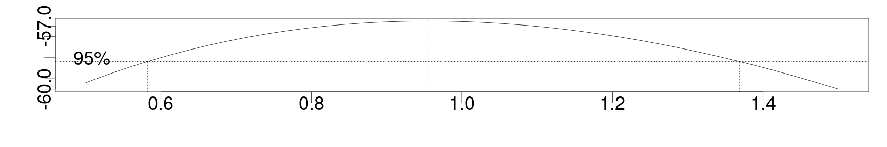
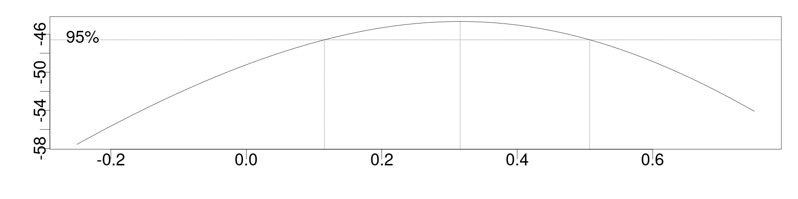
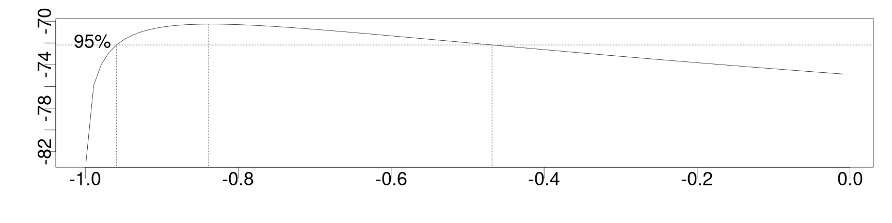
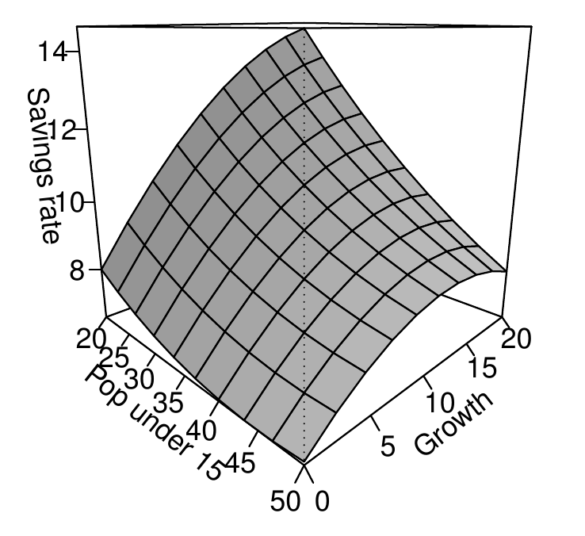

<style>
.section .reveal .state-background {
   background: #ffffff;
}
.section .reveal h1,
.section .reveal h2,
.section .reveal p {
   color: black;
   margin-top: 50px;
   text-align: center;
}
</style>

Nonlinear transformations
========================================================
date: 11/04/2020
autosize: true
incremental: true
width: 1920
height: 1080

<h2 style='color:black'>Instructions:</h2>
<p style='color:black'>Use the left and right arrow keys to navigate the presentation forward and backward respectively.  You can also use the arrows at the bottom right of the screen to navigate with a mouse.<br></p>

<blockquote>
FAIR USE ACT DISCLAIMER:</br>
This site is for educational purposes only.  This website may contain copyrighted material, the use of which has not been specifically authorized by the copyright holders. The material is made available on this website as a way to advance teaching, and copyright-protected materials are used to the extent necessary to make this class function in a distance learning environment.  The Fair Use Copyright Disclaimer is under section 107 of the Copyright Act of 1976, allowance is made for “fair use” for purposes such as criticism, comment, news reporting, teaching, scholarship, education and research.
</blockquote>

========================================================

<h2>Outline</h2>

* The following topics will be covered in this lecture:
  * Power transformations and the Box-Cox method
  * Shifted log transformations
  * Logit and Fisher-z transformations
  * Polynomial regression

========================================================


<h2>General considerations for the change of scale of the response</h2>

* We have so far introduced some basic notions of how scale transformations of the response can be used to handle:

  * non-constant variance in the variation of the response around the mean response; and
  * non-Gaussian error distributions.
  
* Typically, we have referred to power transformations, i.e.,
  
  $$Y \mapsto Y^\lambda$$
  
  for some $\lambda \in (0,1)$; or
  
* log transformations where we have,

  $$Y \mapsto \log(Y)$$
  
  and an associated multiplicative form for the regression in the original scale,
  
  $$Y = \mathrm{exp}\{\mathbf{X} \boldsymbol{\beta} + \boldsymbol{\epsilon}\}.$$
  
* Note that both of the above only make sense for non-negative (and for log, strictly positive) observations of the response variable.
  
* We will now introduce a systematic method for selecting such a transformation.
  

========================================================

<h2> Box-Cox Transformation</h2>

* The goal will be to find an "optimal" transformation problem with respect to some general form.

* The Box-Cox transformation is one particular way to perform this, which is defined only for positive data.

* We will suppose that there is some good form for the response that will solve issues around:
  1. non-constant variances of errors; and/or
  2. non-Gaussian errors;
  
 if we can find an appropriate parameter to do so.
 
* Our hypothesis function will be of the form,

  $$\begin{align}
  h_\lambda (Y)& = 
  \begin{cases}
  \Large{\frac{Y^\lambda -1}{\lambda} }& \text{if }\lambda \neq 0 \\ \\
  \log(Y) & \text{if } \lambda = 0
  \end{cases}
  \end{align}$$
  
  * the above transformation allows for both the possibility of a log transform or a square-root transform, albeit one with a transformation of location and slight re-scaling.
  
  * This is designed so that the function $h_\lambda$ converges to $\log$ when $\lambda \rightarrow 0$.

========================================================
### Box-Cox Transformation

* For any fixed value of $Y$ greater than zero, the function $h_\lambda$ is also continuous in the parameter value $\lambda$.

* In particular, we can try to maximize the likelihood of the known data (observations of $Y$) given all choices of $\lambda$;

* The log-likelihood function is given as,

  $$\begin{align}
  L(\lambda)& = -\frac{n}{2} \log\left(\frac{RSS_\lambda}{ n} \right) + \left( \lambda -1\right) \sum_{i=1}^n \log(Y_i)
  \end{align}$$
 
* Recall, because log is a monotonic function, maximizing the likelihood function is the same as maximizing the log-likelihood function --- we typically just use the log form for computational reasons. 
  
* The above function can be understood in several different competing parts:
  <ol>
    <li> The $RSS_\lambda$ is the residual sum of squares for the model when the response is given by $h_\lambda(Y)$ (the transformed variables). </li>
    <ul>
      <li> For small values of $RSS_\lambda$ normalized by $n$, the log will be negative, and therefor the term will become positive.</li>
    </ul>
    <li> The terms $(\lambda - 1)\sum_{i}^n \mathrm{log}(Y_i)$ will favor small $\lambda \leq 1$ when many of the observations are small and positive, while these will favor $\lambda\geq 1$ when many of the observations are large.</li>
  </ol>

* Using R, we can compute the maximizing value $\hat{\lambda}$ to decide on the best change of variables that is possible within this family of transformations.


========================================================

### Box-Cox Transformation

* We note however, that to interpret, we will typically reduce this to $Y^{[\lambda]}$ for $\lambda\neq 0$ where $[\lambda]$ will be a value rounded to something close by and sensible to interpret.

* Particularly, in order to interpret this transformation, we should consider a confidence interval for $\lambda$.

* For an optimally chosen $\hat{\lambda}$, the $100(1-\alpha)\%$ confidence interval is given as

  $$\begin{align}
  \left\{ \lambda :L(\lambda)  > L\left(\hat{\lambda}\right) - \frac{1}{2}{\chi_1^2}^{\left(1-\alpha\right)} \right\}
  \end{align}$$
 
 where 
 
   * $L$ is the same log-likelihood function as before;
   * ${\chi_1^2}^{(1-\alpha)}$ is the Chi-squared distribution critical value corresponding to the $\alpha$ critical value.
   
* The confidence interval thus gives some sense of what values are plausible to round to in the exponent of the response variable.
   
========================================================

<h3>An example of the Box-Cox transformation</h3>

* In R, the fitting of the appropriate value of $\hat{\lambda}$ can be performed simply using the `boxcox` function from the `MASS` library.

* This is demonstrated on the savings data -- the horizontal axis will be the value of the parameter $\lambda$ while the vertical axis will be the log-likelihood:


```r
library("MASS")
library("faraway")
par(cex=3, mai=c(1.5,1.5,.5,.5), mgp=c(3,0,0))
boxcox(lm(sr ~ pop15+pop75+dpi+ddpi,savings), plotit=T, lambda=seq(0.5,1.5,by=0.1))
```



* In the last transformation, the confidence interval was wide, containing values both greater and less than one, indicating that we cannot reject the null hypothesis, $Y\mapsto Y$.

  * Particularly, these have very different interpretations for the exponent, and we should not make any power transformation in this case.
  

========================================================

<h3>An example of the Box-Cox transformation</h3>

*  We can try a transformation instead on the Galapagos data,


```r
lmod <- lm(Species ~ Area + Elevation + Nearest + Scruz +Adjacent,gala)
par(cex=3, mai=c(1.5,1.5,.5,.5), mgp=c(3,0,0))
boxcox(lmod, lambda=seq(-0.25,0.75,by=0.05),plotit=T)
```



* <b>Q:</b>  in this case do we reject the null hypothesis (i.e., reject the hypothesis that no transformation is necessary)?


* <b>A:</b> in this case, we exclude the null hypothesis, and we can see that there is a reasonable choice of a cubic root transformation for the number of species.

  * A square root transformation is also just barely within our confidence interval, making this also a plausible choice.

========================================================

<h3> General considerations about Box-Cox transformations</h3>

<ol> 
  <li>Box-Cox transformations are sensitive to outliers, and high values of $\hat{\lambda}$ should be suspect.</li>
  <li>If some $Y_i$ <0, we can make the values positive by translating the data by a small constant --- this should be applied to all values.</li>
  <ul>
    <li>However, this is bit "hacky" and reduces the interpretability.</li>
  </ul>
  <li>If the overall spread of the data,
  $$\begin{align}
  \frac{\text{max}_i Y_i}{\text{min}_i Y_i}  
  \end{align}$$
  is not too large, transformation by powers has little effect on the overall regression. </li> 
  <ul>
    <li> For small enough range, polynomials can be well approximated by linear scales and therefore we don't expect much change if the relative scale is small.</li>
  </ul>
  <li>It is debatable if $\lambda$ should be considered a parameter in the number of degrees of freedom (and therefore in the measure of overfitting).</li> 
  <ul>
    <li>In general, we should only apply a transformation of scale when it is deemed absolutely necessary.</li>
    <li>We typically lose interpretability of the regression when we make transformations, and we should always transfer inferences back to the relevant scale of interest for the users.</li>
    <li>In doing so, we should qualify these results and determine if the scale has introduced "unphyiscal" interpretations of the paramters, predictions, etc...</li>
    <li>Of course, after making any such transformation we should re-run diagnostics to determin if this has had the intended effect.</li>
  </ul>
</ol>

========================================================

## Shifted-log transformations

* A similar family of transformations can be defined by a shifted log, i.e.,

  $$\begin{align}
  g_\alpha(Y) = \log\left(Y + \alpha\right)
  \end{align}$$

  * This again should be used for positive data but may be used in a "hacky" way with non-positive data.
  
* We will consider using this transformation on observations of the burning time of tobacco leaves, in the dataset "leafburn"


```r
head(leafburn)
```

```
  nitrogen chlorine potassium burntime
1     3.05     1.45      5.67      2.2
2     4.22     1.35      4.86      1.3
3     3.34     0.26      4.19      2.4
4     3.77     0.23      4.42      4.8
5     3.52     1.10      3.17      1.5
6     3.54     0.76      2.76      1.0
```

* Here the burn time is the response, while the leaves have various chemical charateristics that we want to regress on the response with.

* We will use the "logtrans" function also in the "MASS" library to perform a similar maximium likelihood optimization for the choice of $\alpha$ versus the data.

========================================================
  
### Shifted-log transformations  


```r
lmod <- lm(burntime ~ nitrogen+chlorine+potassium, leafburn)
par(cex=3, mai=c(1.5,1.5,.5,.5), mgp=c(3,0,0))
logtrans(lmod, plotit=TRUE, alpha=seq(-min(leafburn$burntime) +0.001,0,by=0.01))
```



* <b>Q:</b> is a (non-shifted) log transformation justified based on this confidence interval?

* <b>A:</b> The optimization procedure indicates that a log transformation of the response by itself isn't reasonable, as evidenced by excluding zero.

* However, it suggests that a negative shift by the parameter will make a log transformation reasonable.

* Physically, this may be interpreted as a lag-period before the burn can begin the log-scale combustion period.

========================================================

<h3> Additional transformations</h3>

* In special cases when we are looking at a response variable that is a percentage, we are already looking at a particular scale $Y\in [0,1]$.

* In these cases, we may also consider using a logit transformation of the response,

  $$\begin{align}
  \log\left(\frac{Y}{1 - Y}\right)
  \end{align}$$
  
  * this has the effect of moving the range of the response between $-\infty$ and $\infty$, which may help the issues of non-constant variances and non-Gaussianity.
  
* Logit and the inverse logit transformations are included in the `faraway` package as `logit` and `ilogit` respectively. 
  
* Fisher's z-transformation may also be worth considering,

  $$\begin{align}
  \frac{1}{2} \log\left(\frac{1+Y}{1-Y}\right),
  \end{align}$$
  which has the range $[0, \infty]$.
  
* In both cases above, we must take care to interpret the response (again) by transforming it back into the normal percentage values.

========================================================

<h2> Polynomial regression</h2>

* One way to increase the flexibility of our models is to include polynomial terms of the explanatory variables in the model.

* In the case of a simple regression,

  $$\begin{align}
  Y = \beta_0 + \beta_1 X + \epsilon,
  \end{align}$$
  
* We can increase the flexibility of the model by extending this relationship to

  $$\begin{align}
  Y = \beta_0 + \beta_1 X + \beta_2 X^2 + \cdots + \beta_d X^d + \epsilon.
  \end{align}$$
  
* We note that when doing so, this is qualitatively <b>different</b> than writing the model as,

  $$\begin{align}
  Y = \beta_0 + \beta_1 X^2 + \epsilon
  \end{align}$$
  
  which is equivalent to a change of scale for the explanatory variable.
  
* The choice of a polynomial regression is still a linear model, as the signal is linear in the estimated parameters.

  * However, the the interpretation differs when using a polynomial regression versus a change of scale.

========================================================
### Polynomial regression

* We usually do not believe the polynomial exactly represents any underlying reality, but it can allow us to model expected features of the relationship. 

  * This differs from a scale change in which there may be some transformation of scale that will rectify issues with the assumptions of the Gauss-Markov theorem.

* In the case of polynomial regression, we introduce additional flexibility in terms of resembling the signal in the original scale.

  * For instance,  a quadratic term allows for a predictor to have an optimal setting -- there may be a best temperature for baking bread, and we wish to model this relationship with the ability to find an optimal setting. 

  * Particularly, a hotter or colder temperature may result in a lower quality product. 
* If you believe a predictor behaves in this manner, it makes sense to add a quadratic term.

* However, we should be cognizant of how much flexibility we introduce into the relationship, to prevent overfitting.

========================================================

### Selecting the degree of the polynomial  

* Because the degree of the polynomial $d$ could be of arbitrary size, we should try to make the selection systematically.
  
* Firstly, we should not have a degree of polynomial even close to the number of observations --- this will generally lead to severe overfitting.
  
* Typically, we will then choose the degree by evaluating the number of parameters one at a time by their significance.

* If we start with a linear model ($d=1$) we can add higher order terms one at a time, stopping at the last $d$ for which the parameter $\beta_d$ is still significant.

========================================================

### Selecting the degree of the polynomial  


* If we start with a model of degree $d\geq2$, with some known nonlinear structure in mind, we can remove higher order terms.

* However, we should <b>always start with removing the highest term</b> whenever <b>any parameter is not significant</b>.

* Generally, the p-values for different degrees of polynomial terms will change in the presence / absence of other higher order terms.

  * With reduction of complexity in mind, we want to find the degree as low as possible in which all terms have significance.
  
* Supposed we have a cubic model of the form,

 $$\begin{align}
 Y = \beta_0 + \beta_1 X + \beta_2 X^2 + \beta_3 X^3  + \epsilon
 \end{align}$$
 in which  $\beta_3$ and$\beta_1$ are significant, while $\beta_2$ is not significant.
 
* If we remove the $X^2$ term,

 $$\begin{align}
 Y = \beta_0  + \beta_1 X + \beta_3 X^3 + \epsilon
 \end{align}$$
 we have an issue in terms of non-uniqueness in the form of the signal.
 
* Particularly, consider the alternative model in which we regress upon the anomalies of the predictor from its mean,

 $$\begin{align}
 Y = \beta_0  + \beta_1 (X - \overline{X}) + \beta_3 (X - \overline{X})^3 + \epsilon
 \end{align}$$
 we can see that in the expansion of terms, we re-introduce quadratic terms to the model.
 
* For this reason, we should respect the hierarchy of terms, and remove higher order terms first.


========================================================

### Selecting the degree of the polynomial  

* We will show the forward process with the savings data.


```r
sumary(lm(sr ~ ddpi,savings))
```

```
            Estimate Std. Error t value  Pr(>|t|)
(Intercept)  7.88302    1.01100  7.7972 4.465e-10
ddpi         0.47583    0.21462  2.2171   0.03139

n = 50, p = 2, Residual SE = 4.31145, R-Squared = 0.09
```

* As a simple regression, we see that the "ddpi" is significant as a linear term for the savings rate.


```r
sumary(lm(sr ~  ddpi+I(ddpi^2),savings))
```

```
             Estimate Std. Error t value  Pr(>|t|)
(Intercept)  5.130381   1.434715  3.5759 0.0008211
ddpi         1.757519   0.537724  3.2684 0.0020259
I(ddpi^2)   -0.092985   0.036123 -2.5741 0.0132617

n = 50, p = 3, Residual SE = 4.07902, R-Squared = 0.2
```

* Similarly for quadratic terms....

========================================================

### Selecting the degree of the polynomial  


```r
summary(lm(sr ~ ddpi+I(ddpi^2)+I(ddpi^3),savings))
```

```

Call:
lm(formula = sr ~ ddpi + I(ddpi^2) + I(ddpi^3), data = savings)

Residuals:
    Min      1Q  Median      3Q     Max 
-8.5571 -2.5575  0.5616  2.5756  7.7984 

Coefficients:
              Estimate Std. Error t value Pr(>|t|)  
(Intercept)  5.145e+00  2.199e+00   2.340   0.0237 *
ddpi         1.746e+00  1.380e+00   1.265   0.2123  
I(ddpi^2)   -9.097e-02  2.256e-01  -0.403   0.6886  
I(ddpi^3)   -8.497e-05  9.374e-03  -0.009   0.9928  
---
Signif. codes:  0 '***' 0.001 '**' 0.01 '*' 0.05 '.' 0.1 ' ' 1

Residual standard error: 4.123 on 46 degrees of freedom
Multiple R-squared:  0.205,	Adjusted R-squared:  0.1531 
F-statistic: 3.953 on 3 and 46 DF,  p-value: 0.01369
```

* However, the cubic term is the first term that is (incrementally) not significant; 

  * therefore, we select a maximal degree equal to $d=2$.

* Note that starting from quartic and moving downward through cubic would have given the same result.

========================================================

### Orthogonal polynomials 

* In general, fitting this repeatedly "by hand" is difficult, and numerically unstable.

* A special class of polynomials that are "orthogonal" can be used to perform this polynomial regression analysis at once, and in a stable way.

* These polynomials exist up to arbitrary degree, with specially selected coefficients,

 $$\begin{align}
 Z_1 =& a_1 + b_1X \\
 Z_2 =& a_2 + b_2 X + c_2 X^2\\
 Z_3 =& a_3 + b_3 X + c_3 X^2 + d_3 X^3\\
 \vdots &
 \end{align}$$
 such that as vectors  $\mathbf{Z}_i^\mathrm{T} \mathbf{Z}_j = 0$ when $i\neq j$.

* Particularly, we recall that if the predictors are orthogonal, we eliminate correlations between the variables.

  * This has the advantage of making the values of the parameters $\hat{\boldsymbol{\beta}}_d$ independent of the choice of the other variables.
  
* Therefore, we can evaluate the p-values of all parameters for arbitrary degree polynomials simultaneously.

  * The cost, however, is that the meaning of the predictors becomes far less interpretable.


========================================================

### Orthogonal polynomials


* The R function "poly" will compute the orthogonal polynomials to a specified degree, and this can be used for an effcient analysis,


```r
lmod <- lm(sr ~ poly(ddpi,4),savings)
sumary(lmod)
```

```
                 Estimate Std. Error t value Pr(>|t|)
(Intercept)      9.671000   0.584602 16.5429  < 2e-16
poly(ddpi, 4)1   9.558993   4.133760  2.3124  0.02539
poly(ddpi, 4)2 -10.499876   4.133760 -2.5400  0.01461
poly(ddpi, 4)3  -0.037374   4.133760 -0.0090  0.99283
poly(ddpi, 4)4   3.611968   4.133760  0.8738  0.38688

n = 50, p = 5, Residual SE = 4.13376, R-Squared = 0.22
```


========================================================

### Orthogonal polynomials

* Comparing with the earlier model, the regression in terms of up-to-cubic orthogonal polynomials has approximately the same p-values and estimated parameters:


```r
sumary(lm(sr ~ poly(ddpi,3),savings))
```

```
                 Estimate Std. Error t value Pr(>|t|)
(Intercept)      9.671000   0.583097 16.5856  < 2e-16
poly(ddpi, 3)1   9.558993   4.123119  2.3184  0.02493
poly(ddpi, 3)2 -10.499876   4.123119 -2.5466  0.01429
poly(ddpi, 3)3  -0.037374   4.123119 -0.0091  0.99281

n = 50, p = 4, Residual SE = 4.12312, R-Squared = 0.2
```

* Likewise, for the model in to up-to-quadratic terms:


```r
sumary(lm(sr ~ poly(ddpi,2),savings))
```

```
                Estimate Std. Error t value Pr(>|t|)
(Intercept)      9.67100    0.57686 16.7649  < 2e-16
poly(ddpi, 2)1   9.55899    4.07902  2.3435  0.02339
poly(ddpi, 2)2 -10.49988    4.07902 -2.5741  0.01326

n = 50, p = 3, Residual SE = 4.07902, R-Squared = 0.2
```


========================================================

## Multinomial regression

* The methods of polynomial regression will extend to multinomials in different variables.

* That is to say, we can write the response as a function,
 $$\begin{align}
 Y = \beta_0 + \beta_1 X_1 + \beta_2 X_2 + \beta_{11} X_1^2 + \beta_{22}X_2^2 + \beta_{12} X_1 X_2 
 \end{align}$$

* In R, this type of model can be implemented using the `polym` function as follows:


```r
lmod <- lm(sr ~ polym(pop15,ddpi,degree=2),savings)
```

* In two predictors, we can construct a surface plot for the response in the two variables.


```r
pop15r <- seq(20, 50, len=10)
ddpir <- seq(0, 20, len=10)
pgrid <- expand.grid(pop15=pop15r, ddpi=ddpir)
pv <- predict(lmod, pgrid)
persp(pop15r, ddpir, matrix(pv, 10, 10), theta=45, xlab="Pop under 15", ylab="Growth", zlab = "Savings rate", ticktype="detailed", shade = 0.25)
```

* This determines the range of values to be plotted on a $10 \times 10$ grid over the range of the predictors.

* We show this plot on the next slide...

========================================================

### Multinomial regression

<div style="float:left; width:40%">

<p style="text-align:center">Courtesy of: Faraway, J. Linear Models with R. 2nd Edition</p>
</div>
<div style="float:left; width: 60%">
<ul>
  <li>The plot to the left shows how the multinomial model includes interacting effects between variables in the response.</li>
  <li>Rather than the surface plot of only linear terms in the predictors (a plane), the surface in this case has a hyperbolic parabaloid shape.</li>
</ul>
</div>


========================================================

### Multinomial regression

* We can see the emergence of the hyperbolic parabaloid shape due to the opposite-signed terms in the model summary:


```r
sumary(lmod)
```

```
                                   Estimate Std. Error t value  Pr(>|t|)
(Intercept)                         9.61971    0.53426 18.0058 < 2.2e-16
polym(pop15, ddpi, degree = 2)1.0 -12.87961    4.01965 -3.2042  0.002521
polym(pop15, ddpi, degree = 2)2.0   2.03021    3.78872  0.5359  0.594757
polym(pop15, ddpi, degree = 2)0.1  12.68135    4.58240  2.7674  0.008234
polym(pop15, ddpi, degree = 2)1.1 -53.61660   39.14940 -1.3695  0.177781
polym(pop15, ddpi, degree = 2)0.2  -4.02887    4.48566 -0.8982  0.373986

n = 50, p = 6, Residual SE = 3.76848, R-Squared = 0.36
```

* Here, the powers in the two variables are listed in the format $a.b$ such that the significance of the parameter for the term $X_1^a X_2^b$, denoted $\beta_{ab}$, can be evaluated.

* In this case, we can see that the higher order terms (combined degree two or greater) lack significance and that we'd be better off to simplify the model into a linear regression on the two different variables.


========================================================

## A reivew of transformations

* With the Box-Cox transformation,

  $$\begin{align}
  h_\lambda (Y)& = 
  \begin{cases}
  \Large{\frac{Y^\lambda -1}{\lambda} }& \text{if }\lambda \neq 0 \\
  \log(Y) & \text{if } \lambda = 0
  \end{cases}
  \end{align}$$

 we have a way to systematically search for an "optimal" power transformation (or possibly log transformation) of the response when the <b>response is positive</b>.
 
*  Using a maximum likelihood approach, this finds the value $\lambda$ that best transforms the response above.

* We note, however, the actual value of $\lambda$ should be chosen by the confidence interval;

  * it is best to round $\lambda$ to a value that is easier to interpret, e.g., square root, cubic root, etc...

* We should also evaluate different reasonable values for the transformation based on the confidence interval.

========================================================

### A reivew of transformations

<ol> 
  <li>Box-Cox transformations are sensitive to outliers, and high values of $\hat{\lambda}$ should be suspect.</li>
  <li>If some $Y_i$ <0, we can make the values positive by translating the data by a small constant --- this should be applied to all values.</li>
  <ul>
    <li>However, this is bit "hacky" and reduces the interpretability.</li>
  </ul>
  <li>If the overall spread of the data,
  $$\begin{align}
  \frac{\text{max}_i Y_i}{\text{min}_i Y_i}  
  \end{align}$$
  is not too large, transformation by powers has little effect on the overall regression. </li> 
  <ul>
    <li> For small enough range, polynomials can be well approximated by linear scales and therefore we don't expect much change if the relative scale is small.</li>
  </ul>
  <li>It is debatable if $\lambda$ should be considered a parameter in the number of degrees of freedom (and therefore in the measure of overfitting).</li> 
  <ul>
    <li>In general, we should only apply a transformation of scale when it is deemed absolutely necessary.</li>
  </ul>
</ol>

========================================================

### A reivew of transformations

* In some special cases, we may also consider a shifted log transformation, in which we want to account for some kind of delay in the response, in log scale.

* For data on a small bounded interval, e.g., percentages, it can also make sense to try a logit transformation of the response,

  $$\begin{align}
  \log\left(\frac{Y}{1 - Y}\right)
  \end{align}$$
  
  * this has the effect of moving the range of the response between $-\infty$ and $\infty$, which may help the issues of non-constant variances and non-Gaussianity.
  
* Fisher's z-transformation may also be worth considering,

  $$\begin{align}
  \frac{1}{2} \log\left(\frac{1+Y}{1-Y}\right),
  \end{align}$$
  which has the range $[0, \infty]$.
  
* In both cases above, we must take care to interpret the response (again) by transforming it back into the normal percentage values.


========================================================

### A reivew polynomial regression

* Polynomial regression is qualitatively different that changing the scale of the predictor $X$.

* We can increase the flexibility of the model by extending a relationship to

  $$\begin{align}
  Y = \beta_0 + \beta_1 X + \beta_2 X^2 + \cdots + \beta_d X^d + \epsilon.
  \end{align}$$
  
* We note that when doing so, this is qualitatively <b>different</b> than writing the model as,

  $$\begin{align}
  Y = \beta_0 + \beta_1 X^2 + \epsilon
  \end{align}$$
  
  which is equivalent to a change of scale for the explanatory variable.
  
* The choice of a polynomial regression is still a linear model, as the signal is linear in the estimated parameters.

  * However, the the interpretation differs when using a polynomial regression versus a change of scale.


========================================================

### A reivew polynomial regression

* In particular for polynomial regression, it is better to remove higher degree terms rather than lower degree terms when a term lacks significance.

* We can choose to use orthogonal polynomials to evaluate arbitrary degrees of uncorrelated polynomial terms.

  * This can be used to obtain more stability of the result, but it comes with the cost that the meaning of the orthogonal polynomial predictors are harder to interpret.
  
* Multinomial regression is a simple extension of this, but we note, when any of the highest degree $d$ mixed or univariate terms do not have significance, we should remove all terms of degree $d$.

