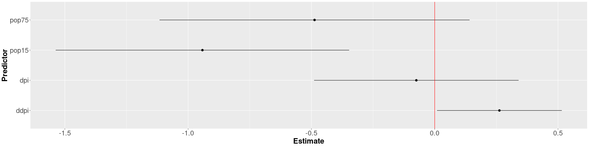

<style>
.section .reveal .state-background {
   background: #ffffff;
}
.section .reveal h1,
.section .reveal h2,
.section .reveal p {
   color: black;
   margin-top: 50px;
   text-align: center;
}
</style>

Model Selection
========================================================
date: 11/09/2020
autosize: true
incremental: true
width: 1920
height: 1080

<h2 style='color:black'>Instructions:</h2>
<p style='color:black'>Use the left and right arrow keys to navigate the presentation forward and backward respectively.  You can also use the arrows at the bottom right of the screen to navigate with a mouse.<br></p>

<blockquote>
FAIR USE ACT DISCLAIMER:</br>
This site is for educational purposes only.  This website may contain copyrighted material, the use of which has not been specifically authorized by the copyright holders. The material is made available on this website as a way to advance teaching, and copyright-protected materials are used to the extent necessary to make this class function in a distance learning environment.  The Fair Use Copyright Disclaimer is under section 107 of the Copyright Act of 1976, allowance is made for “fair use” for purposes such as criticism, comment, news reporting, teaching, scholarship, education and research.
</blockquote>

========================================================
## Outline 

* The following topics will be covered in this lecture:
  * Changes of scale for predictors
  * Handling multicollinearity
  * Criterion methods for model selection
  * Entropy and KL-divergence
  * AIC and BIC
  * Mallows Cp and adjusted R-squared


========================================================
## Changes of scale for the predictors

* Sometimes we want to change the scale of the variables. 

  * Perhaps we need to change the units of measurement, say from inches to centimeters. 

* A change of scale is often helpful when variables take values which are all very large or all very small.


* For example, we might find $\hat{\beta}_i = 0.000000351$. 

  * It can be misleading to deal with quantities like this because it’s easy to lose track of the number of leading zeroes.

* Humans deal better with interpreting moderate sized numbers like $\hat{\beta}_i = 3.51$. 

  * To avoid confusing yourself or your readers, a change of scale can be beneficial.

* In more extreme cases, a change of scale can be needed to ensure numerical stability. 

* Although many algorithms try to be robust against variables of widely different scales, it is possible to run into calculation errors. 
* Most methods work more reliably when variables are on roughly similar scales.

========================================================
### Changes of scale for the predictors

* Suppose we re-express $X_i$ as $(X_i + a)/b$. 

* Rescaling $X_i$ leaves the t- and F-tests and $\hat{\sigma}^2$ and $R^2$ unchanged and

  $$\hat{\beta}_i \mapsto  b\hat{\beta}_i.$$


* Rescaling $Y$ in the same way leaves the t- and F-tests and R2 unchanged, but $\hat{\sigma}$ and $\hat{\beta}$ will rescaled by $b$.

* To demonstrate this, we use the savings data:


```r
require(faraway)
lmod <- lm(sr ~ pop15+pop75+dpi+ddpi,savings)
sumary(lmod)
```

```
               Estimate  Std. Error t value  Pr(>|t|)
(Intercept) 28.56608654  7.35451611  3.8842 0.0003338
pop15       -0.46119315  0.14464222 -3.1885 0.0026030
pop75       -1.69149768  1.08359893 -1.5610 0.1255298
dpi         -0.00033690  0.00093111 -0.3618 0.7191732
ddpi         0.40969493  0.19619713  2.0882 0.0424711

n = 50, p = 5, Residual SE = 3.80267, R-Squared = 0.34
```

* The coefficient for income is rather small — let’s measure income in thousands of dollars instead and refit...


========================================================
### Changes of scale for the predictors


```r
lmod <- lm(sr ~ pop15+pop75+I(dpi/1000)+ddpi,savings)
sumary(lmod)
```

```
            Estimate Std. Error t value  Pr(>|t|)
(Intercept) 28.56609    7.35452  3.8842 0.0003338
pop15       -0.46119    0.14464 -3.1885 0.0026030
pop75       -1.69150    1.08360 -1.5610 0.1255298
I(dpi/1000) -0.33690    0.93111 -0.3618 0.7191732
ddpi         0.40969    0.19620  2.0882 0.0424711

n = 50, p = 5, Residual SE = 3.80267, R-Squared = 0.34
```


* <b>Q:</b> do you notice the difference in the coefficient?  What was the effect?

  * <b>A:</b> we indeed make the scale change for our coefficient $\hat{\beta}_{\mathrm{dpi}} \mapsto 1000 \hat{\beta}_{\mathrm{dpi}}$.
  
* Also note that the p-value for the parameter remains the same under the linear scale transformation.


========================================================
### Changes of scale for the predictors

* We may also consider standardizing all variables such that we pass to the model in the anomalies from the mean,


```r
scsav <- data.frame(scale(savings))
lmod <- lm(sr ~ ., scsav)
sumary(lmod)
```

```
               Estimate  Std. Error t value Pr(>|t|)
(Intercept)  4.2907e-16  1.2003e-01  0.0000 1.000000
pop15       -9.4204e-01  2.9545e-01 -3.1885 0.002603
pop75       -4.8731e-01  3.1218e-01 -1.5610 0.125530
dpi         -7.4508e-02  2.0592e-01 -0.3618 0.719173
ddpi         2.6243e-01  1.2567e-01  2.0882 0.042471

n = 50, p = 5, Residual SE = 0.84873, R-Squared = 0.34
```

* Notice that the intercept is zero in the above model. 

* This is because the regression plane always runs through the point of the averages, which because of the re-centering of the data, is now at the origin. 

* Such scaling has the advantage of putting all the predictors and the response on a comparable scale, which makes comparisons simpler.

* It also allows the coefficients to be viewed as a kind of partial correlation where the values will always be between minus one and one. 

* It also avoids some numerical problems that can arise when variables are of very different scales. 


========================================================
### Changes of scale for the predictors

* The interpretation effect of this scaling is that the regression coefficients now represent the effect of a one standard unit increase in the predictor on the response in standard units

  * this might or might not be easy to interpret.
  
* When the predictors are on comparable scales, it can be helpful to construct a plot of the estimates with confidence intervals:


```r
edf <- data.frame(coef(lmod), confint(lmod))[-1,]
names(edf) <- c("Estimate","lb","ub")
require(ggplot2)
p <- ggplot(aes(y=Estimate, ymin=lb, ymax=ub, x=row.names(edf)), data=edf) + geom_pointrange()
p + coord_flip() + xlab("Predictor")  + geom_hline(yintercept=0, col="red") + theme(axis.text=element_text(size=20), axis.title=element_text(size=22,face="bold"))
```




========================================================
## Handling multicollinearity

* We have discussed the issue already when some predictors are linear combinations of others, then $\mathbf{X}^\mathrm{T}\mathbf{X}$ is singular (noninvertible with eigenvalues equal to zero); 

  * this causes a fundamental lack of of identifiability. 
  
  * Another name for this problem is exact collinearity. 

* In this case, there is no unique least squares estimate of $\boldsymbol{\beta}$. 

* The solution may require removing some predictors to eliminate the dependence relationship between the predictors.

* A more challenging problem arises when $\mathbf{X}^\mathrm{T}\mathbf{X}$ is close to singular but not exactly so. 

* This is known as collinearity or sometimes, multicollinearity. 

* Collinearity leads to imprecise estimates of $\boldsymbol{\beta}$, in the sense that the estimated values $\hat{\boldsymbol{\beta}}$ with respect to the data by least squares will be of high variance under replication. 

* This can be loosely interpreted due to the fact that if $\mathbf{X}^\mathrm{T}\mathbf{X}$ has eigenvalues close to zero, we will get eigenvalues close to $+\infty$ in the inverse matrix.

* We will consider this fact as follows...

========================================================
### Handling multicollinearity

* Recall that for a positive-definite, symmetric matrix, $\mathbf{X}^\mathrm{T}\mathbf{X}$, we have the orthogonal eigen decomposition as

 $$\begin{align}
 \mathbf{X}^\mathrm{T}\mathbf{X}
  &= \mathbf{E} 
  \begin{pmatrix}
  \lambda_1 & 0 & 0  &\cdots & 0 \\
  0 & \lambda_2 &  0 &\cdots & 0 \\
  0 & 0 &  \lambda_3 & \cdots & 0 \\
  \vdots & \vdots & \ddots & \ddots & \vdots \\
  0 &  \cdots & \cdots & \cdots & \lambda_p
  \end{pmatrix} \mathbf{E}^\mathrm{T}
 \end{align}$$

* Therefore, we can consider the inverse of this matrix as

 $$\begin{align}
 \left(\mathbf{X}^\mathrm{T}\mathbf{X}\right)^{-1}
  &= \mathbf{E}^\mathrm{T}
  \begin{pmatrix}
  \frac{1}{\lambda_1} & 0 & 0  &\cdots & 0 \\
  0 & \frac{1}{\lambda_2} &  0 &\cdots & 0 \\
  0 & 0 &  \frac{1}{\lambda_3} & \cdots & 0 \\
  \vdots & \vdots & \ddots & \ddots & \vdots \\
  0 &  \cdots & \cdots & \cdots & \frac{1}{\lambda_p}
  \end{pmatrix} \mathbf{E}
 \end{align}$$
 
* Recalling that the covariance of the parameter estimates is given as $\sigma^2\left(\mathbf{X}^\mathrm{T}\mathbf{X}\right)^{-1}$, we can say that for an eigenvalue $\lambda \ll 1$, the variance of the parameter estimates will scale similar to $\sigma^2 \frac{1}{\lambda} \gg 1$.


========================================================
### Handling multicollinearity

<ul>
  <li> When we have high-multicollinearity, the signs of the coefficients can be the opposite of what intuition about the effect of the predictor might suggest. </li>
  <li> The standard errors are inflated as they scale similar to $\sigma^2 \frac{1}{\lambda} \gg 1$ so that t-tests may fail to reveal significant factors.</li>
  <li> Likewise, the fit becomes very sensitive to measurement errors where small changes in $Y$ can lead to large changes in $\hat{\boldsymbol{\beta}}$.</li>
  <li> Collinearity can be detected in several ways: 
  <ol>
    <li>Examination of the correlation matrix of the predictors may reveal values close to $−1$ or $+1$ indicating large pairwise collinearities.</li>
    <li> Examining the eigenvalues and the condition number of the matrix $\mathbf{X}^\mathrm{T}\mathbf{X}$
    $$\kappa = \sqrt{\frac{\lambda_1}{\lambda_p}}$$
    where $\lambda_1 \geq \cdots \geq \lambda_p$.</li>
    <ul>
      <li>The condition number $\kappa$ commonly used in numerical analysis and optimization is a measure of relative sensitivity to small changes in the predictor values, where $\kappa \geq 30$ is considered large.</li>
    </ul>
    <li> Let the regression of $X_i$ on all other predictors give the $R^2_i$;</li>
    <ul>
      <li>a $R^2_i$ close to one indicates a problem because it means one predictor can almost be predicted exactly by a linear combination of other predictors. </li>
      <li>The linear combination between the variables may be discovered by examining the regression coefficients of these regressions.</li>
    </ul>
  </ol>
</ul>

========================================================
### Handling multicollinearity

* The effects of collinearity can also be seen from the form for the variance of $\hat{\beta}_i$ as

  $$\begin{align}
  \mathrm{var}\left(\hat{\beta}_j\right) = \sigma^2\left(\frac{1}{1 - R_j^2}\right)\left(\frac{1}{s_j^2}\right)
  \end{align}$$
  where $s_{j}$ refers to the empirical standard deviation of the predictor $j$.

* We can see that if the predictor $X_j$ does not vary much, then the variance of $\hat{\beta}_j$ will be large. 

* If $R^2_j$ is close to one, then the variance inflation factor, defined as 
  $$\mathrm{VIF} = \left(1 − R^2_j\right)^{−1}$$
  will be large and so $\mathrm{var}\left(\hat{\beta}_j\right)$ will also be large.

* This equation also tells us which designs will minimize the variance of the regression coefficients if we have the ability to choose the levels of the predictor at which we observe $Y$. 

* Orthogonality means that $R^2_j = 0$ which minimizes the VIF. 

========================================================
### Handling multicollinearity

* With the variance given as,
  $$\begin{align}
  \mathrm{var}\left(\hat{\beta}_j\right) = \sigma^2\left(\frac{1}{1 - R_j^2}\right)\left(\frac{1}{s_j^2}\right)
  \end{align}$$
  we can also maximize the empirical standard deviation $s_{j}$ by spreading $X$ as much as possible. 

* The maximum is attained by placing half the points at the minimum practical value and half at the maximum. 
  
* Unfortunately, this design assumes the linearity of the effect and would make it impossible to check for any curvature in the signal with diagnostics. 

  * In practice, we might put some design points in the middle of the range to allow checking of the fit.


========================================================
### An example of multicollinearity

* Car drivers like to adjust the seat position for their own comfort. 

  * Car designers would find it helpful to know where different drivers will position the seat depending on their size and age. 

* Researchers at the HuMoSim laboratory at the University of Michigan collected data on 38 drivers. 

* They measured 
  1. age in years, 
  2. weight in pounds, 
  3. height with shoes and without shoes in centimeters, 
  4. seated height,
  5. arm length,
  6. thigh length, 
  7. lower leg length 
  8. and hipcenter, the horizontal distance of the midpoint of the hips from a fixed location in the car in millimeters. 

========================================================
### An example of multicollinearity

* We fit a model with all the predictors to find:


```r
lmod <- lm(hipcenter ~ ., seatpos)
sumary(lmod)
```

```
              Estimate Std. Error t value Pr(>|t|)
(Intercept) 436.432128 166.571619  2.6201  0.01384
Age           0.775716   0.570329  1.3601  0.18427
Weight        0.026313   0.330970  0.0795  0.93718
HtShoes      -2.692408   9.753035 -0.2761  0.78446
Ht            0.601345  10.129874  0.0594  0.95307
Seated        0.533752   3.761894  0.1419  0.88815
Arm          -1.328069   3.900197 -0.3405  0.73592
Thigh        -1.143119   2.660024 -0.4297  0.67056
Leg          -6.439046   4.713860 -1.3660  0.18245

n = 38, p = 9, Residual SE = 37.72029, R-Squared = 0.69
```

* This model already shows the signs of collinearity -- the $R^2$ is not small, but none of the individual predictors is significant. 


========================================================
### An example of multicollinearity

* We take a look at the pairwise correlations:


```r
round(cor(seatpos[,-9]),2)
```

```
          Age Weight HtShoes    Ht Seated  Arm Thigh   Leg
Age      1.00   0.08   -0.08 -0.09  -0.17 0.36  0.09 -0.04
Weight   0.08   1.00    0.83  0.83   0.78 0.70  0.57  0.78
HtShoes -0.08   0.83    1.00  1.00   0.93 0.75  0.72  0.91
Ht      -0.09   0.83    1.00  1.00   0.93 0.75  0.73  0.91
Seated  -0.17   0.78    0.93  0.93   1.00 0.63  0.61  0.81
Arm      0.36   0.70    0.75  0.75   0.63 1.00  0.67  0.75
Thigh    0.09   0.57    0.72  0.73   0.61 0.67  1.00  0.65
Leg     -0.04   0.78    0.91  0.91   0.81 0.75  0.65  1.00
```

* There are several large pairwise correlations between predictors -- now we check the
eigen decomposition of $\mathbf{X}^\mathrm{T}\mathbf{X}$ (not including the intercept in $\mathbf{X}$):


```r
x <- model.matrix(lmod)[,-1]
e <- eigen(t(x) %*% x)
e$val
```

```
[1] 3.653671e+06 2.147948e+04 9.043225e+03 2.989526e+02 1.483948e+02
[6] 8.117397e+01 5.336194e+01 7.298209e+00
```

* We do not see any eigenvalues extremely close to zero, but we should note that there is a sign of a large condition number $\kappa$

========================================================
### An example of multicollinearity

* Here we compute the condition number to find:


```r
sqrt(e$val[1]/e$val[ncol(x)])
```

```
[1] 707.5491
```

* This suggests substantial instability in these parameter estimates. 

* Measuring the `hipcenter` is difficult to do accurately and we can expect some variation in these values. 

* Suppose the measurement error had a standard deviation of 10 mm. 

* Let’s see what happens when we add a random perturbation of this size to the response:


```r
set.seed(0)
lmod_pert <- lm(hipcenter+10*rnorm(38) ~ ., seatpos)
```

========================================================
### An example of multicollinearity


```r
sumary(lmod)
```

```
              Estimate Std. Error t value Pr(>|t|)
(Intercept) 436.432128 166.571619  2.6201  0.01384
Age           0.775716   0.570329  1.3601  0.18427
Weight        0.026313   0.330970  0.0795  0.93718
HtShoes      -2.692408   9.753035 -0.2761  0.78446
Ht            0.601345  10.129874  0.0594  0.95307
Seated        0.533752   3.761894  0.1419  0.88815
Arm          -1.328069   3.900197 -0.3405  0.73592
Thigh        -1.143119   2.660024 -0.4297  0.67056
Leg          -6.439046   4.713860 -1.3660  0.18245

n = 38, p = 9, Residual SE = 37.72029, R-Squared = 0.69
```

```r
sumary(lmod_pert)
```

```
              Estimate Std. Error t value Pr(>|t|)
(Intercept) 435.425887 179.326940  2.4281  0.02161
Age           0.620563   0.614002  1.0107  0.32053
Weight       -0.024246   0.356315 -0.0680  0.94622
HtShoes       0.388580  10.499880  0.0370  0.97073
Ht           -2.597266  10.905575 -0.2382  0.81343
Seated        0.410076   4.049963  0.1013  0.92005
Arm          -1.861731   4.198857 -0.4434  0.66077
Thigh        -0.460554   2.863717 -0.1608  0.87335
Leg          -5.631988   5.074827 -1.1098  0.27621

n = 38, p = 9, Residual SE = 40.60874, R-Squared = 0.65
```


========================================================
### An example of multicollinearity

* Although the $R^2$ and standard error are very similar between the models, we see much larger changes in the coefficients often changing signs, indicating their sensitivity to the response values caused by the collinearity.


* We can also compute the VIF for all parameters:


```r
vif(x)
```

```
       Age     Weight    HtShoes         Ht     Seated        Arm      Thigh 
  1.997931   3.647030 307.429378 333.137832   8.951054   4.496368   2.762886 
       Leg 
  6.694291 
```

* We can interpret $\sqrt{307.4} = 17.5$ as telling us that the standard error for height with shoes is $17.5$ times larger than it would have been without collinearity. 

* We cannot apply this as a correction because we did not actually observe orthogonal data, but it does give us a sense of the size of the effect.

* We have too many variables that are trying to do the same job of explaining the response. 

* We can reduce the collinearity by carefully removing some of the variables.

* We can then make a more stable estimation of the coefficients and come to a more secure conclusion regarding the effect of the remaining predictors on the response.

* But we should not conclude that the variables we drop have nothing to do with the response.

========================================================
### An example of multicollinearity

* The effect of collinearity on prediction is less serious. 

* The accuracy of the prediction depends on where the prediction is to be made. 

* The greater the distance is from the observed data, the more unstable the prediction. 

* Of course, this is true for all data but collinear data covers a much smaller fraction of the the predictor space than it might first appear. 

* This means that predictions tend to be greater extrapolations than with data that are closer to the orthogonality.

* We can often handle this issue with respect to predictions by using techniques such as PCA / singular value decompositions for predictions;

  * we often will lose some interpetability with the principal components, but we can construct orthogonal predictors from the original data, selecting the most important parts. 

========================================================


## A review of model selection

* So far haven't derived any formal ways yet to systematically select a model from a wide range of variables, other than t-test, ANOVA and, now, in terms of removing highly collinear predictors.

* The primary issue with the p-value approach is that in doing so much multiple hypothesis testing, we are surely going to get false-positives and false-negatives in counting variables as significant or not.
  
  * Likewise, the relative p-values depend on the larger model in which we start from initially, so that these values will change and may become inflated when we trim to a smaller model.
  
  * The interpretation of such p-values also strongly depends on the correlation between the various predictors.
  
* While this is usually the first choice for model selection that we usually take, as we start empirically building an understanding of the data, this is somewhat "hacky" and has fundamental issues:
  <ol>
    <li> Doing this totally "by hand", we will typically miss an "optimum" that we might find by a more rigorous method.</li>
    <li> The final p-values can't be treated very literally, due to so much multiple testing.  Particularly, we will inflate the significance as we move along through selection</li>
    <li> Variables that are dropped by this selection process can't be said not to have an important effect, and we need to be careful to specify what was actually excluded in the end.</li>
    <li> Step-wise approaches may be over-agressive in the removal of variables for prediction purposes -- even if a parameter isn't strictly significant, there is a balance to be held with predictions and our ability to make some kind of useful prediction</li>
  </ol>
  
* We will now begin considering more formal ways of selecting variables  -- note, that in the following, aspects discussed already with respect to multicollinearity and scale changes should be considered simultaneously with the following methods.

========================================================
<h2>Model selection by criterion methods</h2>

* If we re-framed this somewhat abstractly, and supposed there was a way to measure "how-much-information" is added or lost when selecting certain variables, we might be able to make a more rigorous decision.

* A widely used idea in:
  1. physics;
  2. statistics;
  3. computer science;
  4. information theory;
  
  is the idea of <b>entropy</b>.

* This concept actually makes a concrete connection between the notion of chaos and uncertainty for physically driven models, and forms a fundamental link of interpretation for the predictability of systems of stochastic differential equations.

* The notion of predictability in statistical physics emphasizes that for small scales (e.g., water and air molecules) we are not concerned with the evolution of these individual states.

  * Rather, we are concerned with their statistical properties as a bulk motion of small and unobservable states.
  
* Predicting the weather, we do not care where each drop of rain will land but rather the probability of precipitation coverage over an area of interest.

========================================================

<h3> Entropy </h3>
  
* Entropy was originally developed as a concept in thermodymics, as the idea of "how many microscopic (unobservable) states are consistent with macroscopic (observable) constraints on the system?"

* In the context of of information, we can understand entropy similarly as the measure of possible unknowns (the total uncertainty) relative to what is known.

  * This can be loosely understood as the minimum unknown information needed to recover an unknown mincrostate given some known macrostate.
  
  * This is commonly used as a measure of the necessary information needed to recover a lossless, compressed signal in signal processing.
  
* In the context of regression (viewed as a kind of signal processing) we can view this likewise as a measure of how much uncertainty exists within one model versus another.

* One commonly used measure of the difference of entropy in one distribution versus another is the "Kullback-Leibler Divergence" (KL-divergence).

  * We remark, this is not to be considered a distance as it is <b>not symmetric</b>.
  
  * A more formal <b>distance</b> on probability distributions include Wasserstein Distances (earth-mover distances in image processing).
  
* Nonetheless, the KL-divergence is quite useful for deriving the relative uncertainty of different models with respect to an unknown, ideal signal in the data.
  
========================================================

<h3> KL-divergence</h3>

*  Suppose we had some idea of what the correct form of the model for the relationship should be in terms of some function $f$.

* Let us have a family of possible models $g_\theta$ that look like $f$, but has a dependence on a choice of parameter $\theta$.

  * Particularly, we will assume that whenever $f(x)= 0$ then $g_\theta(x) = 0$, such that the suppport of $g_\theta$ is contained within the support of $f$. 

* We will measure the Kullback-Leibler divergence of $f$ and $g_\theta$ as,

  $$\begin{align}
  I(f,g) \triangleq \int f(x) \log\left(\frac{f(x)}{g(x\vert \theta)}\right) \mathrm{d}x
  \end{align}$$
  
* This measures a kind of relative entropy of $f$ with respect to $g_\theta$, and in particular, the ammount of information lost between using the "true" form of the model $f$ and our choice of model $g_\theta$ (for some choice of $\theta$).

* We are thus interested in the above as a general criterion of minimizing the information lost from the true model with respect to our choice of a particular approximate form.

  * The quantity itself is positive for all choices of $g_\theta \neq f$ and zero when $g_\theta = f$.

* The main issue about the above is that we don't actually know $f$, and that this cannot be computed as it is written...

========================================================
### KL-divergence

* On the other hand, we can use a typical trick and use a maximum-likelihood estimate for $\theta$.

* Define $\hat{\theta}$ to be the maximum likelihood estimated value for the parameter $\theta$. 

*  We write  the equation at this parameter value as, 

  $$\begin{align}
  \hat{I}(f,g) = \int f(x) \log\left(f(x)\right)\mathrm{d}x - \int f(x) \log \left(g\left(x\vert \hat{\theta}\right) \right)\mathrm{d}x
  \end{align}$$
  
  simply by expanding in the log of the fraction.


  * Notice, while $f$ is an unkown model, we integrate out the values of $f$ over all possible values it attains, so the left term becomes a constant that we don't have to worry about in the selection of a model.
  
* Through we can approximate the integral around the MLE estimate as

  $$\begin{align}
  \mathbb{E}\left[\hat{I}\left(f,g\right)\right] \approx - \log\left(\mathcal{L}\left(\hat{\theta}\right)\right) + p + ``\text{some constant''},
  \end{align}$$
  where: 
  <ol>
    <li> the expectation can be understood as taking place over all possible random outcomes of the observations;</li>
    <li> $p$ is the number of parameters in the model;</li>
    <li> $\log\left(\mathcal{L}\left(\hat{\theta}\right)\right)$ is the log-likelihood of the best-choice of parameters for this model;
    <li> the constant is dependent on the unknown, true model, but doesn't affect our optimization procedure.</li>
  </ol>
  
========================================================

### Akaike information criterion

* Due to historical conventions, we define an AIC (Akaike Information Criterion) multiplying by 2 to get

  $$\begin{align}
  AIC = -2\log\left(\mathcal{L}\left(\hat{\theta}\right) \right)+ 2p
  \end{align}$$
  
* For linear regression models, the computation of $-2\log\left(\mathcal{L}\left(\hat{\theta}\right)\right)$ boils down to a computational form of the maximum log-likelihood,

  $$\begin{align}
  -2\log\left(\mathcal{L}\left(\hat{\theta}\right)\right) = n \log\left(\frac{RSS}{n}\right) + ``\text{some other constant"},
  \end{align}$$
  
  where:
  
  <ol>
    <li> the constants are the same for the same dataset; and</li>
    <li> the constants are the same for the same unkown, true model.</li>
  </ol>

* Therefore, when comparing models over the **same dataset**, we are safe to use this as a criterion for a "best" model.

* The goal then, with this criterion, is to minimize the AIC with respect to two competing factors:
  <ol>
   <li> Improve the fit, reducing the RSS, possibly by including more explanatory variables that add new information (variables that are not highly correlated);</li>
   <li> but not overfit, being penalized in terms of the number of parameters $p$.</li>
  </ol>

========================================================

<h3> Bayes Information Criterion</h3>

* There are many different possible criteria we can consider, of similar flavor to the above, for the model selection.

* The most well-known competitor is the Bayes Information Criterion (BIC) given of the form,

  $$\begin{align}
  \mathrm{BIC} \triangleq 2n \log\left(\frac{RSS}{n}\right) + p \log(n),
  \end{align}$$
  
  where again:
  
  <ol>
    <li>we try to minimize the RSS; and</li>
    <li>try not to overparameterize with the penalty for too many parameters $p$.</li>
  </ol>
  
* The BIC is extremely similar, but it has a stronger penalty term and favors simpler models overall.

* Very loosely speaking, we might favor the AIC for predictive models (to get more accurate predictions at the cost of complexity) or the BIC for explanatory models (to get simplicity for explanation purposes at the cost of accuracy).

  * However, either can be used for either purpose.
  
* Indeed, we can consider generally if the two criteria coincide on the selection of the model predictors, or if they favor separate models.

* In the case where we have multiple models which are "optimal" with respect to different criteria, we can evaluate which is a preferable model based on diagnostics for how well the models satisfy the assumptions of the Gauss-Markov theorem.  
  

========================================================
<h3> An example of criterion approaches versus backward selection</h3>

* We will study this in an example looking at life expectancy as regressed upon by demographic factors in various states of the USA, 


```r
statedata <- data.frame(state.x77,row.names=state.abb)
head(statedata)
```

```
   Population Income Illiteracy Life.Exp Murder HS.Grad Frost   Area
AL       3615   3624        2.1    69.05   15.1    41.3    20  50708
AK        365   6315        1.5    69.31   11.3    66.7   152 566432
AZ       2212   4530        1.8    70.55    7.8    58.1    15 113417
AR       2110   3378        1.9    70.66   10.1    39.9    65  51945
CA      21198   5114        1.1    71.71   10.3    62.6    20 156361
CO       2541   4884        0.7    72.06    6.8    63.9   166 103766
```

<ul>
  <li>Here the demographic factors include:</li>
  <ol>
    <li>Population -- population of the state; </li>
    <li>Income -- income per capita in the state</li>
    <li>Illiteracy -- illiteracy per capita in the state</li>
    <li>Murder -- murder rate per 100,000 people in the state</li>
    <li>HS Grad -- High school graduation rate in the state per capita</li>
    <li>Frost -- mean number of days with minimum temperature below freezing in the capital or other large city;</li>
    <li>Area -- land area of the state in square miles.</li>
  </ol>
</ul>

========================================================
<h3> An example of criterion approaches versus backward selection</h3>

* With a pre-selected value of $\alpha_\mathrm{crit}=5\%$, we will go through backward elimination:


```r
lmod <- lm(Life.Exp ~ ., statedata)
sumary(lmod)
```

```
               Estimate  Std. Error t value  Pr(>|t|)
(Intercept)  7.0943e+01  1.7480e+00 40.5859 < 2.2e-16
Population   5.1800e-05  2.9187e-05  1.7748   0.08318
Income      -2.1804e-05  2.4443e-04 -0.0892   0.92934
Illiteracy   3.3820e-02  3.6628e-01  0.0923   0.92687
Murder      -3.0112e-01  4.6621e-02 -6.4590  8.68e-08
HS.Grad      4.8929e-02  2.3323e-02  2.0979   0.04197
Frost       -5.7350e-03  3.1432e-03 -1.8246   0.07519
Area        -7.3832e-08  1.6682e-06 -0.0443   0.96491

n = 50, p = 8, Residual SE = 0.74478, R-Squared = 0.74
```

* As a remark, in the big model we see that the murder rate is strongly significant explanatory variable on life expectancy but, unusually, income (for this model) is not.

* This may be understood in part where other variables tigthly correlated with income (illiteracy, education) might make some information redundant.

========================================================
<h3> An example of criterion approaches versus backward selection</h3>

* On the last summary, Area had the largest p-value greater than $5\%$, so we eliminate this, using the "update" function.


```r
lmod <- update(lmod, . ~ . - Area)
sumary(lmod)
```

```
               Estimate  Std. Error t value  Pr(>|t|)
(Intercept)  7.0989e+01  1.3875e+00 51.1652 < 2.2e-16
Population   5.1883e-05  2.8788e-05  1.8023   0.07852
Income      -2.4440e-05  2.3429e-04 -0.1043   0.91740
Illiteracy   2.8459e-02  3.4163e-01  0.0833   0.93400
Murder      -3.0182e-01  4.3344e-02 -6.9634 1.454e-08
HS.Grad      4.8472e-02  2.0667e-02  2.3454   0.02369
Frost       -5.7758e-03  2.9702e-03 -1.9446   0.05839

n = 50, p = 7, Residual SE = 0.73608, R-Squared = 0.74
```

========================================================
<h3> An example of criterion approaches versus backward selection</h3>

* Subsequently, illiteracy should be removed:


```r
lmod <- update(lmod, . ~ . - Illiteracy)
sumary(lmod)
```

```
               Estimate  Std. Error t value  Pr(>|t|)
(Intercept)  7.1066e+01  1.0289e+00 69.0669 < 2.2e-16
Population   5.1149e-05  2.7095e-05  1.8878   0.06566
Income      -2.4771e-05  2.3160e-04 -0.1070   0.91531
Murder      -3.0001e-01  3.7042e-02 -8.0992 2.907e-10
HS.Grad      4.7758e-02  1.8591e-02  2.5689   0.01367
Frost       -5.9099e-03  2.4678e-03 -2.3948   0.02095

n = 50, p = 6, Residual SE = 0.72773, R-Squared = 0.74
```

========================================================
<h3> An example of criterion approaches versus backward selection</h3>

* Next, we remove income,


```r
lmod <- update(lmod, . ~ . - Income)
sumary(lmod)
```

```
               Estimate  Std. Error t value  Pr(>|t|)
(Intercept) 71.02712853  0.95285296 74.5415 < 2.2e-16
Population   0.00005014  0.00002512  1.9960  0.052005
Murder      -0.30014880  0.03660946 -8.1987 1.775e-10
HS.Grad      0.04658225  0.01482706  3.1417  0.002968
Frost       -0.00594329  0.00242087 -2.4550  0.018018

n = 50, p = 5, Residual SE = 0.71969, R-Squared = 0.74
```


========================================================
<h3> An example of criterion approaches versus backward selection</h3>

* and finally we remove population:


```r
lmod <- update(lmod, . ~ . - Population)
sumary(lmod)
```

```
              Estimate Std. Error t value  Pr(>|t|)
(Intercept) 71.0363788  0.9832622 72.2456 < 2.2e-16
Murder      -0.2830652  0.0367313 -7.7064 8.039e-10
HS.Grad      0.0499487  0.0152011  3.2859  0.001950
Frost       -0.0069117  0.0024475 -2.8240  0.006988

n = 50, p = 4, Residual SE = 0.74267, R-Squared = 0.71
```

* we could possibly include population anyway (as it is really on the line), but the difference in $R^2$ is not large, so we may prefer the smaller model.

* Overall, we see that the reduction of the four parameters results in only a slight loss of fit to the data -- this indicates again, high multicollinearity, which we verify with the condition number


```r
x <- model.matrix(lm(Life.Exp ~ ., statedata))[,-1]
e <- eigen(t(x) %*% x)$values
sqrt(e[1]/e[ncol(x)])
```

```
[1] 276694.1
```


========================================================
<h3> An example of criterion approaches versus backward selection</h3>

* It therefore is important to remember that even when we have removed a variable, this doesn't mean that it has no impact on the response -- this is always understood relative to the overall model in questions.

* Respectively, if we fit,


```r
sumary(lm(Life.Exp ~ Illiteracy+Murder+Frost, statedata))
```

```
              Estimate Std. Error  t value  Pr(>|t|)
(Intercept) 74.5567171  0.5842507 127.6108 < 2.2e-16
Illiteracy  -0.6017607  0.2989270  -2.0131  0.049981
Murder      -0.2800474  0.0433940  -6.4536 6.033e-08
Frost       -0.0086910  0.0029595  -2.9367  0.005166

n = 50, p = 4, Residual SE = 0.79112, R-Squared = 0.67
```

we see that illiteracy is significant with respect to a different choice of variables.

* Particularly, we cannot reliably conclude that illiteracy is not a variable of interest, only that it is surprising that it would be more important than the other variables in the model chosen by backward selection.

* Due to the overall sensitivity of these estimates, we would probably find it more reliable to select based on a criterion method...
  

========================================================

<h3> An example of criterion approaches versus backward selection</h3>

* We will use the BIC to reselect the life expectancy model by state, using the `leaps` library -- this will exhaustively search through the dataset for the best: 1 predictor model, 2 predictor model, 3 predictor model, and so forth...


```r
library("leaps")
sum_life <- summary(regsubsets(Life.Exp~.,data=statedata))
sum_life
```

```
Subset selection object
Call: regsubsets.formula(Life.Exp ~ ., data = statedata)
7 Variables  (and intercept)
           Forced in Forced out
Population     FALSE      FALSE
Income         FALSE      FALSE
Illiteracy     FALSE      FALSE
Murder         FALSE      FALSE
HS.Grad        FALSE      FALSE
Frost          FALSE      FALSE
Area           FALSE      FALSE
1 subsets of each size up to 7
Selection Algorithm: exhaustive
         Population Income Illiteracy Murder HS.Grad Frost Area
1  ( 1 ) " "        " "    " "        "*"    " "     " "   " " 
2  ( 1 ) " "        " "    " "        "*"    "*"     " "   " " 
3  ( 1 ) " "        " "    " "        "*"    "*"     "*"   " " 
4  ( 1 ) "*"        " "    " "        "*"    "*"     "*"   " " 
5  ( 1 ) "*"        "*"    " "        "*"    "*"     "*"   " " 
6  ( 1 ) "*"        "*"    "*"        "*"    "*"     "*"   " " 
7  ( 1 ) "*"        "*"    "*"        "*"    "*"     "*"   "*" 
```


========================================================

<h3> An example of the BIC</h3>


* With three explanatory variables, we find the model that uses the murder rate, high school graduation and frost variables once again.

* The BIC for each "best model in p-parameters" can be called with


```r
sum_life$bic
```

```
[1] -39.22051 -42.62472 -46.70678 -47.03640 -43.13738 -39.23342 -35.32373
```

* Note, the scale of the above values are interpretable in terms of the difference of each BIC computed versus the minimum attainable over the data set.

* Therefore, we can rescale to have more meaning as


```r
sum_life$bic - min(sum_life$bic)
```

```
[1]  7.8158932  4.4116859  0.3296237  0.0000000  3.8990253  7.8029800 11.7126711
```

* Models that have relatively small difference $\mathcal{O}\left(10^{-1}\right)$ or $\mathcal{O}\left(10^{0}\right)$ are those that can be reasonably considered as alternatives to the empirical minimum computed above.

========================================================

<h3> Adjusted $R^2_a$</h3>


* We also see the $R^2$ and adjusted $R^2_a$ of each model by calling this as an argument of the summary of the output:


```r
sum_life$rsq
```

```
[1] 0.6097201 0.6628461 0.7126624 0.7360328 0.7361014 0.7361440 0.7361563
```

```r
sum_life$adjr2
```

```
[1] 0.6015893 0.6484991 0.6939230 0.7125690 0.7061129 0.6993268 0.6921823
```

* As with $R^2$, the $R^2_a$ represents better fit when it is larger.

* In each of these alternative measures, we see that the model with population included (4 predictors) is actually favored.

* We will now discuss what the difference of $R^2$ and adjusted $R^2$ is as criteria for model fit...

========================================================

<h3> Adjusted $R^2_a$</h3>

* We remember that the definition for $R^2$ with intercept is given as,

  $$\begin{align}
  1 - \frac{RSS}{TSS}
  \end{align}$$

  where the $TSS$ is the residual sum of squares for the null model, using only the mean of the data for prediction.
  
* If we try to optimize $R^2$ alone, this can lead to overparameterization -- specifically, $R^2$ is monotonically increasing with additional parameters.

* However, we can include a penalty like before for the number of parameters in the model:

  $$\begin{align}
  R^2_a &\triangleq 1 - \frac{RSS/ \left(n-p\right))}{TSS/\left(n-1\right)} \\
  &  = 1 - \frac{\hat{\sigma}^2_\text{model}}{\hat{\sigma}^2_\text{null model}}
  \end{align}$$
  
* When $n-p$ is small, the numerator is large -- therefore the difference with one gets smaller when unneccessary parameters are included.
  
* Thus, this accounts for the the fit of the model, but penalized for overfiting and compensating only when the new parameter adds meaningful information.

========================================================

<h3> Mallow's $C_p$</h3>

* As an alternative criterion, we can consider "how well does the model predict?" in the mean square sense.

* Specifically, suppose we compare the predicted value from our model $\hat{\mathbf{Y}}_i$ with the expected value of the response given the explanatory variables $\mathbb{E}\left[\mathbf{Y}_i \vert \mathbf{X}_i\right]$;

* then, we can theoreticaly compute the mean square difference of these quantities over all possible random outcomes (normalized by the variance) as,

  $$\begin{align}
  \frac{1}{\sigma^2}\sum_{i=1}^n \mathbb{E}\left[\hat{\mathbf{Y}} - \mathbb{E}\left[\mathbf{Y}_i \vert \mathbf{X}_i\right]\right]^2
  \end{align}$$

* While we cannot compute this in reality, this can be estimated with a sample-based statistic,

  $$\begin{align}
  C_p = \frac{RSS_p}{\hat{\sigma}^2} + 2p - n
  \end{align}$$
  
* Again, we see the competing terms between the $RSS$ and the number of parameters, favoring a compromise between the two.

========================================================

<h3> Mallow's $C_p$</h3>

* In the case that there isn't a lack of fit, then the Mallow's $C_p \approx p$, the number of parameters.

* Therefore, Mallow's $C_p$ favors the smallest model of $p_0$ parameters where the coefficient is $C_{p_0} \approx p_0$, approaching $p_0$ from above.

  * For any values of Mallow's $C_p$ which are smaller, but for which $C_p &lt; p$, we conclude that there is not a good fit to the data.
  
* We can extract Mallow's $C_p$ as a value from the regsubsets summary as,


```r
sum_life$cp
```

```
[1] 16.126760  9.669894  3.739878  2.019659  4.008737  6.001959  8.000000
```
 

========================================================

<h3> Mallow's $C_p$</h3>

* We plot Mallow's $C_p$ versus the number of <b>parameters</b> as 
  

```r
par(cex=3, mai=c(1.5,1.5,.5,.5), mgp=c(1,0,0))
plot(2:8,sum_life$cp,xlab="No. of Parameters",ylab="Cp Statistic")
abline(0,1)
```


* Notice, Mallow's $C_p$ gives an indication that the model with 3 predictors (4 parameters) is a good choice;

  * the model with 4 predictors (5 parameters) has fallen too low, and is no longer a good fit in this sense.

========================================================

<h3> Practical computation for large models</h3>

* We note that combinatorially, if we have $q$ potential explanatory variables that we might try to choose whether or not to put into a model, there will be to choices per variable:
  <ol>
  <li>yes we include this;</li>
  <li>no we don't include this.</li>
  </ol>
* Each choice is independent from each other choice, so that the total number of combinations we can consider is $2^q$.

* Suppose there are 20 possible variables we might consider -- this corresponds to:


```r
as.integer(2)^20
```

```
[1] 1048576
```
 
 * That is, we will have over one million  models to compare... 
 
* Exhaustive search is strictly infeasible even for a (relatively) small number of possible explanatory variables.

  * In practice, this will depend on computational power limitations, but typically we must compromise.  
  
  * Try using exhaustive search based on your hardware, and if there is no reasonable time to convergence, quit it.

========================================================

### Step-wise information criteria

* An alternative is to use an incremental approach, mixing the ad-hoc method we considered at the beginning, with a specific criterion for the best choice of model.

* Particularly we can compute, e.g., the AIC for all one predictor models;

* then we can compute the AIC for all two predictor models with the first chosen variable imposed on the model with two predictors.

* This may not produce an optimal model in the same sense as exhaustive search, but is a cheaper alternative that avoids the problems with many multiple hypothesis tests.

* This is done explicitly in R with the "step" function.

* Likewise, this can be done by a method of reduction starting with a large model.
  
  * By default, the step function will use the backward method, though it can be performed by forward, backward or both-ways selection.
  
========================================================

### Step-wise information criteria

* The output process is too long to see completely on the slide, but the code is presented for reference.


```r
lm_step <- step(lm(Life.Exp ~ ., data=statedata))
```

```
Start:  AIC=-22.18
Life.Exp ~ Population + Income + Illiteracy + Murder + HS.Grad + 
    Frost + Area

             Df Sum of Sq    RSS     AIC
- Area        1    0.0011 23.298 -24.182
- Income      1    0.0044 23.302 -24.175
- Illiteracy  1    0.0047 23.302 -24.174
<none>                    23.297 -22.185
- Population  1    1.7472 25.044 -20.569
- Frost       1    1.8466 25.144 -20.371
- HS.Grad     1    2.4413 25.738 -19.202
- Murder      1   23.1411 46.438  10.305

Step:  AIC=-24.18
Life.Exp ~ Population + Income + Illiteracy + Murder + HS.Grad + 
    Frost

             Df Sum of Sq    RSS     AIC
- Illiteracy  1    0.0038 23.302 -26.174
- Income      1    0.0059 23.304 -26.170
<none>                    23.298 -24.182
- Population  1    1.7599 25.058 -22.541
- Frost       1    2.0488 25.347 -21.968
- HS.Grad     1    2.9804 26.279 -20.163
- Murder      1   26.2721 49.570  11.569

Step:  AIC=-26.17
Life.Exp ~ Population + Income + Murder + HS.Grad + Frost

             Df Sum of Sq    RSS     AIC
- Income      1     0.006 23.308 -28.161
<none>                    23.302 -26.174
- Population  1     1.887 25.189 -24.280
- Frost       1     3.037 26.339 -22.048
- HS.Grad     1     3.495 26.797 -21.187
- Murder      1    34.739 58.041  17.456

Step:  AIC=-28.16
Life.Exp ~ Population + Murder + HS.Grad + Frost

             Df Sum of Sq    RSS     AIC
<none>                    23.308 -28.161
- Population  1     2.064 25.372 -25.920
- Frost       1     3.122 26.430 -23.877
- HS.Grad     1     5.112 28.420 -20.246
- Murder      1    34.816 58.124  15.528
```


========================================================


<h2> A summary of model selection</h2>

* Some general (and non-exhaustive) considerations for model selection are the following:

  <ol>
    <li> All of these techniques are sensitive to outliers, and we should look for potential problems with highly influential observations.</li>
    <li> All these techniques are also sensitive to changes of scale, and the models may need to be re-evaluated after changes of scale and/or removal of outliers of high leverage (which are themselves sensitive to changes of scale).</li>
    <li> Hypothesis testing methods, while simple to implement, greatly suffer when we perform many hypothesis tests.</li>  
    <li>It is generally preferrable to use a criterion approach (or multiple criterion approaches) as a first look and use hypothesis testing to distinguish between nested models of similar performance with ANOVA (when appropriate).</li>
    <li> Approaching the selection problem as above makes the p-values of parameters more useful for interpretation and explanation of the response with the parameters.</li>
    <ul>
      <li>However, in any case we should be cognizant of the effects of multicollinearity and high correlation between predictors.</li>
      <li>Particularly, we should understand the sensitivity of the parameter estimates in this case, and be cautious about the interpretability of these effects.</li>
    </ul>
    <li>If multiple models are being evaluated, with very similar AIC, BIC, $R^2_a$ and $C_p$, consider:
    <ol>
    <li> Do the models have similar qualitative implications for explanation and prediction?</li>
    <li> What are the relative costs and difficulty of measuring the explanatory variables?</li>
    <li> Which model has better performing diagnostic analysis?</li>
    </ol>
    </li>
    <li> If two models have very similar performance by the above, but very different qualitative implications, then it indicates that the data can't well (or definitively) explain the response.</li>
  </ol>
