<style>
.section .reveal .state-background {
   background: #ffffff;
}
.section .reveal h1,
.section .reveal h2,
.section .reveal p {
   color: black;
   margin-top: 50px;
   text-align: center;
}
</style>

Categorical predictors
========================================================
date: 11/16/2020
autosize: true
incremental: true 
width: 1920
height: 1080

<h2 style='color:black'>Instructions:</h2>
<p style='color:black'>Use the left and right arrow keys to navigate the presentation forward and backward respectively.  You can also use the arrows at the bottom right of the screen to navigate with a mouse.<br></p>


<blockquote>
FAIR USE ACT DISCLAIMER:</br>
This site is for educational purposes only.  This website may contain copyrighted material, the use of which has not been specifically authorized by the copyright holders. The material is made available on this website as a way to advance teaching, and copyright-protected materials are used to the extent necessary to make this class function in a distance learning environment.  The Fair Use Copyright Disclaimer is under section 107 of the Copyright Act of 1976, allowance is made for “fair use” for purposes such as criticism, comment, news reporting, teaching, scholarship, education and research.
</blockquote>


========================================================
## Outline 

* The following topics will be covered in this lecture:
  * A review of binary categorical predictors
  * Factors with more than two levels
  * Alternative encoding
  * Models with only categorical predictors
  * Diagnostics
  * Models with multiple factors

========================================================

## A review of binary categorical predictors

* In many circumstances we have been using categorical predictors in which there are one or more categories, e.g.,


```r
library(faraway)
str(teengamb)
```

```
'data.frame':	47 obs. of  5 variables:
 $ sex   : int  1 1 1 1 1 1 1 1 1 1 ...
 $ status: int  51 28 37 28 65 61 28 27 43 18 ...
 $ income: num  2 2.5 2 7 2 3.47 5.5 6.42 2 6 ...
 $ verbal: int  8 8 6 4 8 6 7 5 6 7 ...
 $ gamble: num  0 0 0 7.3 19.6 0.1 1.45 6.6 1.7 0.1 ...
```

* Because the category of "M" or "F" have no mathematical meaning in the regression, this has become coded as a 1 or 0 in the model.

  * The terminology for this encoding of a category as an integer value is commonly known as a "dummy variable" where the value itself doesn't have a specific meaning, but the parameter will describe the effect.

* We have seen the effect of this this coding a giving the option of a "switch" on or off of a parameter $\beta_{sex}$, which adjusts the model for the categorical level.

  * Particularly, this gives an adjusted intercept term when it is "turned on" with a value of a 1, or the original intercept $\beta_0$ when the value of the category is 0.
 
* There are, however, several approaches we could take for a categorical variable as before with two levels...

========================================================

### A review of binary categorical predictors

* For instance, supposing we model the response $Y$ (gamble) in terms of a continuum variable $X$ (income) and a category (sex) with $d\in\{0,1\}$, we can neglect the categorical "switch" in the case we don't find it to be useful in the analysis. 
  
  $$\begin{align}
    Y = \beta_0 + \beta_1 X + \epsilon.
  \end{align}$$</li>


```r
sumary(lm(gamble ~ income, data=teengamb))
```

```
            Estimate Std. Error t value  Pr(>|t|)
(Intercept)  -6.3246     6.0299 -1.0489    0.2998
income        5.5205     1.0358  5.3298 3.045e-06

n = 47, p = 2, Residual SE = 24.94821, R-Squared = 0.39
```

```r
par(mai=c(1.5,1.5,.5,.5), mgp=c(3,0,0))
plot(gamble ~ income, teengamb, cex=3, cex.lab=3, cex.axis=1.5)
abline(-6.3246, 5.5205)
```

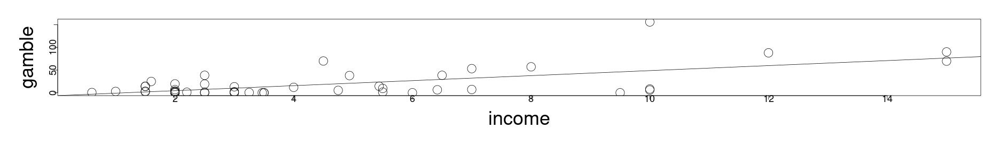

========================================================

### A review of binary categorical predictors


* On the other hand, we might find that the continuum variable is not useful in the analysis.  

* In this case, we can model the response purely in terms of the "switch" part of the equation":
 
  $$\begin{align}
  Y = \beta_0 + \beta_2 d + \epsilon
  \end{align}$$
  
  so that we describe the response in terms of variation around two intercept levels.


```r
sumary(lm(gamble ~ sex, data=teengamb))
```

```
            Estimate Std. Error t value  Pr(>|t|)
(Intercept)  29.7750     5.4983  5.4153 2.282e-06
sex         -25.9092     8.6477 -2.9961  0.004437

n = 47, p = 2, Residual SE = 29.09414, R-Squared = 0.17
```

```r
par(mai=c(1.5,1.5,.5,.5), mgp=c(3,0,0))
plot(gamble ~ sex, teengamb, cex=3, cex.lab=3, cex.axis=1.5)
points(list(x=c(0,1), y=c(29.775, 29.775-25.9092)), pch=17, cex=3)
```

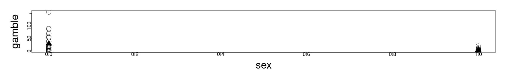

========================================================

### A review of binary categorical predictors

* We can also consider modeling the response with both the continuum variable and the categorical variable, where the <b>slope</b> of the response in terms of the continuum variable will be the same for each category;

  * in this case $\beta_{sex}$ describes the distance between the two regression lines (the adjusted intercept): 
  
 $$\begin{align}
  Y = \beta_0 + \beta_1 X + \beta_2 d + \epsilon
  \end{align}$$
  

```r
sumary(lm(gamble ~ income + sex, data=teengamb))
```

```
             Estimate Std. Error t value  Pr(>|t|)
(Intercept)   4.04083    6.39435  0.6319  0.530698
income        5.17158    0.95105  5.4378 2.245e-06
sex         -21.63439    6.80880 -3.1774  0.002717

n = 47, p = 3, Residual SE = 22.75428, R-Squared = 0.5
```

```r
par(mai=c(1.5,1.5,.5,.5), mgp=c(3,0,0))
plot(gamble ~ income, teengamb, cex=3, cex.lab=3, cex.axis=1.5)
abline(4.04083, 5.17158)
abline(4.04083-21.63429, 5.17158)
```

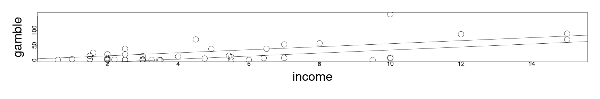

========================================================

### A review of binary categorical predictors

* But it may also make sense to model the response with separate slopes and separate intercepts, done in R with


```r
sumary(lm(gamble ~ income * sex, data=teengamb))
```

```
            Estimate Std. Error t value  Pr(>|t|)
(Intercept) -2.65963    6.31642 -0.4211  0.675804
income       6.51812    0.98808  6.5967 4.951e-08
sex          5.79960   11.20025  0.5178  0.607245
income:sex  -6.34320    2.14456 -2.9578  0.005018

n = 47, p = 4, Residual SE = 20.98167, R-Squared = 0.59
```

```r
par(mai=c(1.5,1.5,.5,.5), mgp=c(3,0,0))
plot(gamble ~ income, teengamb, cex=3, cex.lab=3, cex.axis=1.5)
abline(-2.65963, 6.51812)
abline(-2.65963+5.79960, 6.51812-6.34320)
```

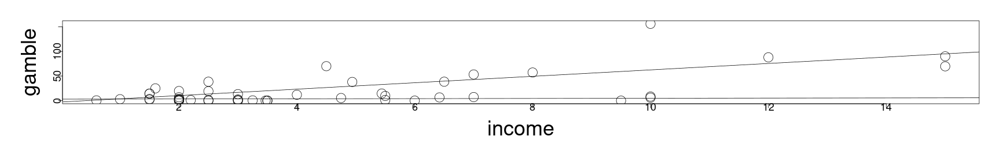

========================================================

### A review of binary categorical predictors


* This can be seen in a functional form as a model like:

  $$\begin{align}
  Y = \beta_0 + \beta_1 X + \beta_2 d + \beta_{x:d}X \times d + \epsilon
  \end{align}$$
  
* Here the parameter $\beta_{x:d}$ is activated to adjust the slope when $d=1$ in the same way that the intercept is adjusted for $d=1$.

  * This parameter is commonly known as the interaction term, which can be more difficult to interpret at times; 
  
  * loosely this is the slope of the response in terms of the variable $X$ conditioned on the category.
  
  * This will also generally extend to multiple predictors, where the category will shift the slope or intercept as determined optimal by the least squares solution.
  
* The interaction term can be an important element in our analysis, as it is seen in the gambling data, the relationship between income and gambling is almost flat for women.

* Performing the model fitting as above is a formal way of computing two separate models (and their differences) simultaneously when it appears that there is reason for two separate models.

* In particular, this is appropriate in the case when we don't think that the difference between the trend in the two categories should be constant.
  

========================================================

### A review of binary categorical predictors

* Generally speaking it is a good idea to perform some exploratory analysis with respect to the categorical variable, to determine if there is a reason to model these separately.


```r
par(cex=2, mai=c(1.5,1.5,.5,.5), mgp=c(1,0,0))
boxplot(gamble ~ sex, teengamb)
```

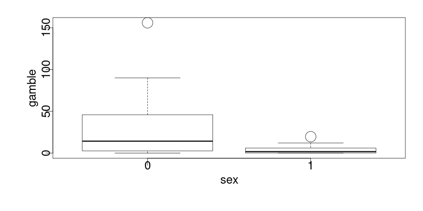

* From the box plots, we have a strong indication that the sub-populations differ in terms of their means and variances.

* We may wish to formalize this somewhat with a two-way t-test, but in this case we should be aware of the issue of the Gaussian distribution assumption.

* Particularly, both have strong indications of non-normal data, even with outliers removed.

========================================================

### A review of binary categorical predictors

* In the case of normal data, or large sample sizes using the central limit theorem, we can appeal to a two-sample t-test to check for the differences of means.

* Likewise, if the data is normal, we can appeal to an F-test to check the differences in the variances;
  
  * however, the F-test is quite sensitive to departures from normality.
  
* For the `teengamb` data, neither the normality nor the large sample size assumption hold and therefore we can appeal at least to the Kolmolgorov-Smirnov test for the continuous response variable:


```r
gamb_m <- teengamb[teengamb$sex==0,]
gamb_m <- gamb_m[gamb_m$gamble<120,]
gamb_f <- teengamb[teengamb$sex==1,]
ks.test(gamb_m$gamble, gamb_f$gamble)
```

```

	Two-sample Kolmogorov-Smirnov test

data:  gamb_m$gamble and gamb_f$gamble
D = 0.50292, p-value = 0.007095
alternative hypothesis: two-sided
```

* As was noted clearly by visual inspection, the two sub-samples do appear to be drawn from statistically distinct sub-populations.

* This is corroborated by our analysis in the activities, where we also saw unequal variances in the residuals with respect to the individually subset models.

========================================================

<h2> An example with heating efficiency</h2>

* A homeowner in England recorded his weekly natural gas consumption, in thousands
of cubic feet, during two winter heating seasons. 

* During the second season, additional insulation had been installed.


```r
library(MASS)
library(ggplot2)
ggplot(aes(x=Temp,y=Gas),data=whiteside)+geom_point()+facet_grid(~
Insul)+geom_smooth(method="lm")+ theme(axis.text=element_text(size=20), axis.title=element_text(size=20,face="bold"), strip.text.x = element_text(size = 20, face="bold"))
```

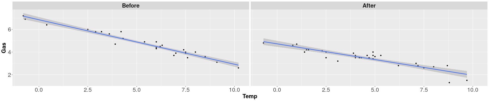

* The horizontal axis is "probably the weekly average, daily minimum temperature" (see help file).

========================================================

### An example with heating efficiency

* The previous plots, there is less gas used after the additional insulation is added, but the difference varies by temperature.

* Producing the multiple models with interaction, we have


```r
lmod <- lm(Gas ~ Temp*Insul, whiteside)
sumary(lmod)
```

```
                 Estimate Std. Error  t value  Pr(>|t|)
(Intercept)      6.853828   0.135964  50.4091 < 2.2e-16
Temp            -0.393239   0.022487 -17.4874 < 2.2e-16
InsulAfter      -2.129978   0.180092 -11.8272 2.316e-16
Temp:InsulAfter  0.115304   0.032112   3.5907 0.0007307

n = 56, p = 4, Residual SE = 0.32300, R-Squared = 0.93
```

* Here we see that the pre-insulation change in gas consumption is approximately .393 cubic feet per 1 degree change in temperature, whereas after the insulation it is approximately 0.278 cubic feet.

  * Producing separate slopes and intercepts does improve the overall fit of the model in this case.
  
  * That is, it is shown in the summary that the interaction term is significant.

* However, some additional care should be taken with the intercept terms, representing the ammount of gas consumption when the temperature is zero.

  * Here there are very few observations, and therefore the uncertainty of these parameters representing the zero-temperature consumption will naturally be higher.
  

========================================================

### An example with heating efficiency

* Generally, if the range or center of mass of the predictors is far away from zero, we can rectify this issue by re-centering the variable at its mean (computing the anomalies).


* By centering at the mean, the intercept will actually describe the predicted value for the mean and the change in the predictor describes the change as the variable deviates from the mean.


```r
mean(whiteside$Temp)
```

```
[1] 4.875
```

```r
whiteside$ctemp <- whiteside$Temp - mean(whiteside$Temp)
lmodc <- lm(Gas ~ ctemp*Insul, whiteside)
sumary(lmodc)
```

```
                  Estimate Std. Error  t value  Pr(>|t|)
(Intercept)       4.936788   0.064241  76.8485 < 2.2e-16
ctemp            -0.393239   0.022487 -17.4874 < 2.2e-16
InsulAfter       -1.567872   0.087713 -17.8750 < 2.2e-16
ctemp:InsulAfter  0.115304   0.032112   3.5907 0.0007307

n = 56, p = 4, Residual SE = 0.32300, R-Squared = 0.93
```

* In this case, re-centering the model gives a more natural interpretation.


========================================================

### An example with heating efficiency

* To obtain the model back in the normal coordinates, we can make a change of variables that includes this shift:

  $$\begin{align}
  &Y = \beta_0 + \beta_{ctemp} \left( X- 4.875\right) + \beta_{InsulAfter} d + \beta_{ctemp:InsulAfter} X \times d\\
  \Leftrightarrow & Y = 4.936788 - 0.393239 \left( X -  4.875\right) + -1.567872 d +  0.115304 X \times d \\
  \Leftrightarrow &  Y = 6.853828 - 0.393239X  + -1.567872 d +  0.115304 X \times d
  \end{align}$$


========================================================

### An example with heating efficiency

* Whereby plotting, we find:


```r
par(mai=c(1.5,1.5,.5,.5), mgp=c(3,0,0),usr=c(-2,12, 0, 8))
plot(Gas ~ Temp, whiteside[whiteside$Insul == "Before",], cex=3, cex.lab=3, cex.axis=1.5)
abline(6.853828, -0.393239)
```

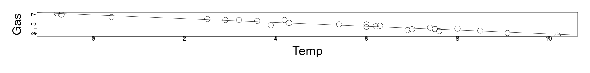


```r
par(mai=c(1.5,1.5,.5,.5), mgp=c(3,0,0), usr=c(-2,12, 0, 8))
plot(Gas ~ Temp, whiteside[whiteside$Insul == "After",], cex=3, cex.lab=3, cex.axis=1.5)
abline(6.853828-1.567872, -0.393239 + 0.115304)
```

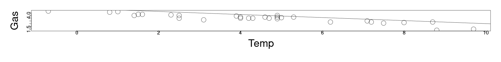


========================================================

<h2> Factors with more than two levels</h2>

* We can consider how to generalize this approach to where there are multiple levels in a categorical variable.

  * For instance, if we wanted to predict the price of a car, we might include several different color levels in a color categorical variable.
  
* If there are $f$ different levels, then we can create $f-1$ dummy variables $\{d_2,\cdots, d_f\}$ with the following meaning:

  $$\begin{align}
  d_i = 
  \begin{cases}
  0 & \text{if case is not level } i\\
  1 & \text{if case is level } i
  \end{cases}
  \end{align}$$
  
  * When a case contains a value that isn't level $i=2,\cdots,f$, then this automatically defaults to the level $1$, described by the default intercept term.
  
* This default intercept term is the reference level from which all other levels deviate.

  * Cases self-identify if they belong to any other level with a 1 correspondingly in the dummy variable that corresponds to the appropriate level.
  
* We can consider multi-level factors in studying the longevity of fruitflies with respect to their sexual behaviors...

========================================================

<h2> Fruitfly example</h2>

* 125 male fruitflies are randomly divided into 5 groups of 25 each -- the response variable will be the number of days the fruitflies live.

* The predictors for the response include thorax length, which is known to affect the longevity of the fly, and sexual activity.

* The groups are then studied with respect to one of several different environments:

  <ol>
    <li> one group is held without any female fruitflies;</li>
    <li> one group is held with a single sexually active female fruitfly, per day;</li>
    <li> one group is held with 8 sexually active female frutflies, per day;</li>
    <li> a control group is held with a single non-sexually active female fruitfly, per day;</li>
    <li> a final control group is held with 8 non-sexually active female fruitflies, per day.</li>
  </ol>
  
* These groups are labeled "isolated", "low", "high", "one" and "many" respectively.

========================================================

### Fruitfly example

* Plotting all groups together, but distinguishing groups by symbols, we have:


```r
par(mai=c(1.5,1.5,.5,.5), mgp=c(3,0,0))
plot(longevity ~ thorax, fruitfly, pch=unclass(activity), cex=3, cex.lab=3, cex.axis=1.5)
legend(0.63,100,levels(fruitfly$activity),pch=1:5)
```

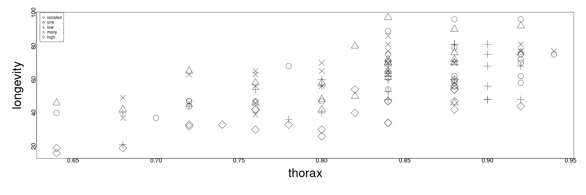

* However, examining the patterns within groups can be difficult with this type of plot.

========================================================

### Fruitfly example

* Using ggplot again, we can use the facet wrap to plot the longevity versus the thorax length over each group individually:


```r
ggplot(aes(x=thorax,y=longevity),data=fruitfly) + geom_point() +
facet_wrap( ~ activity) + theme(axis.text=element_text(size=20), axis.title=element_text(size=20,face="bold"), strip.text.x = element_text(size = 20, face="bold"))
```

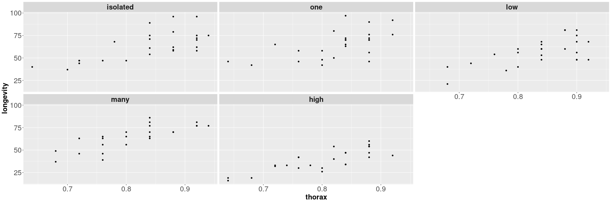

* In this plot, it is more clear that the high sexual activity flies have a lower overall longevity, controlling for the thorax length.

========================================================

### Fruitfly example

* If we create the model as before, allowing for different slopes and intercepts across each categorical level, we obtain the model summary as


```r
lmod <- lm(longevity ~ thorax*activity, fruitfly)
sumary(lmod)
```

```
                     Estimate Std. Error t value  Pr(>|t|)
(Intercept)         -50.24197   21.80118 -2.3046    0.0230
thorax              136.12676   25.95172  5.2454 7.275e-07
activityone           6.51716   33.87083  0.1924    0.8478
activitylow          -7.75013   33.96901 -0.2282    0.8199
activitymany         -1.13943   32.52975 -0.0350    0.9721
activityhigh        -11.03803   31.28660 -0.3528    0.7249
thorax:activityone   -4.67713   40.65175 -0.1151    0.9086
thorax:activitylow    0.87431   40.42531  0.0216    0.9828
thorax:activitymany   6.54779   39.36002  0.1664    0.8682
thorax:activityhigh -11.12676   38.11997 -0.2919    0.7709

n = 124, p = 10, Residual SE = 10.71275, R-Squared = 0.65
```

* in this case, there is an adjustment to the thorax parameter with respect to each group outside of the default (isolation).

* The main difference for this type of multi-factor example is in terms of evaluating the significance of the interaction terms.

* In the summary table, we have four different t-test p-values to evaluate for the respective adjustments to the slope in life expectancy verus thorax size, compared to the group in isolation.

  * This will not, however, describe the overall significance of all interaction terms at once.


========================================================

### Fruitfly example

* If we want to make a comparsion of the interaction between the levels and thorax all together, we can perform this with an ANOVA table:


```r
anova(lmod)
```

```
Analysis of Variance Table

Response: longevity
                 Df  Sum Sq Mean Sq F value    Pr(>F)    
thorax            1 15003.3 15003.3 130.733 < 2.2e-16 ***
activity          4  9634.6  2408.6  20.988 5.503e-13 ***
thorax:activity   4    24.3     6.1   0.053    0.9947    
Residuals       114 13083.0   114.8                      
---
Signif. codes:  0 '***' 0.001 '**' 0.01 '*' 0.05 '.' 0.1 ' ' 1
```

* Here, this represents a sequential evaluation of the nested models, in which
  <ol>
    <li> thorax is evaluated versus the null model;</li> 
    <li> activity and thorax is evaluated versus thorax alone; and </li> 
    <li> finally the model with interaction terms is evaluated versus the one in which all slopes are the same across groups. </li>
  </ol>
  
* In this case, the p-value for the interaction is not significant, and we seem to be able to reasonably model the response with the same slope across all groups.

========================================================

<h2> Alternative codings of categorical variables</h2>

* It is sometimes the case that a different form of coding (than 1/0) for a categorical variable can improve our analysis.

* We can imagine where we could have an issue as follows:

  * Suppose we have a matrix $\mathbf{B}$ with the $ij$-th entry representing case $i$ and factor level $j$.
  
  * We will follow the earlier convention where, if the $i$-th case is of the category level $j$, then $\mathbf{B}_{ij}=1$ and it will equal zero otherwise.
  
  * If we wanted to use $\mathbf{B}$ in the model matrix $\mathbf{X}$ as a sub-matrix to define the regression, there will be an issue with linear dependence.
  
  * Specifically, the intercept term is given by a vector of ones in $\mathbf{X}$.
  
  * On the other hand, the sum of all rows of $\mathbf{B}$ equals one, so that we can easily define a linear dependence relationship.
  
* Removing the intercept from the above will solve this for one factor, but not in general for more factors.

* Deleting one of the dummy variables to define a base-line level was the way we dealt with this in the earlier encoding.

* However, there are ways we might improve numerical stability by encoding this otherwise, or reflecting a different structure in the data.

========================================================

### Alternative codings of categorical variables

* If we take the above matrix $\mathbf{B}$, we can generally define how the data is coded into the model matrix with an additional <b>contrast matrix</b> $\mathbf{C}$.

* In this case, the product of $\mathbf{B}\mathbf{C}$ defines the encoding of the data in $\mathbf{X}$.

* The "treatment" coding is the method we have discussed earlier, in which each level will be compared with a base-line level.

* We can see this encoding in R using the "cont" function, with a type of coding. This will generate the contrast matrix to be right multiplied with $\mathbf{B}$.

* For a factor with 4 levels, the treatement coding contrast matrix is given as:


```r
contr.treatment(4)
```

```
  2 3 4
1 0 0 0
2 1 0 0
3 0 1 0
4 0 0 1
```

* The first level is the multiplied by all zeros, which then means that this level corresponds to the intercept term (without adjustment as discussed earlier).

* Each subsequent level is given the standard "dummy" coding.  This has the interpretation of each other level being compared versus this base-line level, as discussed earlier, adjusted by the intercept.


========================================================

### Alternative codings of categorical variables

* "Helmert" coding is a method used for comparing each level versus all previous levels in a sequence.  

* This can be used typically when there is a natural ordering to the categories, e.g., "high", "medium", "low":


```r
contr.helmert(4)
```

```
  [,1] [,2] [,3]
1   -1   -1   -1
2    1   -1   -1
3    0    2   -1
4    0    0    3
```

* This can be viewed in the above where the second level is compared versus the first level, with the row of minus ones;

  * The third level is compared to the average of the first two, and so forth by the same analogy.
  
* In the same way that we understood the slope and intercept being adjusted according to the level in the earlier examples, the same logic applies here.

  * However, the type of coding changes the interpretation of the parameters and to which level the adjustment to slope and intercept is being made.

========================================================

### Alternative codings of categorical variables

* "Sum" coding uses the following contrast matrix:


```r
contr.sum(4)
```

```
  [,1] [,2] [,3]
1    1    0    0
2    0    1    0
3    0    0    1
4   -1   -1   -1
```

* The sum coding can be useful to make intercomparisons where there is no natural reference level.

========================================================


## Models with only categorical predictors

* The "analysis of variance" that we have studied before actually comes from the situation in which we have only categorical variables as predictors.

* The name comes from the idea of partitioning the overall variance in the response into that which is due to each of the factors and the error $\epsilon$.

* While this is a classical approach, the formulation can become increasingly complex depending on the configuration of the configuration of the factors.

* In the following, we will consider a regression approach with the tools we have developed already.

* As a note on terminology, the way these variables are coded in R (factors with a number of levels) also derives from this framework.

* Additionally, for ANOVA type problems, the parameters $\beta$ are usually denoted as "effects".

* We will consider a framework where the effects are fixed values, but unkown to us;

  * if these parameters are treated as random variables, a slightly different approach is necessary.
  

========================================================

### Models with only categorical predictors

* Suppose that we have a factor (category) $\alpha$ with $i=1,\cdots, I$ different levels.

* Then suppose that there are $j=1,\cdots, J_{i}$ observations per level $i$.

* The model for the $j$-th observation of level $i$ is given a model of the form,

  $$\begin{align}
  Y_{ij} = \mu + \alpha_i + \epsilon_{ij}
  \end{align}$$
  
* In the above, we have an underconstrained problem that won't have any unique solution.

  * For example, if $\mu^\ast = \mu+1$ and $\alpha_i^\ast = \alpha_i -1$, then the above equation also holds for $\mu^\ast$ and the $\alpha_i^\ast$;
  
  * Indeed, for any constant shift as above, this will hold.
  
* Some kind of constraint must be imposed to make this equation solvable uniquely...

========================================================

### Models with only categorical predictors

* Common techniques for constraining the model equation

  $$\begin{align}
  Y_{ij} = \mu + \alpha_i + \epsilon_{ij}
  \end{align}$$
  
  include:
  
  <ol>
    <li> Removing the $\mu$ term and use $I$ different dummy variables to estimate $\alpha_i$ for $i=1,\cdots,I$.  Although this is feasible, it doesn't extend well to models with multiple factors. </li>
    <li> Setting $\alpha_1 = 0$, then $\mu$ corresponds to the expected mean response for the first level and $\alpha_i$ will be the difference from the base-line level as before.</li>
    <li> Setting $\sum_{i=1}^I \alpha_i = 0$, then $\mu$ represents the mean response over all levels, while each $\alpha_i$ represents the deviation of each level from the overall mean.  This corresponds to sum coding.</li>
  </ol>
  
* At the end, the choice of the constrain above defines a coding/ contrast matrix and thus the interpretation of the parameters.

  * However, no choice of coding will change the fitted values or the standard errors.
  


========================================================

### Models with only categorical predictors


* Once the choice of coding is made, and the parameters are estimated, the natural step is to try to understand the diffrences in the levels of each factor.

  * Particularly, we will want to understand if (with respect to some reference level defined by the coding) a particular level differs by more than just random variation.
  
  * This is again the same analogy of adjusting the intercept or the slope line in a regression with an additional continuum variable.
  
* If we used the default "treatment" or "dummy-variable" coding, then our model takes the form:

  $$\begin{align}
  Y_{ij} = \mu + \alpha_i + \epsilon_{ij}
  \end{align}$$
  
  where $\alpha_1=0$, and the null hypothesis is that $\alpha_i = 0$ for $i=2,\cdots, I$.
  
  * Here, once again, the reference level is $\mu$ given by the average response for the level $i=1$ and thus the null represents the hypothesis that the different levels have no difference that is distinguishable from random variation.
  
* For other codings of the model, this statement will necessarily differ, so it is typically easier to understand the hypotheses in terms of models:

  $$\begin{align}
  H_0  : & Y_{ij} = \mu + \epsilon_{ij} \\
  H_1 : & Y_{ij} = \mu + \alpha_{i} + \epsilon_{ij}
  \end{align}$$
  
========================================================

### Models with only categorical predictors


* In the framework of the hypothesis test:


  $$\begin{align}
  H_0  : & Y_{ij} = \mu + \epsilon_{ij} \\
  H_1 : & Y_{ij} = \mu + \alpha_{i} + \epsilon_{ij}
  \end{align}$$
  
  we can compute the parameters and use the usual F-test from regression analysis to reject or fail to reject the null.
  
  * This corresponds to testing versus the null-model, in which everything can be attributed to random variation about the same mean $\mu$.
  
  * The outcome, once again, doesn't depend on the coding but the interpretation of the effects $\alpha_i$ will depend on the coding, if we reject the null.
  
* If we do not reject the null, we still should check for transformations of the response and outliers that might affect our analysis.

* If we reject the null, then we should investigate which individual levels differ.

========================================================

<h2> An example of blood testing </h2>

* Twenty-four animals were randomly assigned to four different diets and blood samples were taken in a random order. 

* The blood coagulation time was measured in seconds, and we wish to see if the diet types (A,B,C or D) have an effect on the coagulation time.


```r
head(coagulation)
```

```
  coag diet
1   62    A
2   60    A
3   63    A
4   59    A
5   63    B
6   67    B
```

* To begin, we will perform some exploratory visual analysis of the data, plotting the spread of the samples versus the diet.

========================================================

### An example of blood testing

* Typically, we may view this type of data in a box-plot.


```r
par(mai=c(1.5,1.5,.5,.5), mgp=c(3,0,0))
plot(coag ~ diet, coagulation,ylab="coagulation time", cex=3, cex.lab=3, cex.axis=1.5)
```

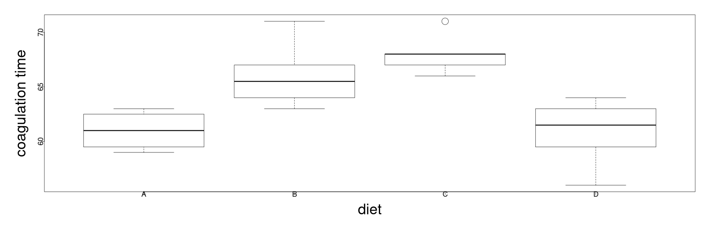

* The issue here with very few observations is that for diet C, the entire upper box has collapsed to the median with only an outlier plotted beyond it.


========================================================

### An example of blood testing

* A stripchart is an alternative form for viewing the same data, where the equal observations are plotted with jittering:


```r
par(mai=c(1.5,1.5,.5,.5), mgp=c(3,0,0))
stripchart(coag ~ diet, coagulation, vertical=TRUE, method="stack",xlab="diet",ylab="coagulation time", cex=3, cex.lab=3, cex.axis=1.5)
```

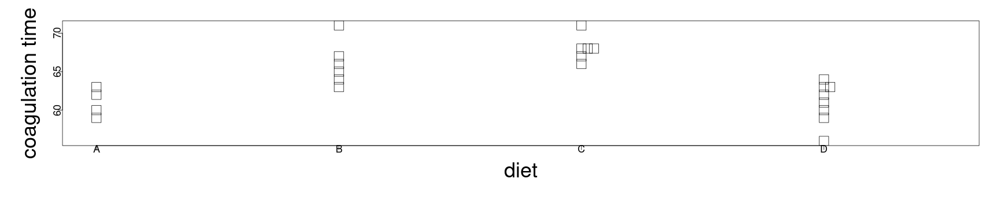

* The main point of this diagnostic is to inspect for unequal variances in the groups, or extreme skewness that might express non-normality.

 * This could suggest, for example, a change of the scale of the response (coagulation time); however, in this case things are reasonable well behaved.
  
========================================================

### An example of blood testing

* We choose thus to fit the model, with the default coding, and find:


```r
lmod <- lm(coag ~ diet, coagulation)
sumary(lmod)
```

```
              Estimate Std. Error t value  Pr(>|t|)
(Intercept) 6.1000e+01 1.1832e+00 51.5544 < 2.2e-16
dietB       5.0000e+00 1.5275e+00  3.2733 0.0038025
dietC       7.0000e+00 1.5275e+00  4.5826 0.0001805
dietD       1.2881e-15 1.4491e+00  0.0000 1.0000000

n = 24, p = 4, Residual SE = 2.36643, R-Squared = 0.67
```

```r
round(coef(lmod),1)
```

```
(Intercept)       dietB       dietC       dietD 
         61           5           7           0 
```

* The interpretation of the parameters is thus (with respect to reference level A), groups B, C and D are 5, 7 and 0 seconds larger, respectively, on average.

  * The baseline A itself has an average of 61 seconds.
  
* The three test statistics above describe the comparisons with the reference level A, though they do not address the overall question of whether there are significant differences from a constant mean.

========================================================

### An example of blood testing

* To test versus this null model hypothesis, we perform the F-test with the ANOVA table:


```r
anova(lmod)
```

```
Analysis of Variance Table

Response: coag
          Df Sum Sq Mean Sq F value    Pr(>F)    
diet       3    228    76.0  13.571 4.658e-05 ***
Residuals 20    112     5.6                      
---
Signif. codes:  0 '***' 0.001 '**' 0.01 '*' 0.05 '.' 0.1 ' ' 1
```

* The result is that we reject the null, and we go forward with the hypothesis that there are statistically significant differences between levels, though we haven't isolated the differences.

========================================================

<h2> Diagnostics for ANOVA </h2>

* There are fewer diagnostics to perform for ANOVA type models, but it is typical to plot the residuals versus fitted and the Q-Q plot of the residuals.


```r
par(mai=c(1.5,1.5,.5,.5), mgp=c(3,0,0))
qqnorm(residuals(lmod), cex=3, cex.lab=3, cex.axis=1.5)
qqline(residuals(lmod))
```

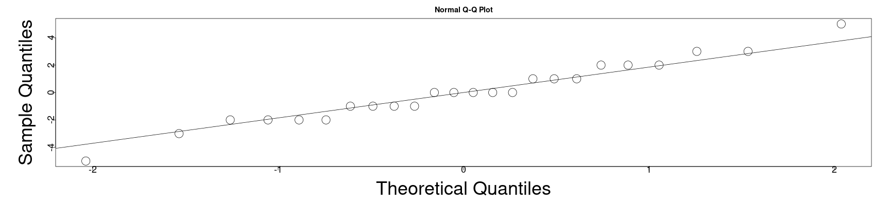

* Because of the integer values of the explanatory and response variables in this case, the discreteness of the Q-Q plot is inevitable.

* However, these aren't so bad with respect to their distribution.

========================================================

### Diagnostics for ANOVA

* We likewise see the discreteness in the fitted verus residual plot:


```r
par(mai=c(1.5,1.5,.5,.5), mgp=c(3,0,0))
plot(jitter(fitted(lmod)),residuals(lmod),xlab="Fitted",ylab="Residuals", cex=3, cex.lab=3, cex.axis=1.5)
abline(h=0)
```

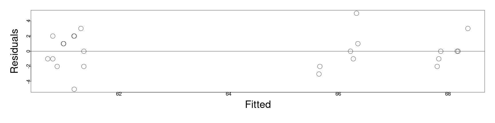

* We wish to use this to understand the homogeneity of the variances of the residuals; here it appears OK, but we can perform a formal hypothesis test additionally.


========================================================


<h2> Levene's Test </h2>

* Levene's test computes the absolute values of the residuals and uses these as the response variable for a new ANOVA model.

* Then, with respect to this new model, we can compute an F-statistic (that is somewhat complicated) for which:

  <ol>
    <li> $H_0:$ the variances across the levels are equal; </li>
    <li> $H_1:$ the variances across the levels are not equal.</li>
  </ol>
  
* Typically, the test statistics is formulated in comparison to the observed level mean;

  * however, in order to control for issues with outliers, we can alternatively use the level median as the predicted value instead of the level mean.


```r
med <- with(coagulation,tapply(coag,diet,median))
ar <- with(coagulation,abs(coag -med[diet]))
anova(lm(ar ~ diet,coagulation))
```

```
Analysis of Variance Table

Response: ar
          Df Sum Sq Mean Sq F value Pr(>F)
diet       3  4.333  1.4444  0.6492 0.5926
Residuals 20 44.500  2.2250               
```

* In this case, the high p-value leaves us with no cause for concern.

========================================================

### Levene's Test

* Generally, most tests and confidence intervals are relatively insensitive to non-constant variance; 

  * with respect to Levene's test, we wouldn't need to take action unless the test is significant at the $1\%$ level.
  
* As an alternative, we may also use Bartlett's test:


```r
bartlett.test(coag ~ diet, coagulation)
```

```

	Bartlett test of homogeneity of variances

data:  coag by diet
Bartlett's K-squared = 1.668, df = 3, p-value = 0.6441
```

* This once again shows no cause for concern.

* The only reason to choose Levene's test ofver Bartlett's test is that Levene's test can be more robust to outliers.

========================================================

### Levene's Test

*  Having performed our basic diagnostics, finding no major cause for alarm, we can continue to investigate if the different levels are significantly different.

  * However, we need to frame this in terms of "significantly different from what?"
  
* To formally compare levels $i$ and $j$, we will use $\hat{\alpha}_i$ and $\hat{\alpha}_j$ as proxies for the true, but unkown effects.

* Then, we will create a confidence interval for the difference $\alpha_i - \alpha_j$ in terms of,

  $$\begin{align}
  \hat{\alpha}_i - \hat{\alpha}_j \pm t_{df}^{\alpha/ 2} se\left(\hat{\alpha}_i - \hat{\alpha}_j\right)
  \end{align}$$
  
* Here, we define 

  $$\begin{align}
  se\left(\hat{\alpha}_i - \hat{\alpha}_j\right)& \triangleq \hat{\sigma} \sqrt{1 / J_i + 1/ J_j} \\
  df \triangleq n - I
  \end{align}$$
  
* Within this framework, a test for $\alpha_i = \alpha_j$ ammounts to determining if zero is contained in the confidence interval above.

========================================================

### Levene's Test

* To find a $95\%$ confidence interval for the difference of diet A and B as we were considering before, we can compute this knowing:

 * the difference $\alpha_A - \alpha_B = 5$;
 * the standard error is given as $1.53.$;
 * the degrees of freedom are given as $24 - 4$
 
* Therefore, the confidence interval is given as:


```r
5 + c(-1,1) * qt(0.975, 24-4) * 1.53
```

```
[1] 1.808476 8.191524
```

* Because the confidence interval excludes zero, we conclude that the effect is different at $5\%$ significance.

========================================================

### Multiple hypothesis testing

* The above type of test is fine when we are only considering a single test between levels.

  * However, the hypothesis testing will quickly saturate producing false positives (significant differences) when they could reasonably be attributed to random variation.
  
* Let's suppose for example we make all pair-wise tests at $\alpha=5\%$ significance, but assume that the null is actually true;

  * in our current example there are four levels and thus six possible pair-wise comparisons.
  
  * Even if there is no actual difference between the levels, there will be approximately a $20\%$ chance that we make a false positive (distinguishing the levels).
  
* Generally, with additional factors, the probability of type I errors continues to increase and therefore this style of difference testing is not recommended...

========================================================

<h2> Tukey's Honest Significance Difference (HSD) </h2>

* There are several ways to adjust for the previous deficiency, but an easier one to understand is Tukey's Honest Significance Difference.

* Let's suppose that,

  $$\begin{align}
  X_1, \cdots , X_n \sim N(\mu, \sigma^2)
  \end{align}$$

  independent and identically distributed.
  
* Let us define,

  $$\begin{align}
  R = \max_i X_i - \min_i X_i
  \end{align}$$
  
  so that $R$ is the range of the random sample.
  
* Then, $\frac{R}{\hat{\sigma}}$ has the <b>Studentized-range</b> distribution $q_{n,\nu}$, where $\nu$ is the number of degrees of freedom used to compute the sample estimate for $\sigma$.

========================================================

### Tukey's Honest Significance Difference (HSD)

* Then, if we understand the difference of levels as the $X_i$ above, we can write the Tukey confidence intervals as

  $$\begin{align}
  \hat{\alpha}_i - \hat{\alpha}_j \pm \frac{a_{I,df}}{\sqrt{2}}\hat{\sigma}\sqrt{1 + 1/J_i + 1/J_j}
  \end{align}$$
  
* These can be computed across all levels as:


```r
(tci <- TukeyHSD(aov(coag ~ diet, coagulation)))
```

```
  Tukey multiple comparisons of means
    95% family-wise confidence level

Fit: aov(formula = coag ~ diet, data = coagulation)

$diet
    diff         lwr       upr     p adj
B-A    5   0.7245544  9.275446 0.0183283
C-A    7   2.7245544 11.275446 0.0009577
D-A    0  -4.0560438  4.056044 1.0000000
C-B    2  -1.8240748  5.824075 0.4766005
D-B   -5  -8.5770944 -1.422906 0.0044114
D-C   -7 -10.5770944 -3.422906 0.0001268
```

* In the above, we see the differences computed with the $\hat{\alpha}_i - \hat{\alpha}_j$, the confidence intervals for the differences and the (dual) p-values.

  * Particularly, we see that there isn't a statistically significant distinction between levels $D$ and $A$ or $C$ and $B$.
  
========================================================

### Tukey's Honest Significance Difference (HSD)

* The same confidence intervals for the differences can be plotted directly:


```r
par(mai=c(1.5,1.5,.5,.5), mgp=c(3,0,0))
plot(tci, cex=3, cex.lab=3, cex.axis=1.5)
```

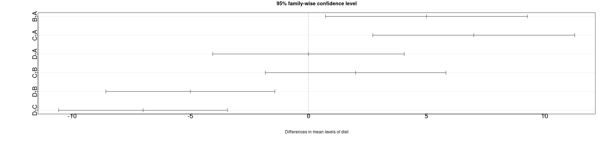

* We note that Tukey's HSD is extremely conservative by focusing on the largest differences; other methods don't assume the worst;

  * additional methods for consideration are covered in the book.

========================================================

## Models with several factors

* We can extend the methodology we used in the simple case with a single factor to handle multiple factors (as the only predictors).

  * This kind of data can be understood loosely in a kind of decision tree format, in which we have different combinations of category labels for each observation.
  
* In the case in which we have at least one case corresponding to every possible combination of labels, this is called a "full factorial design".

* Repeated observations of the same combination of labels are then denoted "replicates".

* A general form for this type of model (for two factors/ multiple levels) is given by:

  $$\begin{align}
  Y_{ij} = \mu + \alpha_i + \beta_j + \left(\alpha \beta\right)_{ij} + \epsilon_{ij}
  \end{align}$$
  where 
  
  * $i=1,\cdots, I$ (levels of the first factor);
  * $j=1,\cdots, J$ (levels of the second factor); and 
  * $\left(\alpha \beta\right)_{ij}$ represents the interactions between these two levels.
  
========================================================

<h2> An example with multiple factors</h2>

* In an experiment to study factors affecting the production of the polyvinyl chloride (PVC) plastic, three operators used eight different devices called resin railcars to produce PVC. 

* For each of the 24 combinations, two observations were produced. 

* The response is the particle size of the product.


```r
head(pvc)
```

```
  psize operator resin
1  36.2        1     1
2  36.3        1     1
3  35.3        1     2
4  35.0        1     2
5  30.8        1     3
6  30.6        1     3
```

* We will make some exploratory plots in the following...

========================================================

###  An example with multiple factors


```r
require(ggplot2)
p <- ggplot(pvc, aes(x=operator,y=psize))+geom_point()+stat_summary(fun.y="mean",geom="line",aes(group=resin)) + theme(axis.text=element_text(size=20),axis.title=element_text(size=20,face="bold"))
op1means <- with(pvc[pvc$operator == 1,],sapply(split(psize,resin),mean))
tdf <- data.frame(x=rep(0.9,8),y=op1means,label=1:8)
p + geom_text(data=tdf,aes(x=x,y=y,label=label))
```

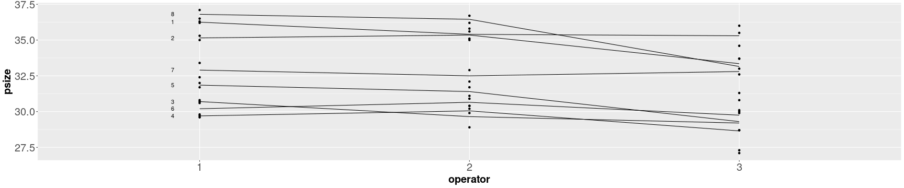

* In this plot, we connect the mean value of each level of resin -- this is the other factor, not expressed in this plot and the mean is the fitted value with respect to the level.

  * The particle size tends to be largest with the first operator and lowest for the third.
  
  * Also, the lines don't cross too much, leading us to believe the interaction between levels in the resin vesus the levels in the operator is probably small.


========================================================

###  An example with multiple factors


```r
ggplot(pvc, aes(x=resin,y=psize,shape=operator))+geom_point()+stat_summary(fun.y="mean",geom="line", aes(group=operator,linetype=operator)) + theme(legend.position = "top", legend.direction ="horizontal") + theme(axis.text=element_text(size=20),axis.title=element_text(size=20,face="bold"))
```

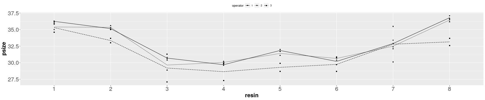

* In this plot, there are 8 levels of resin -- for each level, we observe two responses from each of the three operators.

* We can see variation in the response by resin, though the variances within the levels is approximately equal. 

* Furthermore, the three lines are approximately parallel, suggesting little interaction.

========================================================

###  An example with multiple factors


* We fit the linear model with interaction as:


```r
lmod <- lm(psize ~ operator*resin, pvc)
anova(lmod)
```

```
Analysis of Variance Table

Response: psize
               Df  Sum Sq Mean Sq F value    Pr(>F)    
operator        2  20.718  10.359  7.0072   0.00401 ** 
resin           7 283.946  40.564 27.4388 5.661e-10 ***
operator:resin 14  14.335   1.024  0.6926   0.75987    
Residuals      24  35.480   1.478                      
---
Signif. codes:  0 '***' 0.001 '**' 0.01 '*' 0.05 '.' 0.1 ' ' 1
```

* Here, the interaction term is not significant so we can begin an investigation on the main effects.

* <b>Note:</b> the case that the interaction term is significant, we shouldn't remove a factor even if the factor itself doesn't show significance due to the importance of the interaction.

========================================================

###  An example with multiple factors


* In the Q-Q plot, we see the issue of long-tailed errors:


```r
par(mai=c(1.5,1.5,.5,.5), mgp=c(3,0,0))
qqnorm(residuals(lmod),main="",  cex=3, cex.lab=3, cex.axis=1.5)
qqline(residuals(lmod))
```

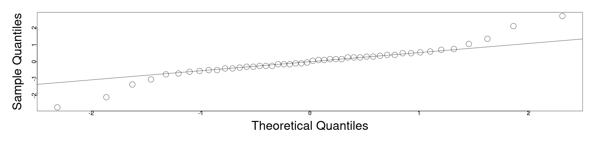

========================================================

###  An example with multiple factors


* In this case, the structure in the residuals arises because there are precisely two replicates for each combination of factors, so that the mean is the fitted value and the residuals are symmetric about the mean:


```r
par(mai=c(1.5,1.5,.5,.5), mgp=c(3,0,0))
plot(fitted(lmod),residuals(lmod),xlab="Fitted",ylab="Residuals",  cex=3, cex.lab=3, cex.axis=1.5)
abline(h=0)
```

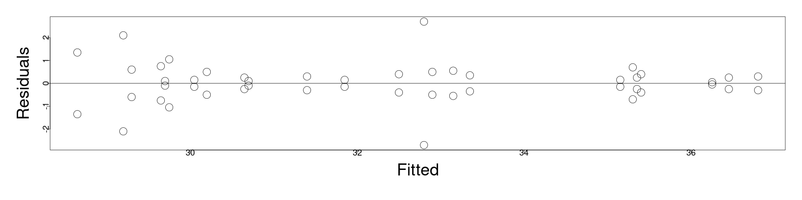

========================================================

###  An example with multiple factors


* Here, we see that the extremely large residuals correspond to operator three:


```r
par(mai=c(1.5,1.5,.5,.5), mgp=c(3,0,0))
plot(residuals(lmod) ~ operator, pvc, ylab="Residuals",  cex=3, cex.lab=3, cex.axis=1.5)
```

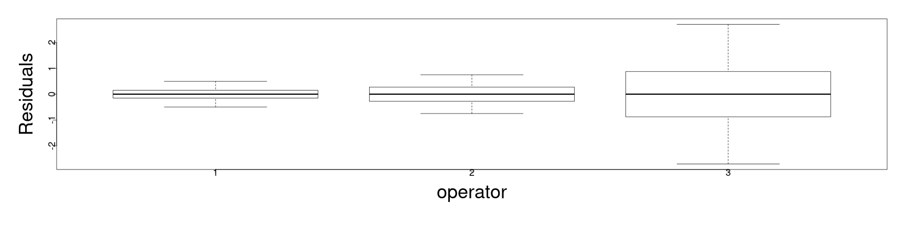

========================================================
###  An example with multiple factors


* Given the previous plots, we may want to formally test for non-constant variance among the operators; this can be produced with Levene's test as follows:

 * We will take the absolute value of the residuals;
 * then the square root to reduce the skewness of the residuals;
 * then we will use the residuals as the response with respect to the two factors:


```r
pvce <- pvc[(1:24)*2,]
pvce$res <- sqrt(abs(residuals(lmod))[(1:24)*2])
vmod <- lm(res ~ operator + resin, pvce)
anova(vmod)
```

```
Analysis of Variance Table

Response: res
          Df  Sum Sq Mean Sq F value    Pr(>F)    
operator   2 1.49035 0.74517 15.1172 0.0003181 ***
resin      7 0.63756 0.09108  1.8477 0.1554466    
Residuals 14 0.69010 0.04929                      
---
Signif. codes:  0 '***' 0.001 '**' 0.01 '*' 0.05 '.' 0.1 ' ' 1
```

* The null hypothesis is that there is constant variance, and we find it here that there is significant difference in the variation among the operators; however, with respect to the resin cars, there is not evidence for this.

* This is an important observation for industrial manufacturing in which the variance of the product can have a significant impact on the production quality.

========================================================

###  An example with multiple factors

* Looking at the model summary, we can see the adjustment of effects from the default, (operator 1, resin car 1);

  * we note, however, that the comparisons are less than optimal due to the non-constant variance.


```r
lmod <- lm(psize ~ operator+resin, pvc)
sumary(lmod)
```

```
            Estimate Std. Error t value  Pr(>|t|)
(Intercept) 36.23958    0.52260 69.3448 < 2.2e-16
operator2   -0.26250    0.40480 -0.6485 0.5205861
operator3   -1.50625    0.40480 -3.7209 0.0006401
resin2      -1.03333    0.66104 -1.5632 0.1262993
resin3      -5.80000    0.66104 -8.7740 1.135e-10
resin4      -6.18333    0.66104 -9.3539 2.113e-11
resin5      -4.80000    0.66104 -7.2613 1.093e-08
resin6      -5.45000    0.66104 -8.2446 5.457e-10
resin7      -2.91667    0.66104 -4.4122 8.164e-05
resin8      -0.18333    0.66104 -0.2773 0.7830225

n = 48, p = 10, Residual SE = 1.14496, R-Squared = 0.86
```

========================================================
###  An example with multiple factors


* We can once again judge if these differences are significant (and how certain they are) with the Tukey HSD;

  * this extends beyond the presentation, so is provided for example.


```r
TukeyHSD(aov(psize ~ operator+resin,data=pvc))
```

```
  Tukey multiple comparisons of means
    95% family-wise confidence level

Fit: aov(formula = psize ~ operator + resin, data = pvc)

$operator
        diff       lwr        upr     p adj
2-1 -0.26250 -1.249747  0.7247472 0.7943575
3-1 -1.50625 -2.493497 -0.5190028 0.0018126
3-2 -1.24375 -2.230997 -0.2565028 0.0106800

$resin
          diff        lwr        upr     p adj
2-1 -1.0333333 -3.1522815  1.0856149 0.7683288
3-1 -5.8000000 -7.9189482 -3.6810518 0.0000000
4-1 -6.1833333 -8.3022815 -4.0643851 0.0000000
5-1 -4.8000000 -6.9189482 -2.6810518 0.0000003
6-1 -5.4500000 -7.5689482 -3.3310518 0.0000000
7-1 -2.9166667 -5.0356149 -0.7977185 0.0019046
8-1 -0.1833333 -2.3022815  1.9356149 0.9999924
3-2 -4.7666667 -6.8856149 -2.6477185 0.0000003
4-2 -5.1500000 -7.2689482 -3.0310518 0.0000001
5-2 -3.7666667 -5.8856149 -1.6477185 0.0000379
6-2 -4.4166667 -6.5356149 -2.2977185 0.0000018
7-2 -1.8833333 -4.0022815  0.2356149 0.1127668
8-2  0.8500000 -1.2689482  2.9689482 0.8984776
4-3 -0.3833333 -2.5022815  1.7356149 0.9989372
5-3  1.0000000 -1.1189482  3.1189482 0.7958917
6-3  0.3500000 -1.7689482  2.4689482 0.9994110
7-3  2.8833333  0.7643851  5.0022815 0.0022073
8-3  5.6166667  3.4977185  7.7356149 0.0000000
5-4  1.3833333 -0.7356149  3.5022815 0.4375901
6-4  0.7333333 -1.3856149  2.8522815 0.9507745
7-4  3.2666667  1.1477185  5.3856149 0.0003909
8-4  6.0000000  3.8810518  8.1189482 0.0000000
6-5 -0.6500000 -2.7689482  1.4689482 0.9741405
7-5  1.8833333 -0.2356149  4.0022815 0.1127668
8-5  4.6166667  2.4977185  6.7356149 0.0000007
7-6  2.5333333  0.4143851  4.6522815 0.0098978
8-6  5.2666667  3.1477185  7.3856149 0.0000000
8-7  2.7333333  0.6143851  4.8522815 0.0042481
```


========================================================

<h2> Summary of models with only categorical predictors</h2>

* These types of models have their own form, in which the parameters are understood as "effects" of the different factor levels;

  * these effects can interact with other factors.
  
* Depending on the coding, the effects describe adjustments with respect to some "reference level";

  * this is possibly a control for the experiment, but it may also be, e.g., an average baseline over all levels.
  
* To test the significance of effects, will typically take an ANOVA table to determine if there is any significant deviation from the reference level.

* However, we need to <b>produce individual confidence intervals</b> for the difference from the reference to evaluate the significance of individual effects.
  
  * This is typically performed with the Tukey HSD.

========================================================

### Summary of models with only categorical predictors

* If we want to include interaction of the effects, we can evaluate the significance of the interaction with sequential ANOVA;

  * this is not equivalent to the individual p-values in the model summary, where the individual p-values won't express the aggregate significance.

* Diagnostics are similar, but more limited due to the discrete nature of the model.

* These diagnostics can, however, reveal important features such as non-constant variance of the response around a particular combination of levels.

* We showed how to test for this exactly, using Levene's Test, using an ANOVA table for the residuals fit in terms of the predictors.

  * We also used this in two particular variations, in which the deviation from the median was used as the fitted value and the absolute square-root residuals were used as the response (separately).
  
* Alternatively, we can also use Bartlett's test, in the absence of outliers.
