<style>
.section .reveal .state-background {
   background: #ffffff;
}
.section .reveal h1,
.section .reveal h2,
.section .reveal p {
   color: black;
   margin-top: 50px;
   text-align: center;
}
</style>

Insurance redlining -- a complete example
========================================================
date: 11/18/2020
autosize: true
incremental: true 
width: 1920
height: 1080

<h2 style='color:black'>Instructions:</h2>
<p style='color:black'>Use the left and right arrow keys to navigate the presentation forward and backward respectively.  You can also use the arrows at the bottom right of the screen to navigate with a mouse.<br></p>


<blockquote>
FAIR USE ACT DISCLAIMER:</br>
This site is for educational purposes only.  This website may contain copyrighted material, the use of which has not been specifically authorized by the copyright holders. The material is made available on this website as a way to advance teaching, and copyright-protected materials are used to the extent necessary to make this class function in a distance learning environment.  The Fair Use Copyright Disclaimer is under section 107 of the Copyright Act of 1976, allowance is made for “fair use” for purposes such as criticism, comment, news reporting, teaching, scholarship, education and research.
</blockquote>


========================================================
## Outline 

* The following topics will be covered in this lecture:
  * Introduction to the data
  * The ecological fallacy
  * Exploratory analysis
  * Model selection
  * Diagnostics
  * Evaluating uncertainty
  * Evaluating the sensitivity of parameter estimates
  * Evaluating predictive power
  * Qualifying our analysis and conclusions
  * A final summary


========================================================

## Introduction

* In the following lecture, we will go through a relatively complete example of the process of data analysis, regression, diagnostics, and remediation.

* Particularly, we will discuss a difficult to analyze question of systematic bias in insurance practices.

* Insurance, by nature of their business, need to price the cost of covering the risk of damages, based on the probability of these damages.

  * There are many legitimate reasons we can imagine why an insurance company would raise the prices on a driver who frequently violates road rules and is an overly agressive driver;
  
  * this individual is more likely to cause damages to themsevles or others, and therefore, the price to cover these damages will increase (or insurance will be refused altogether).
  
* However, we are also in a society that has historically enforced segregation, unequal rights and unequal access to services.

  * While these were once considered legitimate legal practice, discriminatory business practices are now generally considered immoral and illegal.
  
  * Moreover, while these direct discriminatory practices have largely ended, they have led to historical and lasting inequality in the communities that have been affected by them.
  
========================================================

### Introduction -- continued
  
  
* We will investigate a complicated question:
  
  * were insurance companies applying discriminatory business practices on majority non-white neighborhoods in Chicago, 
  
  * or were their practices justifiable based on standard business practices, e.g., 
  
  * limiting access or raising prices based on justifiable crime statistics, etc?
  
* The term "insurance redlining" refers litterally drawing a red line in a map, that excludes certain neighborhoods from services.


* In the late 1970s, the US Commission on Civil Rights examined charges by several Chicago community organizations that insurance companies were redlining their neighborhoods.

* Because comprehensive information about individuals being refused
homeowners insurance was not available, the number of FAIR plan policies written and renewed in Chicago by zip code for the months of December 1977 through May 1978 was recorded. 

* The FAIR plan was offered by the city of Chicago as a default policy to homeowners who had been rejected by the voluntary market. 

* Information on other variables that might affect insurance writing such as fire and theft rates was also collected at the zip code level.


========================================================

## Chicago (chredlin) dataset

<div style="float:left; width:50%">
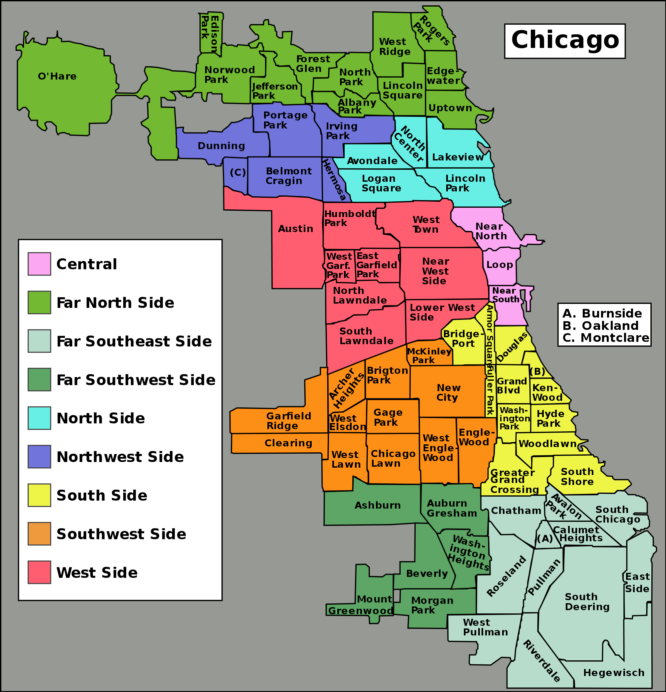
Courtesy of Peter Fitzgerald <a href="https://creativecommons.org/licenses/by-sa/3.0">CC BY-SA 3.0</a>
</div>
<div style="float:left; width:50%">
<ul>
  <li>The data that we have available for our analysis includes the variables:</li>
  <ol>
    <li><b>race</b> -- ethnic composition in percentage of minority;</li>
    <li><b>fire</b> -- fires per 100 housing units;</li>
    <li><b>theft</b> -- thefts per 1000 population;</li>
    <li><b>age</b> --  percentage of housing units built before 1939;</li>
    <li><b>involact</b> -- new FAIR plan policies and renewals per 100 housing units;</li>
    <li><b>income</b> -- median family income in thousands of dollars;</li>
    <li><b>side</b> -- north or south side of Chicago.</li>
  </ol>
<li> For reference, the South Side of Chicago has long had a reputation and cultural identity built around communities of working class African, Hispanic, Chinese, Irish, and Polish Americans, amongst others.
<li> This is due, in part, to historic segregation measures which by the late 1970s were considered illegal.</li>
</ul>
</div>

========================================================

<h2>The ecological fallacy</h2>

* We note here that we do not actually know the ethnicity of the individuals who are denied insurance in this data set.

* Rather, we only know the ethnic makeup of the zip code where an individual was denied.

* This is an important difficulty that needs to be considered carefully before starting our analysis.

* When data are collected at the group level, we may observe a correlation between two variables.

* The <b>ecological fallacy</b> is concluding that the same correlation holds at the individual level.

* For example the ecological fallacy was discussed in a court challenge to the Washington gubernatorial election of 2004; 

  * In this election, a number of illegal voters were identified, after the election; their votes were unknown, because the vote was by secret ballot. 
  
  * The challengers argued that illegal votes cast in the election would have followed the voting patterns of the precincts in which they had been cast, and thus adjustments should be made accordingly.
  * An expert witness said that this approach was like trying to figure out Ichiro Suzuki's batting average by looking at the batting average of the entire Seattle Mariners team,
  
    * since the illegal votes were cast by an unrepresentative sample of each precinct's voters, and might be as different from the average voter in the precinct as Ichiro was from the rest of his team.
  
  * The judge determined that the challengers' argument was an ecological fallacy and rejected it

  * See (<a href="https://faculty.washington.edu/cadolph/papers/AdolphWAreport.pdf" target="blank">Christopher Adolph (May 12, 2005). "Report on the 2004 Washington Gubernatorial Election". Expert witness report to the Chelan County Superior Court in Borders et al v. King County et al.</a>)


========================================================

### The ecological fallacy continued

* Similarly, we can consider the ecological fallacy in US demographic data.


```r
library("faraway")
head(eco)
```

```
            usborn income home      pop
Alabama    0.98656  21442 75.9  4040587
Alaska     0.93914  25675 34.0   550043
Arizona    0.90918  23060 34.2  3665228
Arkansas   0.98688  20346 67.1  2350725
California 0.74541  27503 46.4 29760021
Colorado   0.94688  28657 43.3  3294394
```

* In the "eco" dataset, we have data per state of the USA on:
  <ol>
    <li>the proportion of US born versus naturalized citizens in 1990;</li>
    <li>the per capita annual income in USD in 1998; </li>
    <li>percentage of residents born in state in 1990; and </li>
    <li> population in state in 1990. </li>
  </ol>

========================================================

### The ecological fallacy continued
  
* If we plot the proportion of US born versus the mean annual income, there appears to be a strong (anti)-correlation:


```r
par(mai=c(1.5,1.5,.5,.5), mgp=c(3,0,0))
plot(income ~ usborn, data=eco, xlab="Proportion US born", ylab="Mean Annual Income", col=1,  cex=3, cex.lab=3, cex.axis=1.5)
```

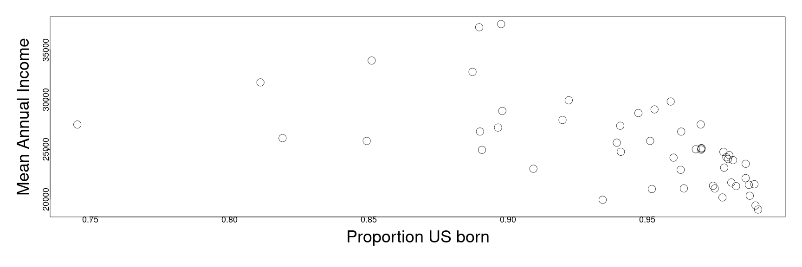

*  Particularly, it appears that states with a higher number of naturalized citizens correlates with higher per-capita income, whereas states with a lower number of naturalized citizens correlates with lower per-capita income.

========================================================
  
### The ecological fallacy continued
 
* Plotting this again with a trendline from simple regression, we find a reasonable fit to the data:


```r
lmod <- lm(income ~ usborn, eco)
par(mai=c(1.5,1.5,.5,.5), mgp=c(3,0,0))
plot(income ~ usborn, data=eco, xlab="Proportion US born", ylab="Mean Annual Income",xlim=c(0,1),ylim=c(15000,70000),xaxs="i", col=1,  cex=3, cex.lab=3, cex.axis=1.5)
abline(coef(lmod))
```


========================================================

### The ecological fallacy continued

* And we find that the relationship holds with $5\%$ significance:


```r
sumary(lmod)
```

```
            Estimate Std. Error t value  Pr(>|t|)
(Intercept)  68642.2     8739.0  7.8547 3.188e-10
usborn      -46018.6     9279.1 -4.9594 8.891e-06

n = 51, p = 2, Residual SE = 3489.54138, R-Squared = 0.33
```

* <b>Q:</b> can we conclude, therefore, that naturalized citizens earn more than US born citizens in general?

* <b>A:</b> no, this is precisely the ecological fallacy.

* From the US Census Bureau, we know that generally US born citizens earn slightly more than their naturalized peers.  

* It is unreasonable to conclude that naturalized citizens have higher income in general just because there is a correlation at the state demographic level between more naturalized citizens and higher per-capita income.

  * Rather, it is more plausible that many immigrants come to states that have high economic activity already for the economic opportunities available there.
  
========================================================

### The ecological fallacy continued

* In our case, with the Chicago insurance data, we have to note likewise the danger of the ecological fallacy.

* Particularly, we only have aggregate data on the zip code level describing the ethnic composition of different neighborhoods, and the number of FAIR plan policies per neighborhood.

* Even if there is a strong correlation between neighborhoods that have a high proportion of minority residents and a higher number of fair plans,

  * we cannot make the conclusion that minority individuals in these neighborhoods were disproportionately rejected on the normal insurance market.

  * It will be especially difficult to conclude that there was a systematic bias and discriminatory business practice given the aggregate data.

* Dealing with this subtlety will be a challenge of this dataset in terms of drawing conclusions.

* We start by performing some exploratory analysis:


```r
head(chredlin, n=4)
```

```
      race fire theft  age involact income side
60626 10.0  6.2    29 60.4      0.0 11.744    n
60640 22.2  9.5    44 76.5      0.1  9.323    n
60613 19.6 10.5    36 73.5      1.2  9.948    n
60657 17.3  7.7    37 66.9      0.5 10.656    n
```

========================================================

## Exploratory analysis


```r
summary(chredlin)
```

```
      race            fire           theft             age       
 Min.   : 1.00   Min.   : 2.00   Min.   :  3.00   Min.   : 2.00  
 1st Qu.: 3.75   1st Qu.: 5.65   1st Qu.: 22.00   1st Qu.:48.60  
 Median :24.50   Median :10.40   Median : 29.00   Median :65.00  
 Mean   :34.99   Mean   :12.28   Mean   : 32.36   Mean   :60.33  
 3rd Qu.:57.65   3rd Qu.:16.05   3rd Qu.: 38.00   3rd Qu.:77.30  
 Max.   :99.70   Max.   :39.70   Max.   :147.00   Max.   :90.10  
    involact          income       side  
 Min.   :0.0000   Min.   : 5.583   n:25  
 1st Qu.:0.0000   1st Qu.: 8.447   s:22  
 Median :0.4000   Median :10.694         
 Mean   :0.6149   Mean   :10.696         
 3rd Qu.:0.9000   3rd Qu.:11.989         
 Max.   :2.2000   Max.   :21.480         
```

* We see that there is a wide range of values for "race" and that the values are skewed towards zero versus 100.  

* The third quartile is just over $57\%$, indicating that about a quarter of the zip codes in Chicago are majority minority neighborhoods.

  * The max value is almost $100\%$, while the minimum is about $1\%$.

* This is a useful fact for our analysis, because if all neighborhoods were homogeneous (approximately equal percentages for all zip codes) we wouldn't be able to distinguish any differences from our aggregate data.

========================================================

### Exploratory analysis -- continued


```r
summary(chredlin)
```

```
      race            fire           theft             age       
 Min.   : 1.00   Min.   : 2.00   Min.   :  3.00   Min.   : 2.00  
 1st Qu.: 3.75   1st Qu.: 5.65   1st Qu.: 22.00   1st Qu.:48.60  
 Median :24.50   Median :10.40   Median : 29.00   Median :65.00  
 Mean   :34.99   Mean   :12.28   Mean   : 32.36   Mean   :60.33  
 3rd Qu.:57.65   3rd Qu.:16.05   3rd Qu.: 38.00   3rd Qu.:77.30  
 Max.   :99.70   Max.   :39.70   Max.   :147.00   Max.   :90.10  
    involact          income       side  
 Min.   :0.0000   Min.   : 5.583   n:25  
 1st Qu.:0.0000   1st Qu.: 8.447   s:22  
 Median :0.4000   Median :10.694         
 Mean   :0.6149   Mean   :10.696         
 3rd Qu.:0.9000   3rd Qu.:11.989         
 Max.   :2.2000   Max.   :21.480         
```


* We see likewise that theft and income are skewed variables.

* Also, the number of FAIR plans has many zeros, including the entire first quartile -- this actually excludes using Box-Cox as a hypothesis test for a scale transform due to the non-positive values.

* Moreover, this is potentially an issue for our linear model assumptions that we have used so far...

* We will perform some quick exploratory plots to examine relationships among variables.

========================================================

### Exploratory analysis -- continued


```r
require(ggplot2)
ggplot(chredlin,aes(race,involact)) + geom_point() +stat_smooth(method="lm") + theme(axis.text=element_text(size=20), axis.title=element_text(size=20,face="bold"))
```

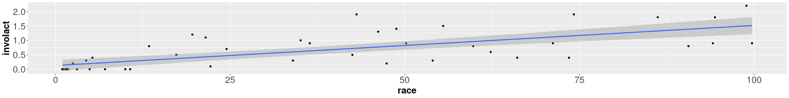

* Here we see a reasonably strong linear relationship between FAIR coverage and neighborhoods with higher minority composition (though we note the ecological fallacy).

========================================================

### Exploratory analysis -- continued


```r
ggplot(chredlin,aes(fire,involact)) + geom_point() +stat_smooth(method="lm") + theme(axis.text=element_text(size=20), axis.title=element_text(size=20,face="bold"))
```

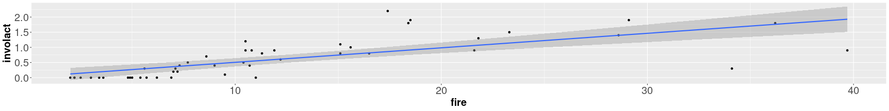

* Here there is also a somewhat strong linear relationship with the number of fires and the number of FAIR coverage plans, though with some strong outliers.

========================================================

### Exploratory analysis -- continued


```r
ggplot(chredlin,aes(theft,involact)) + geom_point() +stat_smooth(method="lm") + theme(axis.text=element_text(size=20), axis.title=element_text(size=20,face="bold"))
```

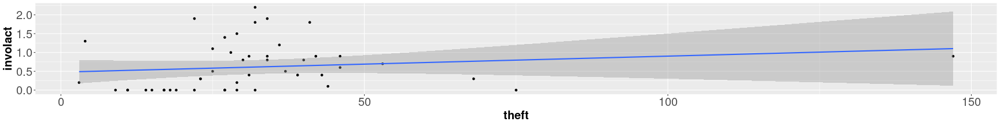

* With theft, we appear to have a point with a high leverage that is influencing the linear fit relationship between the FAIR coverage and theft

  * this single observation has influenced the linear trend, and with great uncertainty ($95\%$ confidence interval).  Likewise, there could be nonlinear scaling to take account of.

========================================================

### Exploratory analysis -- continued


```r
ggplot(chredlin,aes(age,involact)) + geom_point() +stat_smooth(method="lm") + theme(axis.text=element_text(size=20), axis.title=element_text(size=20,face="bold"))
```

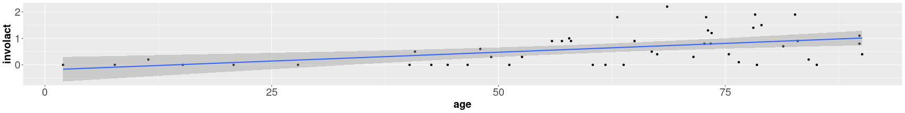

* With age, there appears to be a linear relationship with older housing and higher number of FAIR plans;

  * however, in newer neighborhoods, the uncertainty of this relationship ($95\%$ confidence interval) becomes much wider.

========================================================

### Exploratory analysis -- continued


```r
ggplot(chredlin,aes(income,involact)) + geom_point() +stat_smooth(method="lm") + theme(axis.text=element_text(size=20), axis.title=element_text(size=20,face="bold"))
```

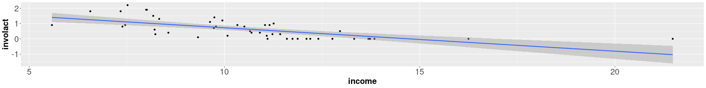

* With income, there appears to be some relationship between higher income and a lower number of FAIR plans, but outliers and nonlinearity appear to affect the relationship.  

* Particularly, the high income observation appears to have high leverage, and to produce unphysical (negative) values for the relationship.


========================================================

### Exploratory analysis -- continued


```r
ggplot(chredlin,aes(side,involact)) + geom_point(position = position_jitter(width = .2,height=0)) + theme(axis.text=element_text(size=20), axis.title=element_text(size=20,face="bold"))
```

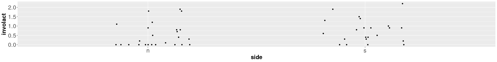

* In the plot of FAIR plans versus the North or South Side of Chicago, we jitter the data points so they don't plot over each other.  It is hard to tell the exact effect of the North or South side from this plot.

========================================================


### Exploratory analysis -- continued

* If we focus on the relationship between the minority composition of the neighborhoods versus the number of FAIR plans, we find:


```r
sumary(lm(involact ~ race,chredlin))
```

```
             Estimate Std. Error t value  Pr(>|t|)
(Intercept) 0.1292180  0.0966106  1.3375    0.1878
race        0.0138824  0.0020307  6.8361 1.784e-08

n = 47, p = 2, Residual SE = 0.44883, R-Squared = 0.51
```

* There is a non-zero parameter, with significance --- there appears to be some statistical relationship between neighborhoods with high minority composition and higher number of FAIR plans.

* However, we have to note at this moment:
  <ol>
    <li> the ecological fallacy, as mentioned before;</li>
    <li> the above is not like, e.g., a partial residual plot and it doesn't factor out other factors like crime and fire rates.</li>
  </ol>
  
* Indeed, there may be a number of confounding variables that may provide a better explanation.
  
* It could be legitimate buisness practice on the part of insurance companies to deny normal insurance when a neighborhood has too high of a risk;

  * we need to analyze this to see if we can actually identify a discriminatory practice.

========================================================

### Exploratory analysis -- continued


```r
ggplot(chredlin,aes(race,fire)) + geom_point() +stat_smooth(method="lm") + theme(axis.text=element_text(size=20), axis.title=element_text(size=20,face="bold"))
```

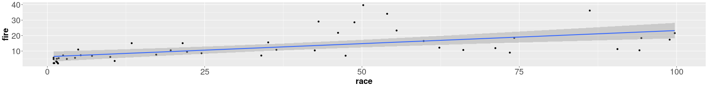

* When plotting fire versus race, we see a somewhat nonlinear but slightly positive trend between the neighborhoods of high minority concentration and higher rate of fires.

========================================================

### Exploratory analysis -- continued


```r
ggplot(chredlin,aes(race,theft)) + geom_point() +stat_smooth(method="lm") + theme(axis.text=element_text(size=20), axis.title=element_text(size=20,face="bold"))
```

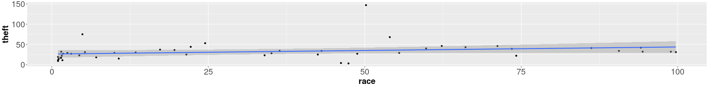

* When plotting theft versus race, we see a trend of slightly higher rate of theft with neighborhoods of higher minority concentration. 

* We note, also, this plot has an extreme outlier that may be important for the analysis -- this might be skewing the trend positively in a way that isn't consistent with the overall behavior of the city;

  * however, this also doesn't appear to be of high leverage.


========================================================

### Exploratory analysis -- continued

* We move to the question of model selection, to determine the best possible predictors for the number of FAIR plans in a neighborhood.

* However, this is fundamentally an explanatory model in which we want to quantify the effect of the ethnic composition of a neighborhood on the number of plans.

  * If this was a disproportinately influential predictor, compared to e.g., theft and fire (when all values are held equal) then we might build evidence of discriminatory business practices.
  
* With this purpose, we will thus emphasize techniques which help analyze the explanatory power of the model.

* This also indicates an important consideration, where we need to control for certain variables in the model.

  * If, e.g., the parameter for "race" was insignificant in the presence of "income" we would struggle to justify a conclusion of illegal discriminatory practice.
  
* In this case, we will belabor some of the model selection (and the sensitivity of the model parameters) so that we can make conclusions and explanations with greater confidence.

* One change that we will make is to use log of income, as it is often done, due to the skewness of the variable; this is also because money operates practically in society on a logarithmic scale.

  * Practically speaking, moving from 10,000 to 11,000 dollars income is a much bigger difference than moving from 100,000 to 101,000 income, and its practical effect is nonlinear. 

========================================================

## Model selection

* We will begin with an information criterion view on the variables:


```r
library("leaps")
sum_life <- summary(regsubsets(involact~ race + fire + theft + age + log(income) + side, data=chredlin))
sum_life
```

```
Subset selection object
Call: regsubsets.formula(involact ~ race + fire + theft + age + log(income) + 
    side, data = chredlin)
6 Variables  (and intercept)
            Forced in Forced out
race            FALSE      FALSE
fire            FALSE      FALSE
theft           FALSE      FALSE
age             FALSE      FALSE
log(income)     FALSE      FALSE
sides           FALSE      FALSE
1 subsets of each size up to 6
Selection Algorithm: exhaustive
         race fire theft age log(income) sides
1  ( 1 ) "*"  " "  " "   " " " "         " "  
2  ( 1 ) "*"  "*"  " "   " " " "         " "  
3  ( 1 ) "*"  "*"  "*"   " " " "         " "  
4  ( 1 ) "*"  "*"  "*"   "*" " "         " "  
5  ( 1 ) "*"  "*"  "*"   "*" "*"         " "  
6  ( 1 ) "*"  "*"  "*"   "*" "*"         "*"  
```

* Here, "race" is the best single predictor model, and appears in all "best" choices of some number of explanatory variables.

========================================================

### Model selection -- continued

* Here, minimizing the BIC, we find that the model with race, fire, theft, and age is favored:


```r
par(mai=c(1.5,1.5,.5,.5), mgp=c(3,0,0))
plot(c(1:6), sum_life$bic, xlab = "Number explanatory variables", ylab = "Bayesian Information Criterion",  col=1,  cex=3, cex.lab=3, cex.axis=1.5)
```

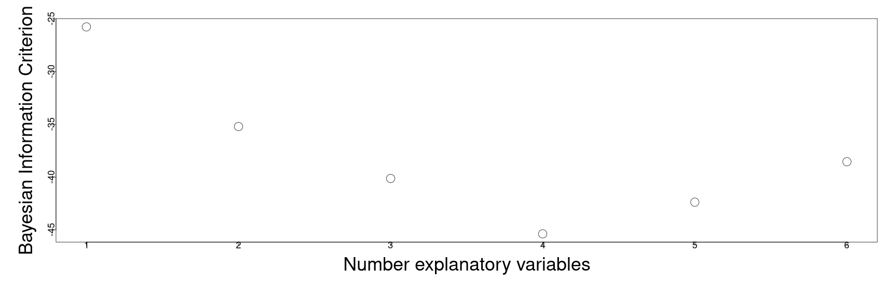


========================================================

### Model selection -- continued

* Adjusted $R^2_a$ favors the same:


```r
par(mai=c(1.5,1.5,.5,.5), mgp=c(3,0,0))
plot(c(1:6), sum_life$adjr2, xlab = "Number explanatory variables", ylab = "Adjusted R squared",  col=1,  cex=3, cex.lab=3, cex.axis=1.5)
```


========================================================

### Model selection -- continued

* With Mallow's Cp, both the five and six parameter model are good, but simplicity would favor five parameters (four explanatory variables):


```r
par(mai=c(1.5,1.5,.5,.5), mgp=c(3,0,0))
plot(c(2:7), sum_life$cp, xlab = "Number of parameters", ylab = "Mallows Cp",  col=1,  cex=3, cex.lab=3, cex.axis=1.5)
abline(0,1)
```

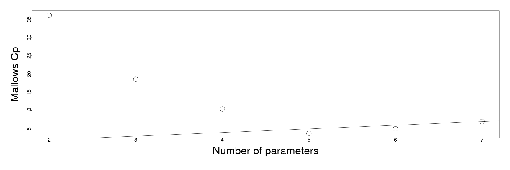

========================================================

### Model selection -- continued

* Finally, to compare the two nested models, we can check the exclude one t-test


```r
lmod <- lm(involact ~ race + fire + theft + age + log(income), data=chredlin)
sumary(lmod)
```

```
              Estimate Std. Error t value  Pr(>|t|)
(Intercept) -1.1855396  1.1002549 -1.0775 0.2875500
race         0.0095022  0.0024896  3.8168 0.0004485
fire         0.0398560  0.0087661  4.5466 4.758e-05
theft       -0.0102945  0.0028179 -3.6533 0.0007276
age          0.0083356  0.0027440  3.0377 0.0041345
log(income)  0.3457615  0.4001234  0.8641 0.3925401

n = 47, p = 6, Residual SE = 0.33453, R-Squared = 0.75
```

* and we find log-income to not be significant.

========================================================

### Model selection -- continued

* Plotting median income versus the percent of minority in each neighborhood, we see that these variables are strongly anti-correlated:


```r
ggplot(chredlin,aes(race,income)) + geom_point() +stat_smooth(method="lm") + theme(axis.text=element_text(size=20), axis.title=element_text(size=20,face="bold"))
```

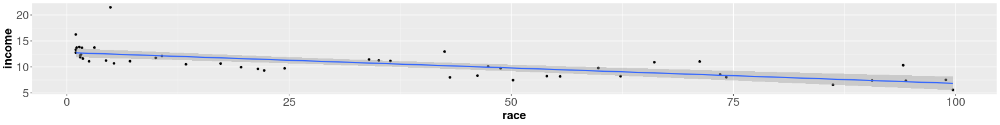

```r
cor(chredlin$income,chredlin$race)
```

```
[1] -0.7037328
```

* This is due, in part, to the historic segregation and inequality in Chicago, and the influence of these two variables can be very difficult to separate.

========================================================

### Model selection -- continued

* The strong anti-correlation of log-income and race makes the variable selection indicates a strong element of confounding variables in our analysis.  

  * While log-income seems to largely be statistically unimportant in the presence of the other variables, if we don't control for it, it might over-state the importance of the race parameter.
  

```r
x <- model.matrix(lmod)
e <- eigen(t(x)%*%x)$values
e[1] / e[length(e)]
```

```
[1] 4042968
```

```r
vif(x)
```

```
(Intercept)        race        fire       theft         age log(income) 
   1.985775    2.705490    2.733322    1.621824    1.577322    4.050811 
```

* We note the indication of high sensitivity in the parameter estimates due to the very large condition number, and the high VIF relative to the scale of the parameters.

* The best case scenario would be that we would perform the model analysis both with and without the log-income and compare the results 

  * however, for sake of a short example, we will only study the model with log-income included (as in Faraway).


========================================================

## Diagnostics

* Before we make conclusions, we will perform diagnostics.


```r
par(mai=c(1.5,1.5,.5,.5), mgp=c(3,0,0))
plot(lmod,1:1,  col=1,  cex=3, cex.lab=3, cex.axis=1.5)
```


* We should note one possible problem lying in the negative fitted values (number of FAIR plans), where there is structure in this tail.

========================================================

### Diagnostics -- continued

* Particularly, we have that,


```r
lmod$fitted[lmod$fitted < 0 ]
```

```
      60611       60656       60638       60652       60655 
-0.05706070 -0.23408790 -0.05930948 -0.28650119 -0.15827619 
```

* there are five zip codes with predicted negative values for the number of FAIR plans.

========================================================

### Diagnostics -- continued


```r
par(mai=c(1.5,1.5,.5,.5), mgp=c(3,0,0))
plot(lmod,1:1,  col=1,  cex=3, cex.lab=3, cex.axis=1.5)
```

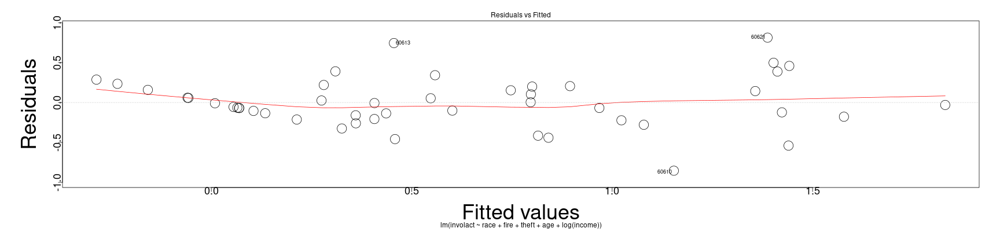

* These small negative numbers are problematic, due in part to the high number of zero values for the FAIR plans; 

  * however, barring this problem which is structural due to the response variable, we have otherwise good residuals.
  
* Unfortunately, a scale change won't fix this realistically --- a square root will make nominal difference, but not enough to justify the loss of interpretability of the response.

 * In this case, we will proceed cautiously, bearing in mind and qualifying our conclusions with the known issues.

========================================================

### Diagnostics -- continued


* The Q-Q plot of standardized residuals looks slightly heavy tailed:


```r
par(mai=c(1.5,1.5,.5,.5), mgp=c(3,0,0))
plot(lmod,2,  col=1,  cex=3, cex.lab=3, cex.axis=1.5)
```

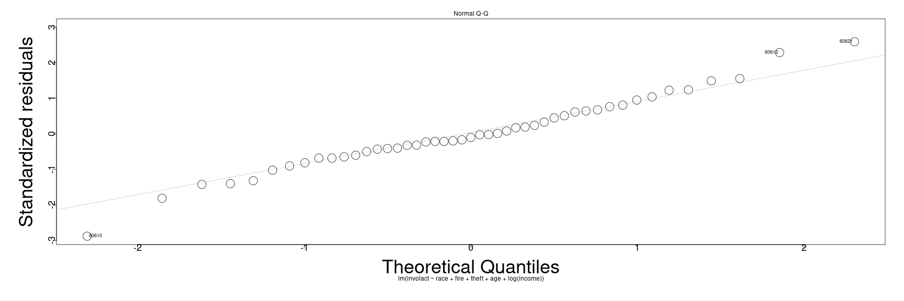

* Without a large number of cases to appeal to (CLT), we note that there may be some danger of bias in the parameter estimates.

========================================================

### Diagnostics -- continued

* Outside the problematic fitted values, the variance in the square-root, standardized residuals is pretty good.


```r
par(mai=c(1.5,1.5,.5,.5), mgp=c(3,0,0))
plot(lmod,3,  col=1,  cex=3, cex.lab=3, cex.axis=1.5)
```

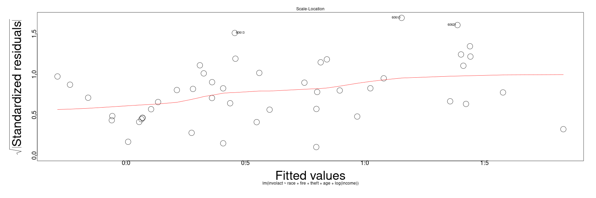

========================================================

### Diagnostics -- continued


* Finally, we notice once again the extreme leverage points that may need to be taken into account; on the other hand, the largest standardized residuals aren't large enough for concern:


```r
par(mai=c(1.5,1.5,.5,.5), mgp=c(3,0,0))
plot(lmod,5,  col=1,  cex=3, cex.lab=3, cex.axis=1.5)
```

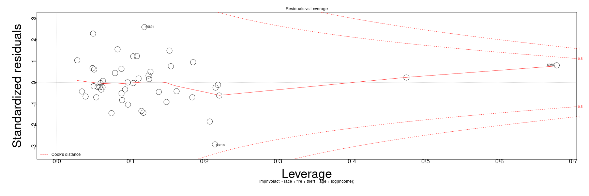

========================================================

### Diagnostics -- continued

* To verify the outlier analysis numerically, we can perform the Bonferroni corrected $5\%$ signficance test on the Studentized Residuals.

* Remember, the parameters are $\frac{\alpha}{2 * n}$ for the correct critical value of the t distribution of $n-p-1$ degrees of freedom:


```r
sumary(lmod)
```

```
              Estimate Std. Error t value  Pr(>|t|)
(Intercept) -1.1855396  1.1002549 -1.0775 0.2875500
race         0.0095022  0.0024896  3.8168 0.0004485
fire         0.0398560  0.0087661  4.5466 4.758e-05
theft       -0.0102945  0.0028179 -3.6533 0.0007276
age          0.0083356  0.0027440  3.0377 0.0041345
log(income)  0.3457615  0.4001234  0.8641 0.3925401

n = 47, p = 6, Residual SE = 0.33453, R-Squared = 0.75
```

```r
stud <- rstudent(lmod)
alpha_crit <- qt(0.05/(2 * 47), 40)
```

* We compute the critical value as above...


========================================================

### Diagnostics -- continued

* But we find that there are no outliers to the fit of the regression function, when we compensate for multiple hypothesis testing:


```r
abs(stud) > abs(alpha_crit)
```

```
60626 60640 60613 60657 60614 60610 60611 60625 60618 60647 60622 60631 60646 
FALSE FALSE FALSE FALSE FALSE FALSE FALSE FALSE FALSE FALSE FALSE FALSE FALSE 
60656 60630 60634 60641 60635 60639 60651 60644 60624 60612 60607 60623 60608 
FALSE FALSE FALSE FALSE FALSE FALSE FALSE FALSE FALSE FALSE FALSE FALSE FALSE 
60616 60632 60609 60653 60615 60638 60629 60636 60621 60637 60652 60620 60619 
FALSE FALSE FALSE FALSE FALSE FALSE FALSE FALSE FALSE FALSE FALSE FALSE FALSE 
60649 60617 60655 60643 60628 60627 60633 60645 
FALSE FALSE FALSE FALSE FALSE FALSE FALSE FALSE 
```

========================================================

<h2> Summary of diagnostics</h2>

* We note that there is a structural issue arising due to the high number of zero FAIR plans (the response variable), but that there isn't a realistic choice of scale transformation to fix this.

* Normality and variance assumptions of the error are OK, bearing in mind slightly heavy tails in the residuals.

* We will probably need to evaluate the effect of points of high leverage in the analysis, which may contribute to the heavy tails in the residuals.

* We wish thus to study the sensitivity of the main parameter of interest "race", with respect to the leverage points and controlling for covariates in the analysis.

* We will begin by looking at partial residual plots, which are used for nonlinearity detection when factoring out for covariates.

  * Specifically, we will evaluate the structural uncertainty of the model in terms of the hypothesis,
  $$
  \mathbf{Y} = \mathbf{X} \boldsymbol{\beta} + \boldsymbol{\epsilon}
  $$
  is a valid form for the signal.
  
* We will also look at the confidence intervals for the parameters.

========================================================

## Evaluating the uncertainty


```r
par(mai=c(1.5,1.5,.5,.5), mgp=c(3,0,0))
termplot(lmod, partial.resid=TRUE, terms=1,  cex=3, cex.lab=3, cex.axis=1.5, col.res="black")
```

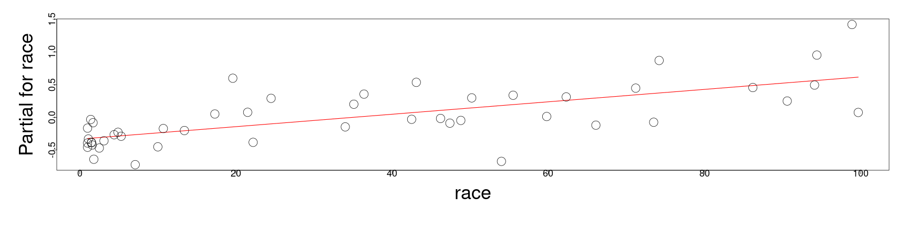

```r
coefficients(lmod)[2]
```

```
       race 
0.009502223 
```

```r
confint(lmod, parm = "race")
```

```
           2.5 %     97.5 %
race 0.004474458 0.01452999
```


========================================================

### Evaluating the uncertainty -- continued


```r
par(mai=c(1.5,1.5,.5,.5), mgp=c(3,0,0))
termplot(lmod, partial.resid=TRUE, terms=2,  cex=3, cex.lab=3, cex.axis=1.5, col.res="black")
```

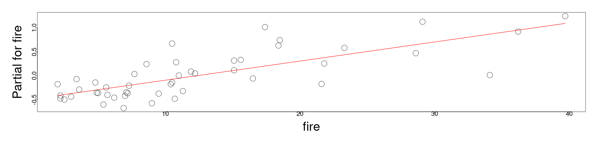

```r
coefficients(lmod)[3]
```

```
      fire 
0.03985604 
```

```r
confint(lmod, parm = "fire")
```

```
          2.5 %     97.5 %
fire 0.02215246 0.05755963
```

========================================================

### Evaluating the uncertainty -- continued


```r
par(mai=c(1.5,1.5,.5,.5), mgp=c(3,0,0))
termplot(lmod, partial.resid=TRUE, terms=3,  cex=3, cex.lab=3, cex.axis=1.5, col.res="black")
```

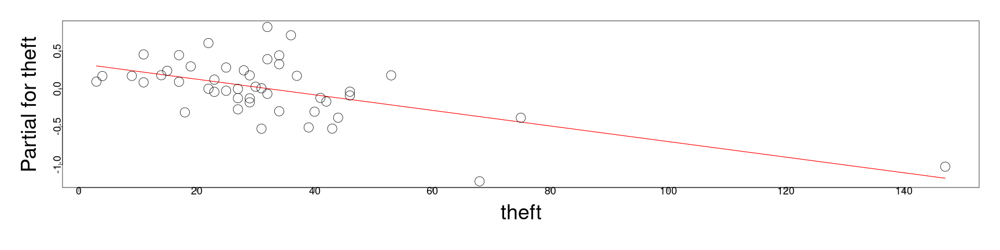

```r
coefficients(lmod)[4]
```

```
      theft 
-0.01029451 
```

```r
confint(lmod, parm = "theft")
```

```
            2.5 %       97.5 %
theft -0.01598536 -0.004603655
```


========================================================

### Evaluating the uncertainty -- continued


```r
par(mai=c(1.5,1.5,.5,.5), mgp=c(3,0,0))
termplot(lmod, partial.resid=TRUE, terms=4,  cex=3, cex.lab=3, cex.axis=1.5, col.res="black")
```

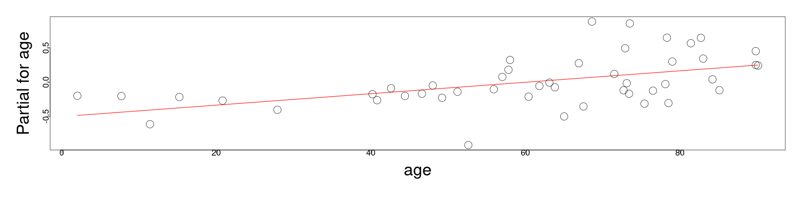

```r
coefficients(lmod)[5]
```

```
      age 
0.0083356 
```

```r
confint(lmod, parm = "age")
```

```
          2.5 %     97.5 %
age 0.002793968 0.01387723
```

========================================================

### Evaluating the uncertainty -- continued


```r
par(mai=c(1.5,1.5,.5,.5), mgp=c(3,0,0))
termplot(lmod, partial.resid=TRUE, terms=5,  cex=3, cex.lab=3, cex.axis=1.5, col.res="black")
```

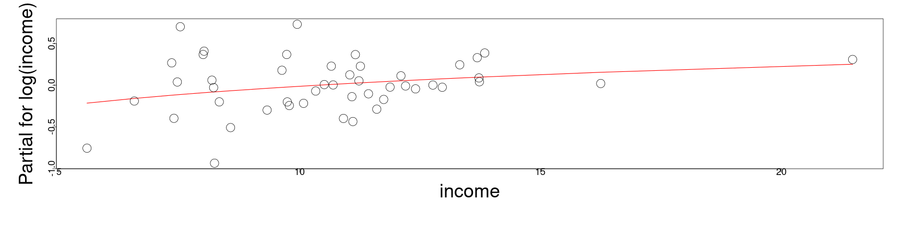

```r
coefficients(lmod)[6]
```

```
log(income) 
  0.3457615 
```

```r
confint(lmod, parm = "log(income)")
```

```
                 2.5 %   97.5 %
log(income) -0.4623041 1.153827
```


========================================================

### Evaluating the uncertainty -- continued


* For each of:
  
  * race

```r
(confint(lmod, parm = "race")[2] - confint(lmod, parm = "race")[1])/coefficients(lmod)[2] 
```

```
    race 
1.058229 
```
  * fire


```r
(confint(lmod, parm = "fire")[2] - confint(lmod, parm = "fire")[1])/coefficients(lmod)[3] 
```

```
     fire 
0.8883765 
```
  * age


```r
(confint(lmod, parm = "age")[2] - confint(lmod, parm = "age")[1])/coefficients(lmod)[5] 
```

```
    age 
1.32963 
```


========================================================

### Evaluating the uncertainty -- continued

* As well as,

  * theft

```r
(confint(lmod, parm = "theft")[2] - confint(lmod, parm = "theft")[1])/coefficients(lmod)[4] 
```

```
    theft 
-1.105609 
```

* There is some moderate uncertainty, evidenced by the confidence intervals, and discussed earlier due to the high sensitivity due to collinearity.

* Log-income, as noted earlier, is not significant and the uncertainty of the parameter is noted by the confidence interval,


```r
confint(lmod, parm = "log(income)")
```

```
                 2.5 %   97.5 %
log(income) -0.4623041 1.153827
```

```r
(confint(lmod, parm = "log(income)")[2] - confint(lmod, parm = "theft")[1])/coefficients(lmod)[6] 
```

```
log(income) 
   3.383293 
```


========================================================

### Evaluating the uncertainty -- continued

* With the OK diagnostics, in terms of constant variance of the errors and slightly heavy tails in the residuals we might make some conclusions with some serious qualifications.  

  * That is, we can put some faith in these p-values and confidence intervals, but they may be subject to some bias due to the heavy tails -- the estimated mean parameter values will be sensitive to this.
  
* Likewise, the effects of confounding variables limits the exact identifiability of effects;

  * this is in conjunction with the ecological fallacy for the race variable.

* Loosely speaking, it appears that there is a small, but statistically significant, effect in which neighborhoods with higher concentrations of ethnic minorities have a higher number of FAIR plans, when all other variables are held equal.

* This effect is not nearly as strong as e.g., the rate of fires with all other variables held equal.

  * However, this indicates that there is a small, but non-random effect where neighborhoods have higher number of FAIR plans based on a variable that shouldn't matter in an insurance application decision.
  
* Our analysis is not even nearly complete, and we cannot say if any application for insurance was rejected based upon their ethnic background;

  * nonetheless, this corroborates the claims of the Chicago neighborhood organizations who filed their civil rights lawsuit -- this warrants further investigation of the overall effect. 

========================================================

## Evaluating the sensitivity of parameters

* In terms of analyzing the sensitivity of the race parameter with respect to the inclusion or exclusion of other covariates, we can automate this to determine if the effect on the response changes dramatically.

  * This is a larger kind of uncertainty in the model selection itself;
  
  * if e.g., the parameter changed sign with a different choice of variables, we would have very contradictory explanations of the effect of the concentration of minorities on the number of FAIR plans.
  
* This is similar to the case when we used matching in the voting districts in New Hampshire, where we needed to see if an additional covariate was acting as a confounding variable on our analysis.

* By analyzing the inter-model stability of this parameter, we have a better sense of if this explanation is actually robust.

========================================================

### Evaluating the sensitivity of parameters -- continued


* Suppressing the code to automate this (in Faraway 2nd Edition) we will compare the parameter value and associated p-value for race in each combination of the variables:


```  
                                            beta   pvalue
race                                        0.0139 0.0000
race + fire                                 0.0089 0.0002
race + theft                                0.0141 0.0000
race + age                                  0.0123 0.0000
race + log ( income )                       0.0082 0.0087
race + fire + theft                         0.0082 0.0002
race + fire + age                           0.0089 0.0001
race + fire + log ( income )                0.0070 0.0160
race + theft + age                          0.0128 0.0000
race + theft + log ( income )               0.0084 0.0083
race + age + log ( income )                 0.0099 0.0017
race + fire + theft + age                   0.0081 0.0001
race + fire + theft + log ( income )        0.0073 0.0078
race + fire + age + log ( income )          0.0085 0.0041
race + theft + age + log ( income )         0.0106 0.0010
race + fire + theft + age + log ( income )  0.0095 0.0004
```

* The above output shows the parameter for race and the associated p-values for all 16 models. 

* There is some variance in the magnitude of the effect, depending on the other variables we control for (corroborating the earlier sensitivity), but in no case does the p-value rise above $5\%$ nor does the parameter change sign. 

* This suggests some uncertainty over the magnitude of the effect, we can be sure that the significance of the effect is not sensitive to the choice of adjusters.

========================================================

### Evaluating the sensitivity of parameters -- continued


* If we suppose that we were able to find models in which the composition of the neighborhood in terms of minorities was not statistically significant, our ability to control for other factors would be more difficult.

* We would then need to consider more deeply which covariates should be adjusted for and which not. 

* This level of model analysis and selection is at the heart of many real world problems;

  * in general, this is the reality of real problems you will encounter after this class.

* Now, we want to analyze the effect of leverage and influence on the model and our interpretation.

* We recall that there are several influential points, and we wish to determine if their inclusion or exclusion would radically change the interpretation for the parameter for race.

========================================================

### Evaluating the sensitivity of parameters -- continued


* We plot below, using the "dfbeta" function we used in another analysis, the change of the parameter for race when excluding any particular observation:


```r
par(mai=c(1.5,1.5,.5,.5), mgp=c(3,0,0))
plot(dfbeta(lmod)[,2],ylab="Change in race coef", cex=3, cex.lab=3, cex.axis=1.5)
abline(h=0)
```

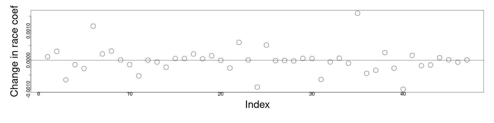

* The difference is negligible given the size of the parameter and scale of the response, so we are not especially concerned about the sensitivity of the parameter to observations.

========================================================

### Evaluating the sensitivity of parameters -- continued

* We note that we can also produce a similar plot from the "lm.influence" function, turning the output into a dataframe


```r
diags <- data.frame(lm.influence(lmod)$coef)
```

* Using this, we will plot the terms in ggplot2:


```r
ggplot(diags,aes(row.names(diags), race)) + geom_linerange(aes(ymax=0, ymin=race)) + theme(axis.text.x=element_text(angle=90), axis.text=element_text(size=20), axis.title=element_text(size=20,face="bold")) + xlab("ZIP") + geom_hline(yintercept = 0)
```

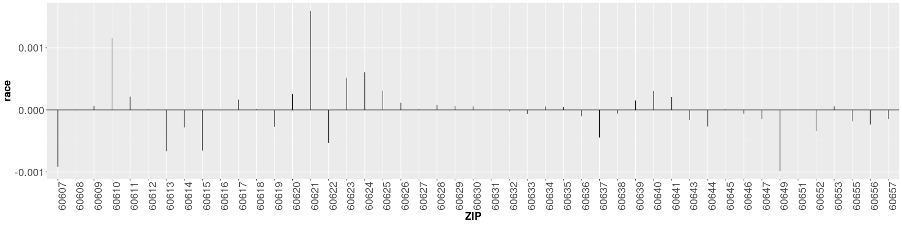

========================================================

### Evaluating the sensitivity of parameters -- continued


* Likewise, using the diags dataframe, we can produce a two dimensional plot of the differences in each the fire and theft parameters when excluding one of the observations:


```r
ggplot(diags,aes(x=fire,y=theft))+geom_text(label=row.names(diags)) +
  theme(axis.text=element_text(size=20), axis.title=element_text(size=20,face="bold"))
```

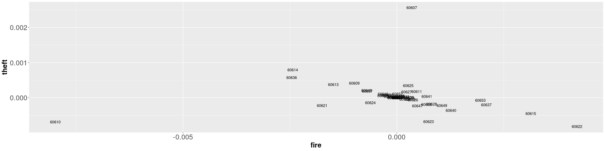

========================================================

### Evaluating the sensitivity of parameters -- continued


* As in the earlier diagnostics, we see that the zip codes 60607 and 60610 stick out for high leverage and influence on the parameter values:


```r
chredlin[c("60607","60610"),]
```

```
      race fire theft  age involact income side
60607 50.2 39.7   147 83.0      0.9  7.459    n
60610 54.0 34.1    68 52.6      0.3  8.231    n
```

* These are both unusually high fire and high theft zip codes -- we will remove these two observations simultaneously and see the effect on the paramters:


```r
lmode <- lm(involact ~ race + fire + theft + age + log(income), chredlin,subset=-c(6,24))
sumary(lmode)
```

```
              Estimate Std. Error t value  Pr(>|t|)
(Intercept) -0.5767365  1.0800462 -0.5340   0.59638
race         0.0070527  0.0026960  2.6160   0.01259
fire         0.0496474  0.0085701  5.7931 1.004e-06
theft       -0.0064336  0.0043489 -1.4794   0.14708
age          0.0051709  0.0028947  1.7863   0.08182
log(income)  0.1157028  0.4011132  0.2885   0.77453

n = 45, p = 6, Residual SE = 0.30320, R-Squared = 0.8
```

* Their exclusion actually makes theft and age no longer significant, though race remains significant.

========================================================

### Evaluating the sensitivity of parameters -- continued


* We have verified that our conclusions are also robust to the exclusion of one or perhaps two cases from the data. 

  * If our conclusions depended on including or excluding only one or two observations we would need to be particularly sure of these measurements. 
  
  * In some situations, we might wish to drop such influential cases but this would require
<b>strong arguments</b> that such points were in some way exceptional. 

* In any case, it would be very important to disclose this choice in the analysis, and any suppression of the information would be extremely dishonest.


========================================================

## Evaluating predictive power

* Although this is a model designed for explanation purposes, for completeness in the example, we will look a the predictive power of the model:


```r
x <- model.matrix(lmod)
x0 <- apply(x,2,median)
x0 <- data.frame(t(x0))
# note here that R won't accept the variable that we've rescaled until we re-name it back to its original name... 
colnames(x0)[6] <- "income"
```


```r
predict(lmod,new=x0,interval="prediction")
```

```
          fit       lwr     upr
1 0.003348934 -1.398822 1.40552
```

```r
predict(lmod,new=x0,interval="confidence")
```

```
          fit       lwr      upr
1 0.003348934 -1.225333 1.232031
```


========================================================

## Evaluating predictive power


```r
x <- model.matrix(lmod)
x0 <- apply(x,2,quantile, 0.05)
x0 <- data.frame(t(x0))
# note here that R won't accept the variable that we've rescaled until we re-name it back to its original name... 
colnames(x0)[6] <- "income"
```


```r
predict(lmod,new=x0,interval="prediction")
```

```
         fit       lwr      upr
1 -0.8398986 -2.599252 0.919455
```

```r
predict(lmod,new=x0,interval="confidence")
```

```
         fit       lwr       upr
1 -0.8398986 -2.464369 0.7845713
```
* We verify, due to the width of the confidence intervals for the mean and new observations on the median (as well as in extrapolation), that the model is worthless for predictions...

========================================================

## Qualifying our analysis: a hypothetical example

* We have shown thus far that even in the presence of confounding variables, and under exclusion of observations, 

  * the neighborhood's ethnic composition, with all other variables held equal, has a significant effect in determining the number of FAIR plans in the neighborhood.

* This doesn't mean conclusively, however, that there was systematic discrimination.

* If we tried another hypothetical model, supressing theft and the two high influence observations:


```r
modalt <- lm(involact ~ race+fire+log(income),chredlin, subset=-c(6,24))
sumary(modalt)
```

```
              Estimate Std. Error t value  Pr(>|t|)
(Intercept)  0.7532557  0.8358798  0.9012   0.37277
race         0.0042061  0.0022757  1.8483   0.07178
fire         0.0510220  0.0084504  6.0378 3.822e-07
log(income) -0.3623825  0.3191620 -1.1354   0.26279

n = 45, p = 4, Residual SE = 0.30919, R-Squared = 0.79
```

* the parameter for race is no longer significant.

* This is just a hypothetical example, because our relatively exhaustive analysis has shown that this is a cherry-picked model, versus the other possible models.

  * This kind of analysis is known as data dredging, and if we selected this model versus all the others that indicate that the race variable is an important explanation (with some uncertainty in the magnitude of the effect) it would be extremely dishonest.

========================================================

### Qualifying our analysis -- continued

* Generally, however, this shows some of the subtlety in statistical analysis like this 
  
  * particularly, independent analyses can lead to a different sequence of models, remediation and refinement, possibly to different conclusions.

* Part of robust analysis is thus to perform several model selections and the associated diagnostics to deal with the overall uncertainty in the model selection;

  * reasonably we should go back and perform the same steps without log income, for example.

* The strength of our conclusions will increase if we can show that several different models all have similar interpretations.

* If there are several reasonable models with different interpretations or conclusions, there is a fundamental issue in the data, and we should be cautious and be skeptical if there is really a signal to be found in the data.

  * A modeler who lacks scientific integrity can similarly explore a large number of models but report only the one that favors a particular conclusion; 
  
  * this is extremely dishonest, and if discovered, often leads to the author being professionally discredited (their work not taken seriously and themselves unemployable).
  
  * This is likewiswe the case for industrial applications;
  
  * even if the work is not published, if the analyst consistently makes flimsy models that aren't demonstrably robust, they will be uemployable because they cannot help business operations in any meaninful way.

========================================================

### Qualifying our analysis -- continued

* We have sketched what a rigorous analysis would look like (pending completion of additional analysis with regards to different scales of the response, and a more robust analysis with heavy tails).

* However, there are still several ways we should be cautious about our conclusions:

  <ol>
    <li> Firstly is that this is based on aggregate data -- we have assumed that the probability a minority homeowner would obtain a FAIR plan after adjusting for the effect of the other covariates is constant across zip codes. 
    <br><br>
    If this probability varies in a systematic way (as opposed to random noise about the signal) then our conclusions may be well off the mark.</li><br>
    <li> We have demonstrated statistical significance, but the practical effect is actually fairly small.  The largest value of the response (percent FAIR plans) is only $2.2\%$ and most other values are much smaller. 
    <br><br>
    The predicted difference between $0\%$ minority and $100\%$ minority is about $1\%$ , so while we may be confident that some people were affected by discrimination, there may not be so many affected call this systematic discrimination.</li><br>
    <li> There may be some other latent, confounding variable that we haven't accounted for that could explain this small difference if included in the model.</li><br>
    <li> We may find other ways to aggregate the data, for which our conclusions will change.</li>
  </ol>


========================================================

### Qualifying our analysis -- continued


* For example, if we fit two separate models for the North Side and South Side of Chicago, we can get very different results:


```r
lmod <- lm(involact ~ race+fire+theft+age+log(income), subset=(side == "s"),chredlin)
sumary(lmod)
```

```
              Estimate Std. Error t value Pr(>|t|)
(Intercept) -1.9946613  1.6949252 -1.1768 0.256470
race         0.0093509  0.0046055  2.0304 0.059285
fire         0.0510812  0.0170314  2.9992 0.008493
theft       -0.0102565  0.0090972 -1.1274 0.276184
age          0.0067778  0.0053061  1.2774 0.219700
log(income)  0.6810543  0.6493336  1.0489 0.309832

n = 22, p = 6, Residual SE = 0.34981, R-Squared = 0.76
```

* In the South Side, the parameter for race is no longer significant...

========================================================

### Qualifying our analysis -- continued

* while in the North Side, it is:


```r
lmod <- lm(involact ~ race+fire+theft+age+log(income), subset=(side == "n"),chredlin)
sumary(lmod)
```

```
              Estimate Std. Error t value Pr(>|t|)
(Intercept) -0.7902939  1.7793768 -0.4441  0.66196
race         0.0133200  0.0053903  2.4711  0.02310
fire         0.0246654  0.0154219  1.5994  0.12623
theft       -0.0079383  0.0039815 -1.9938  0.06073
age          0.0090040  0.0046471  1.9375  0.06769
log(income)  0.1666853  0.6233641  0.2674  0.79204

n = 25, p = 6, Residual SE = 0.35115, R-Squared = 0.76
```

* Generally, sub-dividing data into smaller and smaller groups, we can dillute the significance.

* However, as noted before, aggregating data too much causes its own issues -- the balance between these is contextual and subjective based on our understanding of the task at hand.

========================================================

### Qualifying our analysis -- continued

* In this context, we might explain the difference in terms of the demographics of the North Side and the South Side:


```r
ggplot(chredlin,aes(side,race)) + geom_point(position = position_jitter(width = .2,height=0)) + theme(axis.text=element_text(size=20), axis.title=element_text(size=20,face="bold"))
```

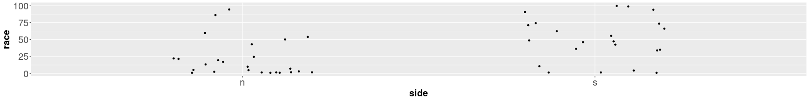


```r
summary(chredlin$race[chredlin$side=="n"])
```

```
   Min. 1st Qu.  Median    Mean 3rd Qu.    Max. 
   1.00    1.80   10.00   21.95   24.50   94.40 
```

```r
summary(chredlin$race[chredlin$side=="s"])
```

```
   Min. 1st Qu.  Median    Mean 3rd Qu.    Max. 
   1.00   34.27   48.10   49.80   72.92   99.70 
```

* With the South Side having a much higher concentration of minorities, the explanatory power of this variable has less effect in the south side, in the presence of other latent variables.


========================================================

### Qualifying our analysis -- continued

<div style="float:left; width:50%">

Courtesy of Eric Fischer <a href="https://creativecommons.org/licenses/by-sa/2.0" target="blank">CC BY-SA 2.0</a>
</div>

<div style="float:left; width: 50%">
<ul>
  <li> A visualization of the demographics of Chicago is to the left, where the North Side/ South Side divide is clearly expressed. </li>
  <li>This is a visualization of the 2010 census, where each dot represents 25 residents.</li>
  <li>The color coding is as follows:</li>
    <ol>
      <li> <b>Red:</b> non-Hispanic Caucasian</li>
      <li> <b>Blue:</b> African American</li>
      <li> <b>Orange:</b> Hispanic </li>
      <li> <b>Green: </b> Asian</b>
      <li> <b>Yellow:</b> other </li>
    </ol>
</ul>
</div>

========================================================

### Qualifying our analysis -- continued

* We may consider including the "Side" effect in multiple forms, with a possible interaction term for a mixed effect, but this doesn't seem to be a strong predictor  with or without the interaction term.


```r
sum_life <- summary(regsubsets(involact~ side * race + fire + theft + age + log(income) + side, data=chredlin))
sum_life
```

```
Subset selection object
Call: regsubsets.formula(involact ~ side * race + fire + theft + age + 
    log(income) + side, data = chredlin)
7 Variables  (and intercept)
            Forced in Forced out
sides           FALSE      FALSE
race            FALSE      FALSE
fire            FALSE      FALSE
theft           FALSE      FALSE
age             FALSE      FALSE
log(income)     FALSE      FALSE
sides:race      FALSE      FALSE
1 subsets of each size up to 7
Selection Algorithm: exhaustive
         sides race fire theft age log(income) sides:race
1  ( 1 ) " "   "*"  " "  " "   " " " "         " "       
2  ( 1 ) " "   "*"  "*"  " "   " " " "         " "       
3  ( 1 ) " "   "*"  "*"  "*"   " " " "         " "       
4  ( 1 ) " "   "*"  "*"  "*"   "*" " "         " "       
5  ( 1 ) " "   "*"  "*"  "*"   "*" "*"         " "       
6  ( 1 ) " "   "*"  "*"  "*"   "*" "*"         "*"       
7  ( 1 ) "*"   "*"  "*"  "*"   "*" "*"         "*"       
```

========================================================

<h2> Summary of the complete example</h2>

* We performed initial, exploratory analysis, checking for structure in the data, and in the plots of variables versus the response.

* We fit a model based on a mix of criterion methods and some qualitative judgment.

* We performed diagnostics to see how our assumptions might be breaking down:

  * there is an unavoidable issue with the many zero observations for the FAIR plan, leading to unphysical predictions;
  
  * there are slightly heavy tails in the residuals which may indicate a slight bias in the estimated parameters and their confidence intervals;
  
  * there are also several leverage points, but which overall don't appear to be significant outliers to the model fit, when excluded;
  
* Despite these issues, many of the conclusions on the explanation in the model remain consistent, even when removing one or more unusual cases.


========================================================
### A summary of the complete example

* When we evaluated the partial residuals, and confidence intervals for each of the parameters in our model, we indicated some parameter uncertainty, but generally a good systematic structure.  

* As this is an explanatory model, we were interested in "predicting" the parameter for "race"; 

  * we wanted to understand the sensitivity of this parameter, so we analyzed the p-value and the parameter value for qualitative differences versus all possible covariates in the data.

* Performing this after the criterion selection for the model, we limit the effect of saturation of p-values to an extent;

  * that is, we tried to avoid introducing bias in our own understanding by seeing false positives and negatives that could later affect our approach.

* By thereafter comparing the effect of race in multiple models, we evaluated an addition kind of model uncertainty;

  * if the interpretation of this parameter is very different among different models, we may question the legitimacy of the interpretation.

* Just for fun (to demonstrate skills in this class), we saw that it has awful predictive power...

* We made a final assessment of the uncertainty that we could not account for with our data.

========================================================

### Summary of the complete example -- continued

* After all this analysis, everything we say needs to be hedged with "ifs" and "buts" and qualified carefully.

  * For that matter, using some additional analysis like bootstrapping our confidence intervals and testing versus additional scales for the predictor / response may have been helpful.

* This is the reality of statistical modeling, where casual conclusions are extremely difficult to draw.

* To quote Faraway, quoting Winston Churchill:

  "Indeed, it has been said that Democracy is the worst form of government, except
all those other forms that have been tried from time to time."

* We might say the same about statistics with respect to how it helps us reason in the face of uncertainty. 
  
  * It is not entirely satisfying but the alternatives are worse.

* This applies both to frequentist and Bayesian analysis, in which we must be extremely careful about our approach and conclusions, including our own biases.

