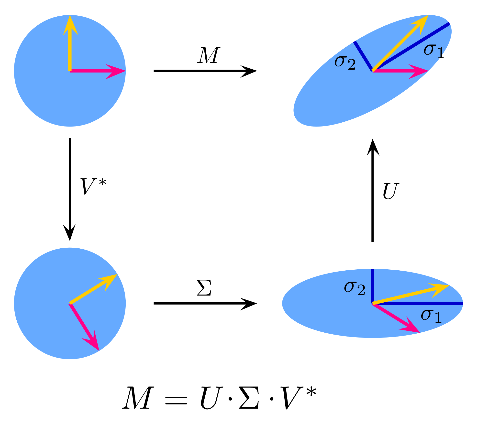

<style>
.section .reveal .state-background {
   background: #ffffff;
}
.section .reveal h1,
.section .reveal h2,
.section .reveal p {
   color: black;
   margin-top: 50px;
   text-align: center;
}
</style>


A review of linear transformations
========================================================
autosize: true
incremental: true
width: 1920
height: 1080

<h2 style="text-align:left"> Instructions:</h2>
<p style='text-align:left'>Use the left and right arrow keys to navigate the presentation forward and backward respectively.  You can also use the arrows at the bottom right of the screen to navigate with a mouse.<br></p>

<blockquote>
FAIR USE ACT DISCLAIMER:</br>
This site is for educational purposes only.  This website may contain copyrighted material, the use of which has not been specifically authorized by the copyright holders. The material is made available on this website as a way to advance teaching, and copyright-protected materials are used to the extent necessary to make this class function in a distance learning environment.  The Fair Use Copyright Disclaimer is under section 107 of the Copyright Act of 1976, allowance is made for “fair use” for purposes such as criticism, comment, news reporting, teaching, scholarship, education and research.
</blockquote>


========================================================

<h2>Outline</h2>

<ul>
  <li>The following topics will be covered in this lecture:</li>
  <ul>
    <li>Linear transformations and matrices</li>
    <li>Linear transformations on subspaces</li>
    <li>Matrix spectrum and positive definite matrices</li>
    <li>The singular value decomposition</li>
    <li>Inverses and Pseudo-inverses</li>
  </ul>
</ul>


========================================================
## Linear transformations

* <b style="color:#d95f02">Matrices and vectors</b> give us tools to "represent" <b style="color:#1b9e77">abstract linear transformations</b> by <b style="color:#d95f02">giving coordinates</b> to them.

*  <b style="color:#1b9e77">Linear transformations</b> refer to a <strong>special class of maps between vector spaces</strong>;

  * we will usually consider vectors spaces such as $\mathbb{R}^N$, though these tools extend in far greater generality.

<blockquote>
<b>Linear transformations</b><br>
Let $a,b\in \mathbb{R}$ and $\pmb{x},\pmb{y}\in V$  be arbitrary scalars and vectors and $T$ be some transformation
  $$\begin{align}
  T : V \rightarrow W.
  \end{align}$$
 $T$ is said to be a <strong>linear transformation</strong> if it satisfies the property
  $$\begin{align}
  T\left(a \pmb{x} + b \pmb{y} \right)  = a T\left( \pmb{x}\right) + b T\left(\pmb{y}\right).
  \end{align}$$
</blockquote>  
  
* Any map that does not satisfy the property above is said to be nonlinear; 

  * nonlinearities arise in highly different ways in practice and developing general tools for nonlinear maps is challenging.

* For reasons we shall see, we often use a <b>linear approximation</b> when it is appropriate to <strong>simplify the challenge of nonlinearities</strong>.

========================================================
### Linear transformations as matrices

* Let's suppose that for simplicity, a <b>transformation</b> 
  
  $$\begin{align}
  T:V \rightarrow V
  \end{align}$$ 
  
  is a map of the vector space $V$ to itself.
  
* Suppose, moreover, that we have <strong>chosen some basis</strong> for $V$, $\{\pmb{x}_i\}_{i=1}^N$; 

  * with a choice of basis, for each $i$ we can write
    
  $$\begin{align}
  T(\pmb{x}_i) = \sum_{j=1}^N \alpha_{i,j} \pmb{x}_j
  \end{align}$$
  
  as $T(\pmb{x})\in V$ by its definition, and by the definition of a basis.

* It is by <strong>choosing a basis for the domain and the image of the map</strong>, that we make a <b style="color:#d95f02">coordinatization of the map</b> $T$.


* Notice that, <b>by the linearity</b> of the transformation $T$, for any vector $\pmb{x} = \sum_{i=1}^N \beta_i \pmb{x}_i$ its map can be written as
  
  $$\begin{align}
  T\left(\pmb{x}\right) &= T\left( \sum_{i=1}^N \beta_i \pmb{x}_i \right)=\sum_{i=1}^N  \beta_i T\left(\pmb{x}_i\right) 
  \end{align}$$

  so that <strong>determining the output of the map on the basis determines the output for any vector</strong>.


========================================================
### Linear transformations as matrices


* Recall the notation for the <b style="color:#d95f02">coordinatization of the map</b>, $T(\pmb{x}_i) = \sum_{j=1}^N \alpha_{i,j} \pmb{x}_j$.

* In particular, suppose we <strong>order the coefficients</strong> $\alpha_{i,j}$ so that <b>$i$ refers to the row index</b> and <b>$j$ refers to column index</b> of the array
 
 $$\begin{align}
 \mathbf{A} := 
 \begin{pmatrix}
 \alpha_{1,1} & \cdots & \alpha_{1,N} \\
 \vdots & \ddots & \vdots \\
 \alpha_{N,1} & \cdots & \alpha_{N,N}.
 \end{pmatrix}
 \end{align}$$

* Recall, if  $\pmb{x} = \sum_{i=1}^N \beta_i \pmb{x}_i$, its <b style="color:#d95f02">coordinates in this basis are given as</b>

  $$\begin{align}
  \pmb{x} := \begin{pmatrix} \beta_1 & \cdots & \beta_N \end{pmatrix}^\top
  \end{align}$$

* Writing the transformation in these bases,
  
  $$T(\pmb{x})= \sum_{i=1}^N \beta_i T(\pmb{x}_i) =  \sum_{i=1}^N \beta_i \left( \sum_{j=1}^N \alpha_{i,j} \pmb{x}_j\right) = \sum_{j=1}^N \left( \sum_{i=1}^N \beta_i \alpha_{i,j} \right)\pmb{x}_j$$
 
  so that the map of $\pmb{x}$ under $T$ has the <b style="color:#d95f02">coordinatization</b> as
  
  $$\begin{align}
  T(\pmb{x}) := \begin{pmatrix} \sum_{i=1}^N \beta_i \alpha_{i,1} & \cdots & \sum_{i=1}^N \beta_i \alpha_{i,N}\end{pmatrix}^\top  \equiv  \mathbf{A} \pmb{x}
  \end{align}$$
 
 so that <strong>$\mathbf{A}$ completely describes the transformation $T$</strong>.


========================================================
### Linear transformations and subspaces

* Note that a <b style="color:#1b9e77">linear transformation</b> need not map a vector space $V$ to itself;

  * a very common situation is when we consider <strong>a map of $V$ to one of its subspaces with a projection operation</strong>.
  
* Generally, <b>a map to a subspace also needs not be orthogonal</b>;

  * however, we will consider a similar property to idempotence in this situation in which a subspace is said to be invariant.
  
<blockquote>
<b>Invariant subspaces of linear transformations</b><br>
Let $W\subset V$ be a subspace, and let $T:V \rightarrow V$ be a linear map.  The subspace $W$ is said to be <strong>invariant under $T$</strong> if for every $\pmb{y} \in W$ then $T(\pmb{y})\in W$. 
</blockquote>


* In the case that a map <b>$T$ has an invariant subspace</b>, there is a <strong>well-defined restriction of $T$</strong> to the subspace 

  $$T|_W: W \rightarrow W.$$

* In particular, this restriction can similarly be written as matrix transformation;

  * if $V$ has a basis of dimension $N$ and $W$ has a basis of dimension $M$, <strong>the restriction takes the form of a $M\times M$ matrix</strong>.

* With the above points, it brings us to the question of <b style="color:#d95f02">what basis should we choose for a linear transformation?</b>

* The standard Euclidean basis is the most common choice, but the <strong>Euclidean basis may not take advantage of the invariant properties of the transformation</strong>.

* Particularly, if $M \ll N$ and we are only concerned with the action on the subspace, a <b>well-chosen basis</b> as above can perform a <b>dramatic reduction to the computation of the map</b>.


========================================================
### Linear transformations and subspaces

* As a motivating example, consider the case where $\mathrm{span}\{\pmb{x}\} \subset \mathbb{R}^N$ is an <strong>invariant subspace of the transformation</strong> 
  
  $$T:\mathbb{R}^N \rightarrow \mathbb{R}^N.$$

* By the definition, 

  $$T(\pmb{x}) \in \mathrm{span}\{\pmb{x}\} \Leftrightarrow T(\pmb{x}) =\alpha \pmb{x}.$$
  
* Therefore, for <b>any arbitrary vector</b> $\beta \pmb{x}$ in the subspace
  
  $$\begin{align}
  \mathbf{A}\beta \pmb{x} = \alpha \beta\pmb{x} 
  \end{align}$$

  so that the <strong>action of the linear transformation on the entire subspace is that of scalar multiplication</strong>.
  
* If we <b>choose $\pmb{x}$ as a basis vector</b> for $\mathbb{R}^N$, the associated matrix $\mathbf{A}$ for this choice of basis will have a <strong>diagonal element corresponding to this action</strong>.

* Diagonal matrices are extremely simple for computation; to make <b>efficient use of computations</b> we will be concerned with <strong>matrix decompositions, corresponding to special choices of coordinates</strong>.

* The most fundamental matrix decomposition is known as the <b>eigen value decomposition</b>, discussed as follows.


========================================================
## Eigenvalues and eigenvectors

<blockquote>
<b>Eigen values and vectors</b><br>
If a nonzero vector $\pmb{x}$ has the property that,
  
  $$\mathbf{A}\pmb{x} =\lambda \pmb{x}$$

  then $\pmb{x}$ is said to be an <strong>eigen vector</strong> of $\mathbf{A}$ associated to the <strong>eigen value</strong> $\lambda$.
</blockquote>  

* <b>Diagonal matrices</b> are ones that have an <strong>entire coordinate system composed of eigen vectors</strong>;

  *  <b>each basis vector</b> <strong>defines an invariant subspace</strong> and the action is equivalent to scalar multiplication on each subspace.

* Certain non-diagonal matrices can be <strong>transformed into diagonal matrices</strong> by <b style="color:#d95f02">finding such a coordinate system</b> and <b style="color:#d95f02">applying a "change of basis" transformation</b>.


* Suppose that $\pmb{x}$ is an eigen vector for a matrix $\mathbf{A}$ associated to a <strong>zero eigenvalue $\lambda=0$</strong>; then the columns of $\mathbf{A}^i$ we have a <b>linear dependence</b> defined as
  
  $$\begin{align}
  \sum_{i=1}^N x_i \mathbf{A}^i = \pmb{0} .
  \end{align}$$
  
*  Notice now that,
 
  $$\begin{align}
   \mathbf{A}\pmb{x} =\lambda \pmb{x} 
  & & \Leftrightarrow & & \mathbf{A}\pmb{x} - \lambda \pmb{x} = 0 & & \Leftrightarrow
  & & \left(\mathbf{A}  - \lambda \mathbf{I}_n\right) \pmb{x} = 0.
  \end{align}$$
  
* This means that <b>$\pmb{x}$ is an eigen vector</b> of the matrix $\left(\mathbf{A}  - \lambda \mathbf{I}_n\right)$ associated to the <strong>zero eigenvalue and a linear dependence</strong> in the columns of $\left(\mathbf{A}  - \lambda \mathbf{I}_n\right)$.

========================================================
## The polar decomposition

* <b>Not all matrices can be diagonalized with a change of basis</b>;
  
  * however, there is a <strong>special class of matrices</strong> for which this is true and <b>arise commonly in statistical analysis</b>.

* This result is a special case of the more general <b>spectral theorem</b>:

<blockquote>
<b>The polar decomposition (restricted spectral theorem)</b><br>
Suppose that $\mathbf{A}$ is a <strong>real valued symmetric matrix</strong>, i.e., $\mathbf{A} = \mathbf{A}^\top$.  Then there exists an <strong>orthogonal change of basis matrix</strong> $\mathbf{U}$ and <strong>diagonal matrix</strong> $\mathbf{D}$ for which
$$\begin{align}
\mathbf{A} = \mathbf{U}\mathbf{D} \mathbf{U}^\top.
\end{align}$$
</blockquote>

* The <strong>columns of $\mathbf{U}$</strong> are the <b>(orthonormal) eigen vectors</b> of the matrix $\mathbf{A}$ and the <strong>diagonal elements of $\mathbf{D}$</strong> are the associated <b>eigen values</b>.

  * Orthogonal matrices represent rotations; 
  
  * therefore, <strong>with respect to a rotation of the coordinate frame</strong>, the <b>action of the map is scalar multiplication</b> on the invariant subspaces.
  
* If the <b>eigenvalues are larger than one in absolute value</b>, this action then corresponds to an <strong>expansion along these directions</strong> while <b>eigen values with norm less than one</b> correspond to a <strong>contraction</strong>;

  * a <b>negative eigenvalue</b> corresponds to a <strong>reflection in the subspace</strong>, including a contraction or expansion as above.

* The eigenvalues, with a correct rotation of perspective, thus completely describe the action of a symmetric matrix as above.

========================================================
## Eigen values and vectors in Numpy

* We will make a quick demonstration of the basic eigen function in Numpy


```python
import numpy as np
from numpy.linalg import eig
from numpy.random import normal
```

* We begin by randomly generating an array with standard normal entries


```python
np.random.seed(42)
my_array = normal(size=[3,3])
my_array
```

```
array([[ 0.49671415, -0.1382643 ,  0.64768854],
       [ 1.52302986, -0.23415337, -0.23413696],
       [ 1.57921282,  0.76743473, -0.46947439]])
```

* To compute the eigen values and the eigen vectors, we can use the `eig` function imported above:


```python
e_vals, e_vecs = eig(my_array)
```

========================================================
### Eigen values and vectors in Numpy

* From the last slide, we have


```python
e_vals
```

```
array([ 1.22795686+0.j        , -0.71743524+0.61245434j,
       -0.71743524-0.61245434j])
```

* Notice that <strong>two of the eigen values are complex and come in a conjugate pair</strong>;

  * generally, <b style="color:#d95f02">real matrices</b> can have <b style="color:#1b9e77">complex eigen values, corresponding to rotations within the subspaces</b>.
  
* This is <b>not the case</b>, however, <strong>for real symmetric matrices</strong> as discussed in the polar decomposition.

* Indeed,


```python
my_symmetric_array = my_array.transpose() @ my_array
my_symmetric_array
```

```
array([[ 5.06025801,  0.78664234, -0.77628148],
       [ 0.78664234,  0.66290088, -0.39501919],
       [-0.77628148, -0.39501919,  0.69472676]])
```

```python
e_vals, e_vecs = eig(my_symmetric_array)
```

========================================================
### Eigen values and vectors in Numpy

* From the last slide, we see that the <strong>eigen values of the symmetric array</strong> are given as


```python
e_vals
```

```
array([5.34613967, 0.78854214, 0.28320384])
```

* Notice the action of the symmetric array on the eigen vectors


```python
e_vecs[:,0]
```

```
array([ 0.96813371,  0.17751704, -0.17664888])
```

```python
my_symmetric_array @ e_vecs[:,0] / e_vals[0]
```

```
array([ 0.96813371,  0.17751704, -0.17664888])
```

* If the map needs to be applied many times, <strong>computing the change of basis into the eigen vectors</strong> can be <b>more cost-efficient than applying the map directly</b>.

* Notice that the above <b>eigen values are all positive</b> -- this is actually <strong>a general property of "squared" matrices</strong> constructed as

 $$\begin{align}
 \mathbf{A}^\top \mathbf{A}
 \end{align}$$
 
 for arbitrary arrays $\mathbf{A}$ with <b>linearly independent columns</b>.

========================================================
## Positive definite matrices

* When all eigenvalues of a symmetric matrix $\mathbf{A}$ are positive we can <b>visualize the matrix as a hyper-ellipse</b>.

* The  <b style="color:#d95f02">principal axes</b> of the hyper-ellipse are given by the  <b style="color:#d95f02">eigen vectors</b>, while the <b style="color:#1b9e77">length of these axes</b> are given by the <b style="color:#1b9e77">eigen values</b>.

<blockquote>
<b>Positive (semi)-definite matrices</b><br>
A <strong>real symmetric matrix</strong> $\mathbf{A}$ is said to be <strong>positive definite</strong> if all of its eigenvalues are greater than zero.  If all eigenvalues are non-negative, then $\mathbf{A}$ is said to be <strong>positive semi-definite</strong>.
</blockquote>


* <b>Positive definite matrices</b> are special, in part, because they <strong>define alternative, weighted version of the Euclidean norm</strong> by  $\sqrt{\pmb{x}^\top \mathbf{A}\pmb{x}}$.

* For our purposes, we will more commonly use the norm defined by the inverse of a positive definite $\mathbf{A}$;

  * we will return to this point shortly when we discuss matrix inverses.
  
* Let $\mathbf{D} := \mathrm{diag}\left(\lambda_i\right)$ be the <strong>diagonal matrix of the eigen values</strong> for the positive definite matrix $\mathbf{A}$. 

* Positive definite matrices also have <b>well-defined square roots</b> -- notice that for

  $$\sqrt{\mathbf{A}} := \mathbf{A}^\frac{1}{2}:=  \mathbf{U}\mathrm{diag}\left(\sqrt{\lambda}_i\right) \mathbf{U}^\top$$

  we can write $\mathbf{A}= \left(\mathbf{A}^\frac{1}{2}\right)^2$.

========================================================

## The singular value decomposition

* Consider now an arbitrary matrix $\mathbf{M}\in \mathbb{R}^{N\times M}$ for $N>M$; if $\mathbf{M}$ is not square, it cannot be symmetric, but each of

  $$\begin{align}
  \mathbf{M}^\top \mathbf{M} \in \mathbb{R}^{M\times M} & & \mathbf{M}\mathbf{M}^\top \in \mathbb{R}^{N\times N}
  \end{align}$$
  <b>are symmetric</b>.

* Using the <b>polar decomposition</b>, we can thus find their <strong>diagonalizations</strong>

  $$\begin{align}
  \mathbf{M}^\top \mathbf{M} & = \mathbf{V} \mathbf{D} \mathbf{V}^\top\\
  \mathbf{M}\mathbf{M}^\top  & = \mathbf{U} \hat{\mathbf{D}} \mathbf{U}^\top,
  \end{align}$$
  
  where
  <ol>
    <li> $\mathbf{V} \in \mathbb{R}^{M\times M},\mathbf{U} \in \mathbb{R}^{N \times N}$ are <b>orthogonal matrices</b>;</li>
    <li> $\mathbf{D} \in \mathbb{R}^{M \times M}, \hat{\mathbf{D}} \in \mathbb{R}^{N \times N}$ are both <b>diagonal matrices of the eigenvalues of the "square"</b>.
  </ol>

*  Assume that the <b>columns of $\mathbf{M}$ are linearly independent</b> -- then both $\mathbf{D}$ and $\hat{\mathbf{D}}$ have <strong>exactly $M$ non-zero eigenvalues</strong>.

* If we order the non-zero eigenvalues of $\hat{\mathbf{D}}$ such that there is a non-zero block in the top left,

  $$\begin{align}
  \hat{\mathbf{D}} = 
  \begin{pmatrix}
  \mathbf{D} & 0_{M \times (N-M)} \\
  0_{(N-M) \times M} & 0_{(N-M) \times (N-M)} 
  \end{pmatrix}
  \end{align}$$
  
  

========================================================
### The singular value decomposition


* It can be demonstrated that $\mathbf{M}$ has a decomposition into,

  $$\begin{align}
  \mathbf{M} = \mathbf{U} \boldsymbol{\Sigma} \mathbf{V}^\top,
  \end{align}$$
  
  where 
  
  $$\begin{align} 
  \boldsymbol{\Sigma} = \begin{pmatrix}
  \sqrt{\mathbf{D}} \\
  0_{(N-M) \times M} 
  \end{pmatrix}.
  \end{align}$$

* This decomposition is known as the <b>singular value decomposition</b>.  The <b>singular values</b> are the (positive) principal-diagonal entries of $\boldsymbol{\Sigma}$ usually ordered descendingly in size.

* The columns of $\mathbf{U}$ are called the <strong>left singular vectors</strong> while the columns of $\mathbf{V}$ are called the <strong>right singular vectors</strong>.

* Thus we can write, e.g., 

  $$\begin{align}
  \mathbf{M}\mathbf{M}^\top &= \mathbf{U} \boldsymbol{\Sigma} \mathbf{V}^\top \mathbf{V} \boldsymbol{\Sigma}^\top \mathbf{U}^\top \\
  &= \mathbf{U} \begin{pmatrix} \sqrt{\mathbf{D}} \sqrt{\mathbf{D}} & 0_{M \times (N-M)} \\
  0_{(N-M) \times M} & 0_{(N-M) \times (N-M)} \end{pmatrix} \mathbf{U}^\top \\
  & = \mathbf{U} \hat{\mathbf{D}} \mathbf{U}^\top
  \end{align}$$

* We can recover the eigen decomposition for $\mathbf{M}^\top \mathbf{M}$ in a similar fashion.


========================================================

### Visualizing the SVD 

<div style="float:left; width:40%; text-align:center">

<p>Courtesy of Georg-Johann <a href="https://creativecommons.org/licenses/by-sa/3.0" target="blank">CC BY-SA 3.0</a></p>
</div>

<div style="float:left ; width:60%">
<ul>
  <li> We view the orthogonal transformations as rotations of the standard Euclidean frame;</li>
  <li> likewise, we view the diagonal matrix as a dilation of the points along the specified frame, stretching the unit circle into an ellipsoid.</li>
  <li> Therefore, for a matrix transformation $\mathbf{M}$, we can view its SVD 
  $$\begin{align}
  \mathbf{M} = \mathbf{U}\boldsymbol{\Sigma}\mathbf{V}^\top
  \end{align}$$ 
  as a composition of:
  <ol>
    <li> <b>a rotation into a new frame</b>; </li>
    <li> <strong>a stretch, contraction or mapping to zero along the directions in this frame</strong>;</li>
    <li> <b>a final rotation back into the Euclidean coordinates</b>, but where the shape may no longer align with this frame.</li>
  </ol>
  <li>It is important to recognize that this applies for non-square matrices so that the image space and the domain do not match.</li>
</ul>
</div>
<div style="float:left; width:100%">
<ul>
  <li>The <b>trailing zeros</b> in 
  $$\begin{align} 
  \boldsymbol{\Sigma} = \begin{pmatrix}
  \sqrt{\mathbf{D}} \\
  0_{(N-M) \times M} 
  \end{pmatrix}
  \end{align}$$
  correspond to the <strong>inputs that are mapped to zero automatically</strong>, based on the dimensional reduction from the domain to the image space.</li>
</ul>
</div>


========================================================
### SVD in numpy

* The singular value decomposition is similarly a built-in function in Numpy, with the values and left / right vectors given as a standard output:


```python
from numpy.linalg import svd
U, Sigma, Vh = svd(my_array)
```

* Notice that unlike the eigen values of the random matrix, the singular values are all non-negative, real-valued


```python
Sigma
```

```
array([2.31217207, 0.88799895, 0.53216899])
```

* For the <b>real symmetric array</b> the <strong>SVD is identical to the polar decomposition</strong>:


```python
U, Sigma, Vh = svd(my_symmetric_array)
Sigma
```

```
array([5.34613967, 0.78854214, 0.28320384])
```

```python
e_vals
```

```
array([5.34613967, 0.78854214, 0.28320384])
```

* <b>SVD routines are more expensive than eigen value routines</b> for symmetric arrays, but <strong>tend to be more accurate / stable numerically</strong>; therefore, they may still be used in place of an eigen value solver when this is the priority.

========================================================
## Solving a linear system of equations

* For any <b>zero eigen vector</b>, its image under the corresponding linear transformation is <strong>zero regardless of which particular value in the subspace we choose</strong>.

  * This means that <b style="color:#d95f02">we cannot decipher what was the input from observing the output</b> of the map on this subspace. 

* We can still attempt to <b>reconstruct the information of the input from an observed output</b>, but the <strong>methods will depend on how the relationships constrain the data, and if we can be satisfied with an approximate solution</strong>.
<blockquote>
<b>Linear inverse problem</b><br>
Let $\mathbf{A} \in \mathbb{R}^{N \times M}$, $\pmb{x} \in \mathbb{R}^N$, $\pmb{b}\in\mathbb{R}^M$.  Suppose that $\mathbf{A}$ and $\pmb{b}$ are known, but $\pmb{x}$ is unknown and satisfy the relationship:
  $$\mathbf{A} \pmb{x} = \pmb{b}$$
  Finding the collection of values $\pmb{x}$ that satisfy this relationship is known as a <strong>linear inverse problem</strong>.
</blockquote>  

* If $N>M$ <strong>(more rows than columns)</strong> then the <b>system is over-determined</b> and there <strong>may be no value of $\pmb{x}$ satisfying the relationship</strong>;

  * for $M>N$ <strong>(more columns than rows)</strong>, the <b>system is under-determined</b>, and there <strong>may be infinitely many choices for $\pmb{x}$</strong>.

* In the case that <strong>$M=N$ and $\mathbf{A}$ has no zero eigen values</strong> then <b>$\mathbf{A}$ is invertible</b>:

<blockquote>
<b>Matrix inverse</b><br>
Suppose $\mathbf{A}\in \mathbb{R}^{N \times N}$ has no zero eigen values.  There exists an <strong>inverse transformation denoted $\mathbf{A}^{-1}$</strong> that satisfies the property

$$\begin{align}
\mathbf{A}^{-1}\mathbf{A} = \mathbf{A}\mathbf{A}^{-1} = \mathbf{I}_N:= \mathrm{diag}(\pmb{1}_N).
\end{align}$$
</blockquote>


========================================================
### Solving a linear system of equations

* If we suppose that an inverse for $\mathbf{A}$ exists, then notice that
  
  $$\pmb{x} = \mathbf{A}^{-1} \pmb{b}.$$
  
  * Therefore, <strong>if $\pmb{b}$ is observed and $\mathbf{A}$ is a known relationship</strong>, we can <b>uniquely identify the inputs from the observations</b>.

* The way to implement such a procedure in Numpy is with the `linalg.solve` function.

  * Firstly we create a simple array for example:
  

```python
from numpy.linalg import solve, inv
observed_vec = np.arange(3)
observed_vec
```

```
array([0, 1, 2])
```

  * Now, applying the `solve` function, we compute the desired inputs and demonstrate that the action of `my_array` gives the original example:


```python
input_vec = solve(my_array, observed_vec)
my_array @ input_vec
```

```
array([-2.77555756e-17,  1.00000000e+00,  2.00000000e+00])
```


========================================================
### Solving a linear system of equations

* We can also compute the inverse of a matrix directly 


```python
my_inverse_array = inv(my_array)
my_inverse_array @ my_array
```

```
array([[ 1.00000000e+00,  0.00000000e+00,  4.16333634e-17],
       [-2.22044605e-16,  1.00000000e+00,  0.00000000e+00],
       [ 1.38777878e-16, -6.93889390e-17,  1.00000000e+00]])
```

*  and then apply its action to the observed vector to recover the input vector:


```python
my_inverse_array @ observed_vec
```

```
array([ 0.7323549 ,  0.86895275, -0.37614669])
```

```python
input_vec
```

```
array([ 0.7323549 ,  0.86895275, -0.37614669])
```

* However, <b>for purposes of the inverse problem</b>, it is <strong>far more efficient to use the `solve` function</strong> as on the last slide.


========================================================
## Pseudo-inverses

* Consider the linear inverse problem again, 
  
  $$\begin{align}
  \mathbf{A} \pmb{x}= \pmb{b} & & \mathbf{A}\in \mathbb{R}^{N \times M}
  \end{align}$$
  and suppose that the <strong.system is over determined</strong>, $N>M$, where $\mathbf{A}$ has the SVD $\mathbf{A} = \mathbf{U}\boldsymbol{\Sigma}\mathbf{V}^\top$.

* We note, $\mathbf{A}$ is <b>not square and thus has no formal inverse</b>;

  * however, we can still <strong>reconstruct a "best" estimate with a pseudo-inverse</strong>.
  
<blockquote>
<b>The (left) pseudo-inverse</b><br>
Suppose that $\mathbf{A}\in \mathbb{R}^{N\times M}$ has linearly independent columns with $N>M$.  In this case, $\left(\mathbf{A}^\top\mathbf{A}\right)^{-1}$ exists, and the <strong>(left) pseudo-inverse</strong> is defined

$$\begin{align}
\mathbf{A}^\dagger := \left(\mathbf{A}^\top \mathbf{A}\right)^{-1} \mathbf{A}^\top.
\end{align}$$
</blockquote>

* If the pseudo-inverse exists as above it satisfies the property,
  
  $$\begin{align}
  \mathbf{A}^\dagger \mathbf{A} =  \left(\mathbf{A}^\top \mathbf{A}\right)^{-1} \mathbf{A}^\top\mathbf{A} = \mathbf{I}_M;
  \end{align}$$
  
  * this is what is meant by a "left pseudo-inverse".
  
* Note, right pseudo-inverses also exist under the right conditions;
  
  * these can be used to solve an under-determined linear system, though this will not be the focus of our discussions.

========================================================
### Pseudo-inverses

* Consider now the representation of the pseudo-inverse with respect to the SVD,

  $$\begin{align}
  \mathbf{A}^\dagger &= \left(\mathbf{V}\boldsymbol{\Sigma}^\top\mathbf{U}^\top\mathbf{U}\boldsymbol{\Sigma}\mathbf{V}^\top\right)^{-1} \mathbf{V}\boldsymbol{\Sigma}^\top\mathbf{U}^\top \\
  &=\mathbf{V}\left(\boldsymbol{\Sigma}^\top\boldsymbol{\Sigma}\right)^{-1} \boldsymbol{\Sigma}^\top\mathbf{U}^\top
  \end{align}$$
  
  where $\boldsymbol{\Sigma}^\top\boldsymbol{\Sigma}\in \mathbb{R}^{M\times M}$ is the <strong>diagonal matrix of the singular values squared</strong>.
  
* Applying $\mathbf{A}$ to the left-hand-side,

  $$\begin{align}
  \mathbf{A}\mathbf{A}^\dagger &=\mathbf{U} \boldsymbol{\Sigma}\left(\boldsymbol{\Sigma}^\top\boldsymbol{\Sigma}\right)^{-1} \boldsymbol{\Sigma}^\top\mathbf{U}^\top\\
  &= \mathbf{U}\mathbf{U}^\top
  \end{align}$$
  where $\mathbf{U}\mathbf{U}^\top$ is the <b>orthogonal projection into the column span of $\mathbf{A}$</b>.

* The <b>orthogonal projection lemma</b> thus tells us that for $\pmb{y} := \mathbf{A}^\dagger \pmb{b}$,

  $$\begin{align}
  \parallel \mathbf{A} \pmb{x} - \pmb{b} \parallel \geq \parallel \mathbf{A} \pmb{y} - \pmb{b} \parallel
  \end{align}$$
  <strong>for any $\pmb{x}$ that lies in the column span of $\mathbf{A}$</strong>.

* The <b>pseudo-inverse</b> thus gives a <b style="color:#d95f02">coordinatization of a projected vector when restricted to $\mathrm{span}\{\mathbf{A}\} \equiv \mathbb{R}^M$</b>, but <b style="color:#1b9e77">without embedding the coordinates in the higher dimensional space $\mathbb{R}^N$</b>.  

* Applying the action of $\mathbf{A}$ once again raises the coordinates to the embedding in $\mathbb{R}^N$.

========================================================
### Pseudo-inverses

* It is clear that one can <strong>efficiently compute the pseudo-inverse in Numpy by using the SVD formulation directly</strong>.

  * One can simply compute $\mathbf{V} \boldsymbol{\Sigma}^\dagger\mathbf{U}^\top$ where $\boldsymbol{\Sigma}^\dagger$ is array with the <b>inverse singular values on the diagonal</b> wherever the singular values are non-zero and zero otherwise.

* However, Numpy also has a <b>built-in function to handle the pseudo-inverse</b>;

  * this <strong>averts instability when computing the inverse singular values that are close to zero</strong> by automatically cutting off at a small threshold.


* We can use


```python
from numpy.linalg import pinv
my_rectangular_array = normal(size=[3,2])
my_pseudo_inverse = pinv(my_rectangular_array)
my_pseudo_inverse @ my_rectangular_array
```

```
array([[1.00000000e+00, 5.55111512e-17],
       [0.00000000e+00, 1.00000000e+00]])
```

* In the above, the <b>array is not even square</b>, but we are <strong>able to find an "inverse" that lies only within the column span</strong>.

  * This is part of what is meant by an <b>approximate solution to the linear inverse problem</b>, where we can re-write this as a <strong>"least squares problem"</strong> to be discussed further in the course.


========================================================
### Weighted norms and pseudo-norms 

* We remarked earlier that when a <b>matrix is positive definite</b>, we can <strong>define a weighted norm from this matrix</strong>;

  * in this case, then the matrix inverse is also defined as all eigen values are greater than zero.

* On the other hand, if a matrix $\mathbf{A} \in \mathbb{R}^{N \times M}$ has linearly independent columns then $\mathbf{M}:= \mathbf{A} \mathbf{A}^\top$ is <b>positive semi-definite</b>;

  * in this case, the <strong>pseudo-inverse $\mathbf{A}^\dagger$ is also defined</strong>.

* Often, we will want to take a norm or a pseudo-norm with respect to a positive semi-definite matrix, but <strong>weighted inverse proportionally</strong>. 
  
<blockquote>
<b>Weighted norms and pseudo-norms</b><br>
Suppose $\mathbf{A}$ is positive definite, we denote the <strong>vector norm with respect to $\mathbf{A}$</strong> as
$$\begin{align}
\parallel \pmb{x}\parallel_\mathbf{A} := \sqrt{\pmb{x}^\top \mathbf{A}^{-1}\pmb{x}}
\end{align}$$
If $\mathbf{A}$ has full column rank and $\mathbf{M}:= \mathbf{A}\mathbf{A}^\top$, we denote the <strong>pseudo-norm with respect to $\mathbf{M}$</strong> as
$$\begin{align}
\parallel \pmb{x}\parallel_\mathbf{M} := \sqrt{ \left(\mathbf{A}^\dagger\pmb{x}\right)^\top \left(\mathbf{A}^{\dagger}\pmb{x}\right)}
\end{align}$$
</blockquote>

* Note, the <b>pseudo-norm</b> is not a true norm as it <strong>takes a zero value on the null space of $\mathbf{A}$</strong>.

  * In both cases above this represents a <b>true a norm on the column span of $\mathbf{A}$</b>, but where the distance from <strong>zero is measured inversely proportional to the singular values of $\mathbf{A}$</strong>.
  
  * Directions corresponding to singular values greater than one are penalized less than directions corresponding to singular values less than one.
