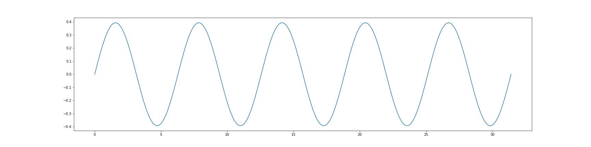
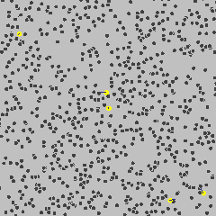

<style>
.section .reveal .state-background {
   background: #ffffff;
}
.section .reveal h1,
.section .reveal h2,
.section .reveal p {
   color: black;
   margin-top: 50px;
   text-align: center;
}
</style>

<!-- foo 
Highlighting
bold
strong
orange <b style="color:#d95f02"> text </b>
green  <b style="color:#1b9e77"> text </b>
purple <b style="color:#d24693"> text </b>
red    <b style="color:#FF0000"> text </b>
blue   <b style="color:#0000FF"> text </b>
-->

Stochastic Processes and Gauss-Markov Models Part I
========================================================
autosize: true
incremental: true
width: 1920
height: 1080

<h2 style="text-align:left"> Instructions:</h2>
<p style='text-align:left'>Use the left and right arrow keys to navigate the presentation forward and backward respectively.  You can also use the arrows at the bottom right of the screen to navigate with a mouse.<br></p>

<blockquote>
FAIR USE ACT DISCLAIMER:</br>
This site is for educational purposes only.  This website may contain copyrighted material, the use of which has not been specifically authorized by the copyright holders. The material is made available on this website as a way to advance teaching, and copyright-protected materials are used to the extent necessary to make this class function in a distance learning environment.  The Fair Use Copyright Disclaimer is under section 107 of the Copyright Act of 1976, allowance is made for “fair use” for purposes such as criticism, comment, news reporting, teaching, scholarship, education and research.
</blockquote>

========================================================

<h2>Outline</h2>

* The following topics will be covered in this lecture:
  * Extending the concept of random vectors -- stochastic processes
  * Continiuity in probability
  * Separability
  * Gaussian stochastic processes
  * Wiener Processes

========================================================
## Stochastic processes

* We are now familiar with the <b>Gaussian model for a random state</b>, and its <strong>centrality due to the central limit theorem</strong>.

  * Likewise, we have developed a variety of tools to extend the Gaussian model, and to efficiently simulate it numerically.

* We will now make a fundamental leap that will allow us to model time-varying random processes -- i.e., we will introduce <b>stochastic processes</b>.

* A <b>stochastic process</b> is an <strong>infinite collection of random variables</strong>. 

* We will ultimately use this object to model uncertain signals based on mechanistic processes;

  * however, we want to emphasize from the beginning that a <strong>stochastic process is just a generalization of a random variable / vector</strong>.

* However, unlike a random vector $\pmb{x}\in\mathbb{R}^{N_x}$, a stochastic process requires considerably more care.

  * This is due to the fact that a stochastic process $\pmb{x}_t$ is the <strong>generalization of a random vector into infinite dimensions</strong>.
  
<blockquote>
<b>Stochastic Processes</b><br>
A <strong>stochastic process</strong> is a family of random variables, $X(\omega, t)$, indexed by
a real parameter $t \in T$ and defined on a common probability space $(\Omega, A, \mathcal{P} )$.
</blockquote>

* The "real parameter $t$" in the above is almost always taken a time variable. 

* Thus, a random process can be thought of as a <strong>function that takes both the sample point and time as arguments</strong>. 

* Hence, we will often use the notation $X(\omega, t)$, or $X_t$ for short, to denote a random variable depending on time. 


========================================================
### Stochastic processes

*  Note, in many cases we will actually <b>consider time to be discrete in nature</b>;

  * this is a consequence, in part, of the fact that we <strong>often have measurements discretely and not continuously in time</strong>. 

* If the parameter set $T = \mathbb{N}$, the natural numbers, then $X_t$ is often
called a random sequence to reflect the discrete nature of the time parameter.
  
  * In this case, we will often use a notation such as $X_k$ corresponding to a sequence of times $\{t_0, t_1, \cdots, t_k, \cdots\}$ to denote the discrete nature of the time variable.

* On the other hand, if $T = \mathbb{R}$, then $X_t$ is called either a random function or process. 

* We should also note that the values of $X_t$, for a fixed value of $t$, <strong>can also be a discrete or continuous random variable</strong>.

* If we look at random processes in a certain way, we can see that they are a <strong>natural
extension of the idea of random vectors to infinite collections</strong>:

$$\begin{align}
&\begin{matrix}\text{Random variable} & X \end{matrix} & \begin{matrix}\text{Random vector} & & \pmb{x}^\top:= \begin{pmatrix} X_1 & \cdots & X_{N_x}\end{pmatrix}\end{matrix}\\\\
&\begin{matrix}\text{Random sequence} & \begin{pmatrix} \cdots & X_k & \cdots \end{pmatrix}\end{matrix} &  \begin{matrix} \text{Random process} & \begin{pmatrix} \cdots & X_t & \cdots \end{pmatrix}\end{matrix}
\end{align}$$

* The key notion to take away is that a <b>random process is a set of time functions</b>, each of which is one possible outcome, $\omega$, out of the set of all possible outcomes, $\Omega$. 
* A random variable returns a real number, and a random process <strong>returns a continuously indexed collection of real numbers or a real-valued function</strong>.

========================================================
### Stochastic processes

* As a quick example, consider a sine wave with an amplitude given as a random variable taking on values from −1 to 1 with a uniform distribution:

  $$\begin{align}
  X(\omega, t) := A(\omega) \sin(t): \Omega \times \mathbb{R} \rightarrow \mathbb{R} & & A(\omega) \sim U[-1, 1]
  \end{align}$$
  
* Again, we emphasize that the random variable $X$ takes $\omega$ and returns a function. 

  * In particular, if we know which sample point, $\omega$, we have selected, we know the plot of the function $X_t$ for all $t\in \mathbb{R}$.

* We can consider this in Python as follows, where `A` below is a uniform random variable on $[-1,1]$


```python
import matplotlib.pyplot as plt
import numpy as np
np.random.seed(123)
A = np.random.uniform(low=-1, high=1)
A
```

```
0.3929383711957233
```

* Having determined the particular outcome for $\omega$, we now define a function in time given by

  $$\begin{align}
  0.3929383711957233 * \sin(t).
  \end{align}$$

========================================================
### Stochastic processes

* We plot the function defined on the last slide for 5 cycles of sine:


```python
time_points = np.linspace(start=0, stop=10*np.pi, num=10000)
plt.subplots(figsize=(24, 6))
```

```
(<Figure size 2400x600 with 1 Axes>, <matplotlib.axes._subplots.AxesSubplot object at 0x7fec2c398940>)
```

```python
plt.plot(time_points, A*np.sin(time_points))
```

```
[<matplotlib.lines.Line2D object at 0x7fec2bdd3ba8>]
```

```python
plt.show()
```




========================================================
### Stochastic processes

* We just showed how <b>fixing $\omega$</b> yields an <strong>outcome for a random function defined for all time</strong>.

  * This particular function, defined over the time variable $t$, is known as a <b>sample path or a realization of the random process</b>.

* On the other hand, if we fix $t$ and let $X$ vary over $\omega$, i.e.,

  $$\begin{align}
  X_{t_0}(\omega) := X(\omega,t)|_{t=t_0},
  \end{align}$$
  
* we get a random variable $X_{t_0}$ defined on $(\Omega, \mathcal{A}, \mathcal{P})$ with 
 
 $$\begin{align}
 \{\omega : X_{t_0} (\omega) \leq x \} \in \mathcal{A},
 \end{align}$$
 i.e., these form the <b>generating sets of the observable events</b> for the probability space.

* This is what is meant that the parameters $t$ indexes a family of random variables.

========================================================
### Stochastic processes

* We can consider random processes as infinite-dimensional extensions of the idea of random vectors. 

* However, when we extend our ideas to <b>infinite dimensions</b>, <strong>new complications arise</strong>. 

* With random vectors, we can completely define the probability of the vector as a collection of random variables by the joint probability,

  $$\begin{align}
  P(x_1, \cdots, x_{N_x}) := \mathcal{P}\left( X_1(\omega) \leq x_1 , \cdots, X_{N_x}(\omega) \leq x_{N_x}\right)
  \end{align}$$
  
* However, when $T$ is an infinite set, we have to be more careful. 

* If $T$ is a <b>countably infinite set</b>, then we can <strong>characterize the process</strong> with sets of the form
  
  $$\begin{align}
  \{\omega: X(\omega,t_k) \leq a, \quad k= 1,\cdots\} = \cap_{k=1}^\infty \{\omega : X_{t_k} \leq a\};
  \end{align}$$
  
 * in the measure-theoretic approach, this type of countably-infinite intersection still generates the observable events of the process.
  
* However, trouble arises with the <b>uncountable infinity of the continuum</b> for such constructions, where 

  $$\begin{align}
  \{\omega: X(\omega,t_k) \leq a, \quad k= 1,\cdots\} = \cap_{t\in\mathbb{R}} \{\omega : X_{t_k} \leq a\}
  \end{align}$$
  an <strong>intersection over a continuum can lead to problems</strong> with our construction of observable events.
  
 * In particular, if we follow the above alone, the <b>probability of</b> $\mathcal{P}\left(X_t \geq 0 : \forall t\in[0,1]\right)$ <b>may not actually be defined</b>.
 
 
========================================================
## Continuity in probability

* To get around the problems which might arise from continuous-time stochastic processes,
we need to add two more conditions to our process.

<blockquote>
<b>Continuous in probability</b><br>
A stochastic process $X(\omega, t)$ is said to be <strong>continuous in probability</strong> at $t$ if
$$\begin{align}
\lim_{s\rightarrow t} \mathcal{P}\left(\vert X(\omega, s) -  X(\omega, t) \vert \geq \epsilon\right) =0
\end{align}$$
for all $\epsilon > 0$.
</blockquote>

* Note that in the above, the probability we are referring to is over all possible outcomes $\omega\in \Omega$.

* This means there is <b>such a small set of possible $\omega$</b> for which we would see a discontinuity, that the <strong>probability of observing such an event is zero</strong>.
  
* Being continuous in probability means then that the <b>possibility of seeing a nonzero jump in zero time</b> has <strong>probability zero</strong>.

========================================================
## Separability

* Our second condition is known as separability, which is described as follows.

<blockquote>
<b>Separability</b><br>
A stochastic process $X(\omega, t)$ is said to be <strong>separable</strong> if there exists a countable, dense
set $S \subset T$ such that for any closed set $K \subset [-\infty, \infty]$ the two sets
$$\begin{align}
A_1 = \{\omega : X(\omega, t) \in K, \forall t \in T \} & & A_2 =\{\omega: X(\omega, t)\in K, \forall s \in S\}
\end{align}$$
differ by a set $A_0$ such that $\mathcal{P}\left(A_0\right)=0$.
</blockquote>

* Separability means that for a <b>continuous-parameter random process</b>, <strong>it is possible to analyze it like a discrete-parameter one</strong>.

* When we say that $S$ is dense in $T$, we mean that $S$ must contain enough points
of $T$ so as to provide <strong>essentially a complete representation</strong> of $T$.

* That is, if we plotted out the set $\{X(\omega, t) : t \in S\}$ versus $t$, it would look indistinguishable from $\{X(\omega, t), t \in T \}$.

* Lets suppose that $T = \mathbb{R}$, the real line, or perhaps the positive real line $\mathbb{R}^+$.

* The simplest way to get a separating set of the continuous-time interval $T$ is to simply choose $S$ to be the set of rational numbers $\mathbb{Q} \cap T$.

* Mathematically, what this means is that for any point $t \in T$, there exists a discrete sequence $t_k \in S$ such that $t_k \rightarrow t$. 

* Thus, if $X(t, \omega)$ is a separable process, it is such that $X(t_k , \omega) \rightarrow X(t, \omega)$ except on the zero probability set mentioned in the definition.

* We, therefore, have <strong>well-defined discretized limits in time</strong> with probability one.


========================================================
## Gaussian processes

* Just like we extended the Gaussian to multiple variables, we can now <b>extend the (multivariate) Gaussian</b> to a <strong>family of Gaussian random (vectors) variables parameterized by time</strong>.

* We will need to start with identifying the notion of independence properly for a stochastic process.

<blockquote>
<b>Independent increments</b><br>
Let $X$ be a random process defined on the time interval, $T$. Let $t_0 &lt; t_1 &lt; \cdots &lt; t_n$ be a partition of the time interval, $T$. If the increments, $X(t_k) − X(t_{k−1})$, are mutually independent random variables for any partition of $T$, then $X$ is said to be a <strong>process with independent increments</strong>.
</blockquote>

* In the above, this is to say that if we take arbitrary, discrete time points $t_{k-1} &lt; t_{k} &lt; t_{k+1} \in T$, the following holds

 $$\begin{align}
 \mathcal{P}\left( X_{k+1} - X_{k} \leq a | X_{k} - X_{k-1} = b\right) = \mathcal{P}\left( X_{k+1} - X_{k} \leq a\right),
 \end{align}$$
 and vice-versa in the time indices.
 
* In particular, the size of any <strong>past difference in realizations</strong> <b>doesn't affect the probability of any future difference</b> in realizations.

========================================================
## Gaussian processes

<div style="float:left; width:60%">
<ul>
   <li>We now introduce the notion of a <b>Gaussian process</b>, and two of its quintessential applications.</li>
<blockquote>
<b>Gaussian processes</b><br>
We say that a random process, $X_t$, is a <strong>Gaussian process</strong> if for every finite
collection, $X_{1}, X_{2}, \cdots , X_{N_x}$, the corresponding density function,
$$\begin{align}
p(x_1 , . . . , x_n ),
\end{align}$$
is a Gaussian density function, for the joint, multivariate Gaussian in $\pmb{x}^\top:= \begin{pmatrix}X_1, & \cdots, & X_{N_x} \end{pmatrix}$.
</blockquote>
   <li>A commonly understood Gaussian process is actually <b>"white noise"</b>, visualized to the right.</li>
</div>
<div style="float:right; width:40%" class="fragment">

</div>
<div style="float:left; width:100%">
<ul>
   <li>White noise corresponds, typically, to a Gaussian process as above such that for any two time points, $t_0, t_1$:</li>
   <ul>
      <li>$\mathbb{E}\left[X_0\right]=\mathbb{E}\left[X_1\right]=\overline{x}$ and $\mathrm{var}\left(X_0\right) = \mathrm{var}\left(X_1\right) = \sigma^2$; and</li>
      <li>$X_0$ and $X_1$ are independent.</li>
   </ul>
   <li>A formal mathematical definition can actually be quite a bit more complicated, but this is a good intuitive way to understand the white noise Gaussian process.</li>
   <li>We can think of <strong>white noise as adding random shocks to a system</strong>, with an average value of the shock being $\overline{x}$.</li>
   <li>When $\overline{x}=0$, this corresponds to a <b>sequence of perturbations that "fuzz", but do not bias, the underlying process</b>.</li>
</ul>
</div>

========================================================
## The Weiner process

<div style="float:left; width:60%">
<ul>
   <li>A related application of Gaussian processes is one that we will use frequently in stochastic, continuous-time models.</li>
<blockquote>
<b>Wiener process</b><br>
A continuous-time stochastic process is denoted a <strong>Wiener process</strong> $W_{t}$ if it has the following properties:
<ul>
   <li>$W_0:= 0$,</li>
   <li>$W$ has independent increments, as defined earlier;</li>
   <li>The increments $W_{t+s} - W_{t} \sim N(0,s)$; and</li>
   <li>$W_t$ is continuous in $t$.</li>
</ul>
</blockquote>
   <li>The Wiener process is a common model for the interaction of a particle suspended in fluid as it bounces off other particles in its evolution.</li>
   <li>In particular, this is also known as a Brownian motion, as pictured to the right.</li>
</ul>
</div>
<div style="float:right; width:35%" class="fragment">

<p style="text-align:center">
Courtesy of Lookang et al., <a href="https://creativecommons.org/licenses/by-sa/3.0">CC BY-SA 3.0</a>, via <a href="https://commons.wikimedia.org/wiki/File:Brownianmotion5particles150frame.gif">Wikimedia Commons</a>
</p>
</div>
<div style="float:left; width:100%">
<ul>
   <li>The Wiener process is a very special example of a function that is <strong>everywhere continuous but is nowhere differentiable</strong>.</li>
   <li>It is also used commonly to model the <b>time evolution of a physical process</b>, defined by differential equations, when this is <strong>perturbed by additive white noise</strong>.</li>
   <li>In particular, the Wiener process can be formulated as an integral of a white noise process, using the proper mathematical formalism.</li>
</ul>
</div>
